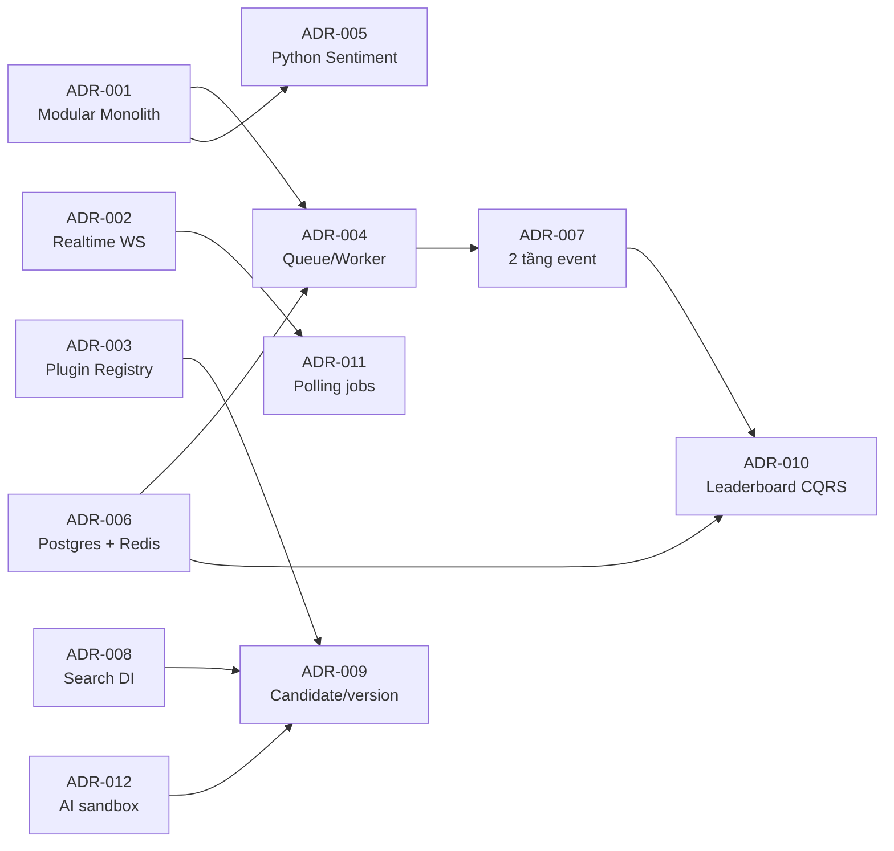

# Crypto Strategy Lab — Architectural Decision Records

| Thuộc tính | Giá trị |
|---|---|
| Trạng thái tài liệu | Active |
| Phiên bản | 1.0 |
| Ngày chuẩn hóa | 2026-09-04 |
| Tài liệu liên quan | [architecture-document.md](architecture-document.md) |

## 1. Quy ước ADR

Mỗi ADR ghi lại một quyết định kiến trúc có ảnh hưởng dài hạn. Trạng thái được dùng như sau:

- **Proposed:** đang đề xuất, chưa ràng buộc implementation;
- **Accepted:** đã chấp nhận và là baseline hiện tại;
- **Superseded:** đã được ADR khác thay thế;
- **Deprecated:** vẫn còn dấu vết nhưng không nên dùng cho code mới.

Thay đổi một quyết định đã `Accepted` phải tạo ADR mới và ghi rõ ADR bị thay thế. Không sửa lịch sử để làm mất bối cảnh cũ.

## 2. Danh mục quyết định

| ID | Quyết định | Trạng thái |
|---|---|---|
| ADR-001 | NestJS Modular Monolith với auxiliary worker | Accepted |
| ADR-002 | WebSocket stream cho market realtime, REST cho history | Accepted |
| ADR-003 | Strategy Plugin Registry thay cho hard-coded branching | Accepted |
| ADR-004 | BullMQ/Redis tách API producer và background consumer | Accepted |
| ADR-005 | Tách News/Sentiment sang Python process và dùng provider abstraction | Accepted |
| ADR-006 | PostgreSQL/TimescaleDB là source of truth; Redis chỉ queue/cache | Accepted |
| ADR-007 | Phân biệt durable job và in-process domain event | Accepted |
| ADR-008 | Search algorithm được thay qua DI token | Accepted |
| ADR-009 | Candidate/version model để bảo đảm tái lập | Accepted |
| ADR-010 | Materialized Leaderboard theo Tactical CQRS và versioned cache | Accepted |
| ADR-011 | Polling cho trạng thái long-running job; WebSocket dành cho market stream | Accepted |
| ADR-012 | AI strategy chạy trong process riêng có validation/timeout | Accepted |

---

## ADR-001 — NestJS Modular Monolith với auxiliary worker

**Trạng thái:** Accepted  
**Ngày:** 2026-08-23; chuẩn hóa 2026-09-04

### Bối cảnh

Hệ thống có nhiều capability khác nhau: market data, auth, strategy, search, backtest, leaderboard, news, sentiment và AI strategy. Nhóm nhỏ và phạm vi đồ án không cần vận hành, deploy hay scale từng domain độc lập như một hệ microservice hoàn chỉnh. Tuy nhiên, search/crawl/AI generation có thời gian chạy dài và không nên chiếm request lifecycle của API.

### Quyết định

Dùng **NestJS Modular Monolith** cho business core, chia module theo domain. Build cùng một codebase/image nhưng chạy hai process:

- API process từ `AppModule`: REST, WebSocket, validation, enqueue và query;
- Worker process từ `WorkerModule`: BullMQ consumers và business operation dài.

News/sentiment và AI sandbox được phép là auxiliary Python process vì phụ thuộc/runtime của chúng khác Node.js.

### Lý do

- Module boundary và DI đủ để chứng minh khả năng mở rộng mà không nhận chi phí mạng/phân tán của microservice.
- API và Worker tái sử dụng cùng business service, tránh fork logic.
- Có thể scale worker riêng ở mức process/container khi tải search tăng.
- Một image cho API/Worker giảm dependency drift.

### Hệ quả

**Tích cực:** deploy và debug đơn giản; transaction database thuận tiện; refactor liên module nhanh; API không bị công việc dài giữ event loop.  
**Tiêu cực:** module vẫn dùng chung release cadence và database; lỗi process worker có thể ảnh hưởng nhiều loại job; boundary phải được giữ bằng code review thay vì network boundary.

### Phương án đã cân nhắc

- **Microservices theo từng domain:** loại vì tăng service discovery, network failure, distributed tracing và eventual consistency không cần thiết cho quy mô đồ án.
- **Một process API duy nhất + `setImmediate`:** loại vì restart API làm mất công việc và không scale ngang an toàn.
- **Một monolith không module:** loại vì dẫn tới God Service và coupling khó kiểm soát.

### Bằng chứng implementation

`service/src/app.module.ts`, `service/src/worker.module.ts`, `service/src/main.ts`, `service/src/worker.ts`, `docker-compose.yml`.

---

## ADR-002 — WebSocket stream cho market realtime, REST cho history

**Trạng thái:** Accepted  
**Ngày:** 2026-08-28; chuẩn hóa 2026-09-04

### Bối cảnh

Chart cần cập nhật candle đang hình thành và recent trades với độ trễ thấp. Polling theo chu kỳ gây request thừa và không thể hiện biến động trong một candle; chỉ phát candle khi đóng làm chart trễ tới cả interval. Ngược lại, tải lịch sử là truy vấn hữu hạn, phù hợp request/response.

### Quyết định

- Dùng Socket.IO namespace `/market` cho kline update, status và aggregate trade.
- Dùng REST cho candle history/import.
- Mỗi interval chỉ mở một upstream provider stream, chia sẻ bằng room/ref-count.
- Phát cả candle đang hình thành và candle đã đóng; chỉ persist candle đã đóng.
- Provider tự reconnect với backoff; UI có thể phục hồi state từ REST history.

### Lý do

- WebSocket phù hợp stream hai chiều, latency thấp và nhiều update.
- REST phù hợp history, dễ cache/retry và quan sát.
- Shared upstream stream tránh nhân số kết nối Binance theo số browser.
- Không persist forming candle giúp series backtest ổn định.

### Hệ quả

**Tích cực:** chart chuyển động trong interval; tải API thấp hơn polling; lifecycle upstream được quản lý rõ.  
**Tiêu cực:** gateway có state subscription trong memory; reconnect và duplicate/out-of-order update phải được xử lý; scale nhiều API replica cần sticky session hoặc Socket.IO adapter chung.

### Phương án đã cân nhắc

- **REST polling:** loại cho realtime market vì độ trễ và request amplification.
- **Server-Sent Events:** có thể dùng cho push một chiều, nhưng Socket.IO đã đáp ứng room, reconnect và client ecosystem.
- **Persist mọi forming update:** loại vì candle mutable có thể làm dữ liệu lịch sử không ổn định.

### Bằng chứng implementation

`service/src/modules/market-data/market-data.gateway.ts`, `clients/binance.client.ts`, `market-data.controller.ts`, `web-platform/src/hooks/useMarketSocket.ts`.

---

## ADR-003 — Strategy Plugin Registry thay cho hard-coded branching

**Trạng thái:** Accepted  
**Ngày:** 2026-08-24; chuẩn hóa 2026-09-04

### Bối cảnh

Một Strategy Engine dùng `switch/if` theo `MA`, `RSI`, `BOLLINGER`... buộc sửa engine mỗi khi thêm strategy. Điều này vi phạm Open/Closed Principle, làm metadata/validation phân tán và biến engine thành God Service.

### Quyết định

Mỗi strategy triển khai `StrategyPlugin`, tự khai báo:

- type/domain/display metadata;
- parameter schema;
- hàm `analyze(member, context)` trả `BUY | SELL | HOLD`.

`StrategyRegistry` đăng ký và resolve plugin. `StrategyEngineService` chỉ delegate tới plugin được resolve. AI strategy dùng adapter động với namespace `AI:<strategyId>`.

### Lý do

- Thêm plugin không sửa engine/backtest/composite.
- Parameter schema là một nguồn cho validation và UI động.
- Strategy được test độc lập.
- Registry tạo điểm kiểm soát duy nhất cho duplicate/missing plugin.

### Hệ quả

**Tích cực:** mở rộng strategy cục bộ; loại hard-coded branching; built-in và AI strategy dùng cùng signal contract.  
**Tiêu cực:** plugin phải được đăng ký ở composition root; thay đổi contract ảnh hưởng toàn bộ plugin; metadata code và row catalog phải đồng bộ.

### Phương án đã cân nhắc

- **Switch trong engine:** loại vì coupling tăng tuyến tính theo số strategy.
- **Reflection/auto-discovery toàn phần:** chưa chọn vì tăng magic và khó kiểm soát thứ tự/lỗi đăng ký trong đồ án nhỏ.
- **Một microservice cho mỗi strategy:** loại vì quá nặng và backtest sẽ phát sinh network call trong hot loop.

### Bằng chứng implementation

`service/src/modules/strategy-plugin/strategy-plugin.types.ts`, `strategy-registry.ts`, `strategy-plugin.module.ts`, `service/src/modules/strategy-engine/strategy-engine.service.ts`.

---

## ADR-004 — BullMQ/Redis tách API producer và background consumer

**Trạng thái:** Accepted  
**Ngày:** 2026-08-29; chuẩn hóa 2026-09-04

### Bối cảnh

Search có thể chạy hàng trăm candidate; crawl phụ thuộc mạng/process ngoài; AI generation chờ LLM và validation. Chạy các việc này trong HTTP process làm cạnh tranh event loop, mất tiến trình khi API restart và không cho phép scale worker riêng.

### Quyết định

Dùng BullMQ trên Redis với ba queue:

| Queue | Producer | Consumer | Concurrency/retry chính |
|---|---|---|---|
| `search` | `SearchQueueService` | `SearchProcessor` | concurrency 5, retry/backoff |
| `news-crawl` | `NewsCrawlQueueService` | `NewsCrawlProcessor` | concurrency 1, không retry mù |
| `ai-generate` | `AiGenerateQueueService` | `AiGenerateProcessor` | concurrency 5, một lần thử |

API chỉ enqueue/read status; Worker thực thi. Payload chỉ chứa ID và tham số nhỏ, không chứa candle/result lớn hoặc secret. Job in-flight được coalesce theo business key; job ID lần chạy sau phải mới để không bị BullMQ trả lại completed job cũ.

### Lý do

- Job sống qua API restart và có trạng thái quan sát được.
- Worker scale/tune concurrency độc lập.
- Retry policy khác nhau theo tính idempotent của tác vụ.
- Không sao chép logic nghiệp vụ sang processor.

### Hệ quả

**Tích cực:** HTTP trả `202` nhanh; công việc bền vững hơn; có queue health và graceful shutdown.  
**Tiêu cực:** Redis trở thành dependency vận hành; delivery ít nhất một lần yêu cầu idempotency; user thấy eventual completion thay vì response đồng bộ.

### Phương án đã cân nhắc

- **In-memory queue/setImmediate:** loại vì mất khi restart và không chia sẻ giữa replica.
- **RabbitMQ/Kafka:** có thể phù hợp quy mô lớn nhưng quá nặng; BullMQ đã đủ delayed/retry/status cho hệ Node.js này.
- **Cron trực tiếp:** không phù hợp command theo người dùng và trạng thái từng job.

### Bằng chứng implementation

`service/src/queue/`, các `*-queue.service.ts`, `*.processor.ts`, `service/src/worker.module.ts`, `artifacts/queue.md`.

---

## ADR-005 — Tách News/Sentiment sang Python process và dùng provider abstraction

**Trạng thái:** Accepted  
**Ngày:** 2026-08-23; cập nhật fallback 2026-08-29; chuẩn hóa 2026-09-04

### Bối cảnh

Crawling cần parser RSS/HTML/API và thư viện Python phù hợp. FinBERT cần PyTorch/Transformers/model weights lớn, không phù hợp nhúng vào Node API. Crawler cũng không được gắn cứng với một model; thiếu model không nên làm mất toàn bộ crawl.

### Quyết định

- NestJS enqueue crawl và Worker process spawn `workers/news/main.py`.
- Python pipeline tách fetch → parse → normalize → validate/deduplicate → sentiment → upsert.
- Sentiment dùng interface/provider factory chọn bằng cấu hình.
- Thứ tự mặc định: FinBERT → Lexicon fallback; No-op chỉ khi tắt có chủ đích.
- Kết quả báo model **thực tế** đã chấm, kèm trạng thái degraded nếu có.
- Process có timeout, output cap và cancel `SIGTERM` rồi `SIGKILL`.

### Lý do

- Cô lập dependency ML và scraping khỏi API image/runtime logic.
- Provider abstraction cho phép đổi local model hoặc dịch vụ ngoài.
- Fallback giữ pipeline Collect→Store→Analyze hoạt động và không báo sai năng lực.
- Process boundary hạn chế ảnh hưởng memory/error của ML lên Node worker.

### Hệ quả

**Tích cực:** dễ dùng Python ecosystem; thay model không sửa crawler/NestJS; failure/degradation quan sát được.  
**Tiêu cực:** deployment cần Python và model artifact; spawn process có overhead; shared DB access từ Python đòi hỏi schema discipline; lexicon chỉ là fallback chất lượng thấp hơn FinBERT.

### Phương án đã cân nhắc

- **FinBERT trong NestJS:** loại vì dependency/runtime không phù hợp.
- **Crawler gọi thẳng một hosted LLM:** loại vì coupling, cost, rate limit và mất khả năng offline.
- **Tách thành HTTP microservice ngay:** chưa cần; process + queue đủ cho phạm vi hiện tại. Có thể nâng thành service độc lập khi cần scale/deploy model riêng.

### Bằng chứng implementation

`service/src/modules/news/crawl/`, `workers/news/src/core/crawler/`, `workers/news/src/core/sentiment/`.

---

## ADR-006 — PostgreSQL/TimescaleDB là source of truth; Redis chỉ queue/cache

**Trạng thái:** Accepted  
**Ngày:** 2026-08-23; chuẩn hóa 2026-09-04

### Bối cảnh

Hệ thống cần transaction và quan hệ chặt cho experiment/candidate/backtest, đồng thời lưu candle time-series và xử lý job/cache. Nếu dùng Redis làm kho nghiệp vụ hoặc tách nhiều database quá sớm, tính nhất quán và vận hành phức tạp hơn.

### Quyết định

- PostgreSQL là nguồn sự thật cho mọi dữ liệu nghiệp vụ bền vững.
- Bảng `candles` là TimescaleDB hypertable.
- Dùng raw `pg` và SQL migration đánh số hiện có; không thêm ORM/migration tool thứ hai.
- Redis chỉ dùng cho BullMQ, job return value ngắn hạn và response cache có thể tái tạo.
- Redis cache fail-open: lỗi cache trở thành cache miss, không làm hỏng read từ PostgreSQL.

### Lý do

- Transaction relational phù hợp graph dữ liệu và ownership.
- TimescaleDB giữ SQL/PostgreSQL ecosystem nhưng tối ưu time-series.
- Một migration mechanism tránh schema drift.
- Phân loại source-of-truth/cache giúp recovery rõ ràng.

### Hệ quả

**Tích cực:** query/transaction nhất quán; backup tập trung; cache có thể xóa/tái dựng.  
**Tiêu cực:** shared database tạo coupling tiềm ẩn; raw SQL cần discipline; database là critical dependency.

### Phương án đã cân nhắc

- **ORM mới:** loại để không song song hai migration stack và tránh rewrite code hiện có.
- **Redis làm primary store:** loại vì dữ liệu nghiên cứu và audit cần bền vững/quan hệ.
- **Database-per-module:** hoãn tới khi có nhu cầu deploy/scale độc lập thật.

### Bằng chứng implementation

`service/src/database/`, `database/migrate.js`, `database/migrations/`, `service/src/cache/`, `docker-compose.yml`.

---

## ADR-007 — Phân biệt durable job và in-process domain event

**Trạng thái:** Accepted  
**Ngày:** 2026-08-29; chuẩn hóa 2026-09-04

### Bối cảnh

Hệ thống cần hai loại giao tiếp bất đồng bộ khác nhau:

1. ra lệnh thực hiện công việc dài qua ranh giới API/Worker;
2. thông báo một sự kiện domain đã xảy ra để giảm coupling trong cùng process.

Đánh đồng hai loại này sẽ làm mất job hoặc tạo hạ tầng quá nặng cho event nội bộ.

### Quyết định

- BullMQ/Redis cho **command/job xuyên process**, durable và có retry.
- `@nestjs/event-emitter` cho **domain event trong process**, không durable.
- Domain event hiện gồm `backtest.completed`, `backtest.failed`, `candidates.regenerated`, `leaderboard.updated`.
- Dùng `emitAsync` tại điểm cần chờ listener; mọi process phát event phải import module chứa listener.
- Việc invalidation cần vượt process được truyền qua shared Redis version, không giả định EventEmitter vượt process.

### Lý do

- Mỗi công cụ khớp đúng semantics.
- Search không import/call `LeaderboardService`, giảm compile-time coupling.
- Không cần broker event riêng cho các thông báo nội bộ hiện tại.

### Hệ quả

**Tích cực:** boundary dễ giải thích; job không mất khi API restart; module Search và Leaderboard tách hơn.  
**Tiêu cực:** event nội bộ mất khi process chết; thiếu listener trong module graph có thể gây lỗi im lặng; phải duy trì event catalog.

### Phương án đã cân nhắc

- **Chỉ EventEmitter:** loại vì không qua process và không durable.
- **Chỉ BullMQ cho mọi event:** loại vì tăng serialization/Redis traffic cho thông báo nội bộ đồng bộ.
- **Kafka/event streaming:** chưa có nhu cầu replay/throughput biện minh cho chi phí.

### Bằng chứng implementation

`service/src/domain-events/`, `service/src/modules/leaderboard/leaderboard-events.handler.ts`, `artifacts/event-catalog.md`.

---

## ADR-008 — Search algorithm được thay qua DI token

**Trạng thái:** Accepted  
**Ngày:** 2026-08-29; chuẩn hóa 2026-09-04

### Bối cảnh

Yêu cầu kiến trúc cho phép thay Random Search bằng Genetic/Bayesian/algorithm khác mà không sửa backtesting và downstream. Chỉ định nghĩa interface nhưng inject concrete class vẫn chưa tạo extension point thật.

### Quyết định

- `StrategySearchService` phụ thuộc `SearchAlgorithm` qua token `SEARCH_ALGORITHM`.
- `StrategySearchModule` là nơi duy nhất bind token vào `DomainGuidedRandomGenerator`.
- Algorithm chỉ tạo `CandidateDefinition`; orchestration, persistence, backtest và ranking nằm ngoài algorithm.
- Random generator nhận seeded PRNG và run catalog.

### Lý do

- Thay algorithm bằng một binding, không sửa orchestrator/downstream.
- Contract nhỏ giúp test và so sánh thuật toán.
- Seed hỗ trợ tái lập.

### Hệ quả

**Tích cực:** extension axis có thật trong wiring; backtest không biết nguồn candidate.  
**Tiêu cực:** algorithm stateful/phức tạp hơn có thể cần mở rộng lifecycle contract; schema candidate vẫn là constraint chung.

### Phương án đã cân nhắc

- **Inject concrete generator:** loại vì thay thế vẫn phải sửa service/wiring nhiều nơi.
- **Strategy pattern chọn bằng `if` runtime:** loại vì đưa branching trở lại orchestrator.
- **Mỗi algorithm là microservice:** chưa cần cho workload hiện tại.

### Bằng chứng implementation

`service/src/modules/strategy-search/domain/search.types.ts`, `strategy-search.module.ts`, `generators/domain-guided-random.generator.ts`.

---

## ADR-009 — Candidate/version model để bảo đảm tái lập

**Trạng thái:** Accepted  
**Ngày:** 2026-08-23; cập nhật 2026-09-03; chuẩn hóa 2026-09-04

### Bối cảnh

`Strategy` là loại/phiên bản thuật toán; `Candidate` là một tổ hợp cụ thể được đánh giá trong search. Nếu ghi đè parameter hoặc nhúng mọi candidate thành strategy mới, lịch sử phình to và không thể biết chính xác code/parameter nào đã chạy. Weight cũng không nên nhân bản vào candidate vì thuộc cấu hình so sánh của experiment.

### Quyết định

- Tách `strategies`, `experiment_configs`, `candidates`, `candidate_strategies`.
- Mỗi candidate member ghim đúng `strategy_id`/plugin version và parameters đã dùng.
- AI strategy dùng ID cụ thể trong type namespace để ghim source version.
- Weight và trading costs thuộc experiment config, dùng chung cho mọi candidate trong experiment.
- Candidate fingerprint phục vụ chống trùng; random seed và parameter-space version được lưu.
- Strategy version cũ không bị overwrite khi user lưu phiên bản mới.

### Lý do

- Audit/reproduce được một kết quả.
- Phân biệt definition/version với một tổ hợp thử nghiệm.
- So sánh candidate công bằng vì cùng weight/cost.
- Không làm bảng strategy phình theo số iteration.

### Hệ quả

**Tích cực:** lineage rõ từ leaderboard về evaluation, backtest, candidate và strategy version; cascade regenerate có thể có chủ đích.  
**Tiêu cực:** schema và query join nhiều hơn; version/cascade semantics phải được quản lý; cần migration khi thay candidate schema.

### Phương án đã cân nhắc

- **Gắn strategy trực tiếp vào experiment:** loại vì không biểu diễn tốt candidate composite/version.
- **Mỗi parameter set là một strategy độc lập không phân loại:** loại vì mất phân biệt loại thuật toán và candidate.
- **Overwrite parameter hiện tại:** loại vì phá lịch sử và reproducibility.

### Bằng chứng implementation

`database/migrations/003_candidate_auth_schema.sql`, `005_candidate_fingerprint.sql`, `service/src/modules/strategy-search/repositories/`.

---

## ADR-010 — Materialized Leaderboard theo Tactical CQRS và versioned cache

**Trạng thái:** Accepted  
**Ngày:** 2026-08-29; chuẩn hóa 2026-09-04

### Bối cảnh

Top-K được đọc thường xuyên trong khi dữ liệu nguồn nằm qua nhiều bảng backtest/evaluation. Tính lại full ranking cho mỗi GET tốn query/CPU; nhưng leaderboard phải phản ánh iteration mới và hoạt động xuyên API/Worker process.

### Quyết định

- Write model là candidate/backtest/trade/evaluation.
- Sau iteration hoặc regeneration, `LeaderboardService` rebuild `leaderboard_entries` như read model materialized.
- GET Top-K đọc read model; Redis cache kết quả theo version.
- Worker tăng shared `leaderboard:version`; API đọc version để tránh trả cache cũ.
- Cache outage không ngăn rebuild/read PostgreSQL.

### Lý do

- Tách chi phí tính ranking khỏi request đọc.
- Shared version giải quyết invalidation xuyên process mà không cần distributed event bus.
- Read model có thể xóa và dựng lại từ dữ liệu nguồn.

### Hệ quả

**Tích cực:** GET Top-K nhanh; consistency model rõ; Search không trực tiếp sở hữu ranking.  
**Tiêu cực:** leaderboard là eventual read model; rebuild có write amplification; phải xử lý cache invalidation đúng thứ tự.

### Phương án đã cân nhắc

- **JOIN/sort mọi GET:** đơn giản nhưng không phù hợp khi tần suất đọc và candidate tăng.
- **Chỉ cache query không materialize:** vẫn phải tính full query khi miss và khó audit snapshot/rank.
- **Database/read store riêng:** chưa cần; Tactical CQRS trong cùng database đủ.

### Bằng chứng implementation

`service/src/modules/leaderboard/`, `service/src/cache/`, `artifacts/cqrs.md`, `artifacts/cache.md`.

---

## ADR-011 — Polling cho trạng thái long-running job; WebSocket dành cho market stream

**Trạng thái:** Accepted  
**Ngày:** 2026-08-29; chuẩn hóa 2026-09-04

### Bối cảnh

Search, crawl và AI generation có trạng thái thưa, thường thay đổi theo giây; market data thay đổi dày theo tick. Dùng WebSocket cho mọi thứ tăng gateway state và coupling, còn polling market data gây độ trễ/request amplification.

### Quyết định

- Market candle/trade dùng WebSocket.
- Search/crawl/AI generation trả `202` và client poll endpoint trạng thái/kết quả với cadence hữu hạn.
- Trạng thái durable của experiment ở PostgreSQL; trạng thái/kết quả job ngắn hạn ở BullMQ.
- Không dùng WebSocket làm kênh duy nhất cho kết quả job.

### Lý do

- Chọn transport theo tần suất và semantics dữ liệu.
- Polling đơn giản, dễ retry và không yêu cầu mapping socket↔user↔job.
- Refresh trang vẫn khôi phục trạng thái từ server.

### Hệ quả

**Tích cực:** implementation và recovery đơn giản; realtime channel tập trung vào market.  
**Tiêu cực:** polling tạo request định kỳ và độ trễ tối đa bằng cadence; quy mô lớn có thể cần SSE/WebSocket progress.

### Phương án đã cân nhắc

- **Một WebSocket cho mọi job event:** hoãn vì complexity lớn hơn giá trị hiện tại.
- **Long polling:** không cần khi job state endpoint nhẹ và cadence chấp nhận được.
- **Webhook:** không phù hợp browser client.

### Bằng chứng implementation

`web-platform/src/hooks/useExperiment.ts`, `web-platform/src/state/NewsCrawlContext.tsx`, `web-platform/src/state/AiGenerateContext.tsx`, các status controller/service tương ứng.

---

## ADR-012 — AI strategy chạy trong process riêng có validation/timeout

**Trạng thái:** Accepted  
**Ngày:** 2026-08-29; cập nhật Windows 2026-09-03; chuẩn hóa 2026-09-04

### Bối cảnh

AI-generated strategy là source code không hoàn toàn tin cậy và có thể lỗi cú pháp, chạy quá lâu hoặc phụ thuộc hành vi khác nền tảng. Chạy trực tiếp trong NestJS process có thể crash/block API hoặc Worker.

### Quyết định

- LLM call nằm trong NestJS service/Worker; Python scripts không gọi LLM.
- Source được validate trước khi lưu/chạy theo contract cho phép.
- `validate.py` và `run.py` chạy bằng child process, có timeout và error mapping.
- Python executable được resolve theo cấu hình và nền tảng, không hard-code POSIX path.
- Candidate AI ghim đúng strategy row/source version; signal có thể được precompute trước hot loop.

### Lý do

- Process boundary bảo vệ event loop và cho phép terminate khi timeout.
- Tách generation, validation và execution giúp audit lỗi rõ.
- Pin version và precompute bảo đảm cùng code cho cùng candidate, tránh spawn cho từng candle.

### Hệ quả

**Tích cực:** lỗi code không chạy trực tiếp trong Node process; hỗ trợ Windows; backtest tránh process-per-candle.  
**Tiêu cực:** child process không phải sandbox bảo mật hoàn chỉnh; cần Python runtime; validation contract giới hạn biểu đạt strategy.

### Phương án đã cân nhắc

- **`eval`/dynamic JS trong Node:** loại vì rủi ro và khả năng block/crash process.
- **Container/VM sandbox mỗi run:** an toàn hơn nhưng chi phí vận hành cao; là hướng nâng cấp nếu cho người dùng công khai chạy code tùy ý.
- **Chỉ sinh JSON rule, không source code:** an toàn hơn nhưng không đáp ứng phạm vi AI strategy hiện tại.

### Bằng chứng implementation

`service/src/modules/ai-strategy/`, `workers/ai-strategy/`, `service/src/common/python-bin.ts`.

---

## 3. Quan hệ giữa các quyết định

## 4. Tiêu chí xem xét lại

Các ADR cần được xem xét lại khi xuất hiện một trong các điều kiện:

- API/Worker phải deploy theo release cadence khác nhau;
- số WebSocket connection yêu cầu nhiều API replica và cross-node room state;
- queue throughput hoặc replay/audit event vượt khả năng BullMQ;
- FinBERT cần GPU/autoscaling riêng;
- AI code được mở cho người dùng không tin cậy trên Internet;
- leaderboard rebuild trở thành bottleneck;
- polling status tạo tải đáng kể;
- một module cần database ownership vật lý hoặc SLA độc lập.

Khi đó tạo ADR mới, đo đạc trước/sau và ghi rõ ADR nào bị `Superseded`.

