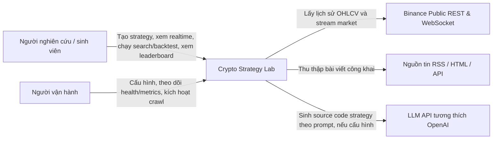
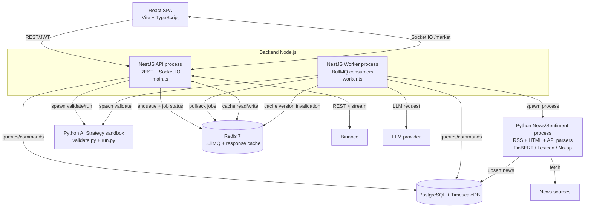
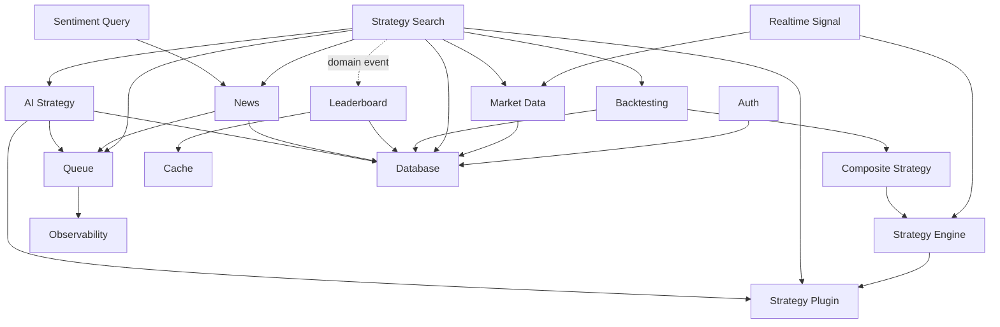
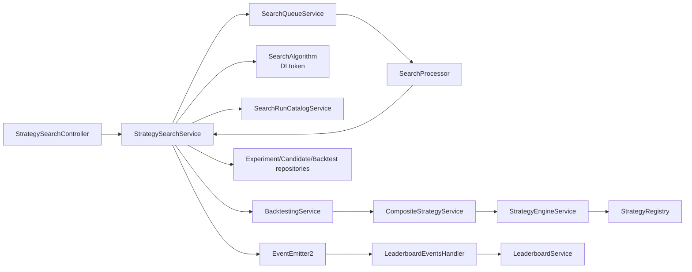
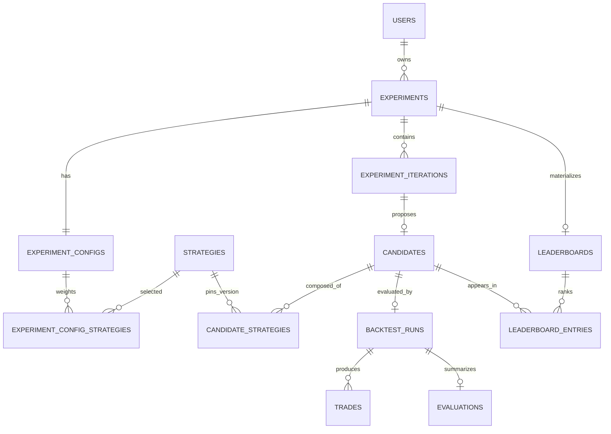
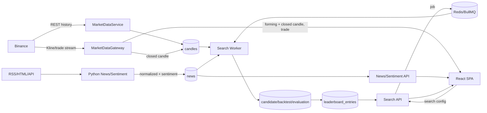
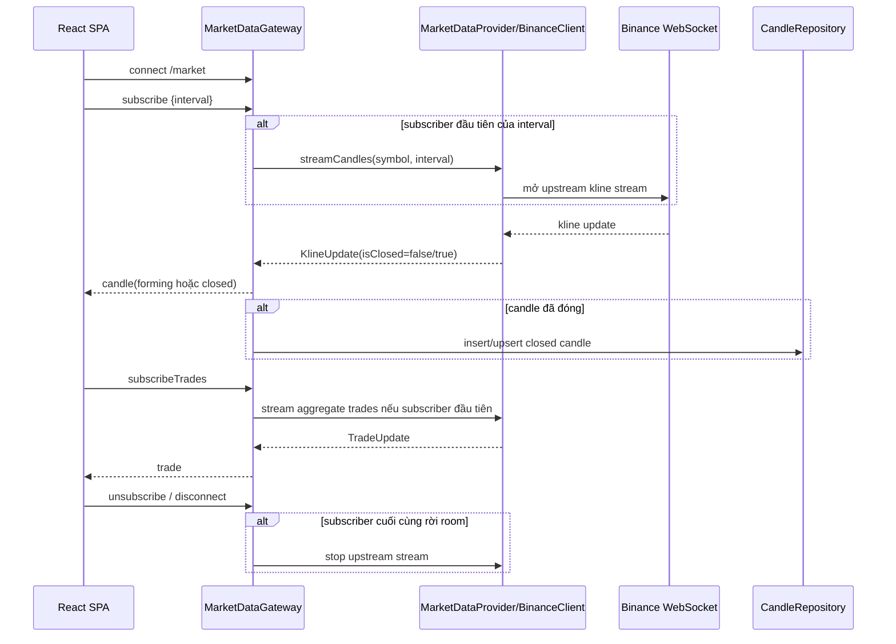
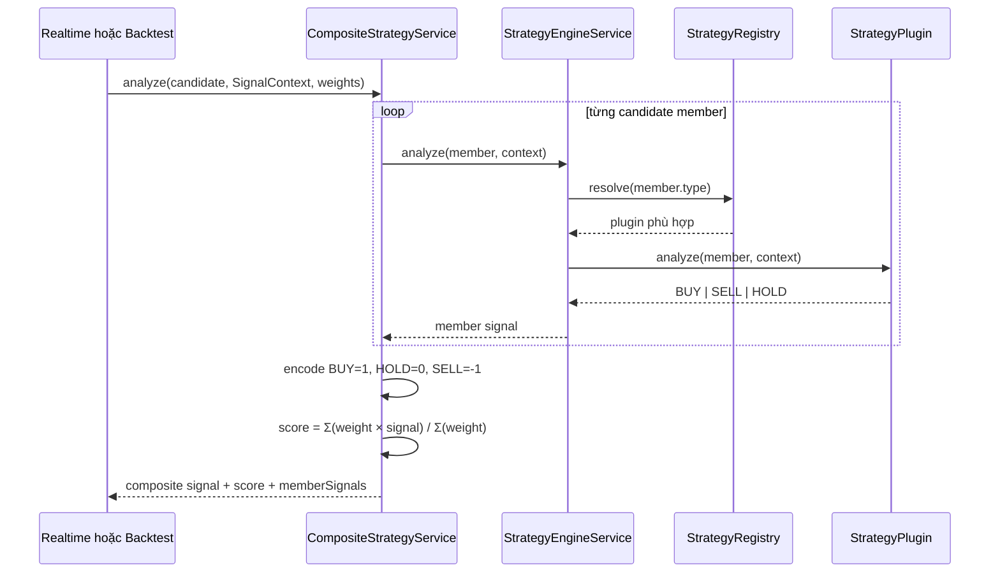
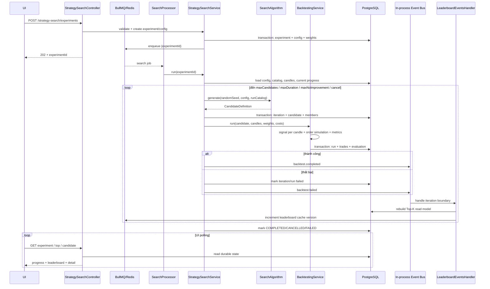

# Crypto Strategy Lab — Architecture Document

| Thuộc tính | Giá trị |
|---|---|
| Trạng thái | Baseline — mô tả kiến trúc đang triển khai |
| Phiên bản | 1.0 |
| Ngày cập nhật | 2026-09-04 |
| Phạm vi | Web SPA, NestJS API, background worker, Python news/sentiment worker, PostgreSQL/TimescaleDB, Redis và các tích hợp ngoài |
| Tài liệu quyết định | [architectural-decision-records.md](architectural-decision-records.md) |

## 1. Mục đích và phạm vi

Crypto Strategy Lab là nền tảng nghiên cứu chiến lược giao dịch crypto. Hệ thống thu thập dữ liệu thị trường và tin tức, tạo tín hiệu từ các strategy độc lập, kết hợp tín hiệu, chạy backtest, tìm kiếm candidate tốt và xếp hạng kết quả. Hệ thống chỉ phục vụ nghiên cứu/mô phỏng, **không đặt lệnh và không giao dịch tiền thật**.

Tài liệu này là mô tả kiến trúc của code trong repository tại thời điểm ghi nhận. Nó bao phủ:

- System Context;
- phân rã container, module và component;
- trách nhiệm và ranh giới dữ liệu;
- Data Flow tổng quát;
- Realtime Flow;
- Strategy Flow;
- Search/Backtest/Leaderboard Flow;
- các thuộc tính chất lượng, giới hạn và rủi ro còn lại.

## 2. Mục tiêu kiến trúc

1. **Mở rộng strategy mà không sửa Strategy Engine:** strategy mới được thêm qua plugin/registry.
2. **Thay nguồn market data hoặc thuật toán search tại composition root:** consumer chỉ phụ thuộc interface/DI token.
3. **Tách đường HTTP khỏi công việc dài:** search, crawl và AI generation chạy qua queue/worker.
4. **Đáp ứng realtime:** UI nhận candle đang hình thành, candle đã đóng và aggregate trade qua WebSocket.
5. **Backtest tái lập được:** candidate ghim đúng strategy version, parameters, weights, random seed, market scope và chi phí giao dịch.
6. **Giữ module boundary rõ:** strategy không truy cập database trực tiếp; frontend không chứa business logic giao dịch.
7. **Vận hành đơn giản cho nhóm nhỏ:** dùng modular monolith thay vì phân rã toàn bộ thành microservices.

### Ngoài phạm vi

- giao dịch thật, quản lý ví hoặc API key của sàn để đặt lệnh;
- đảm bảo lợi nhuận hay tư vấn đầu tư;
- service mesh và triển khai microservice độc lập cho từng module;
- continuous self-improvement loop hoàn chỉnh. `ContinuousLoopModule` hiện chỉ là khung/stub.

## 3. System Context



### Tác nhân và hệ thống ngoài

| Tác nhân/hệ thống | Vai trò | Giao thức |
|---|---|---|
| Người dùng | Đăng ký/đăng nhập, theo dõi market, cấu hình strategy, search và xem kết quả | HTTPS/JSON, WebSocket |
| Người vận hành | Khởi động API/worker, cấu hình provider, xem health và metrics | Docker/CLI, HTTP |
| Binance | Nguồn candle lịch sử, kline realtime và aggregate trade | REST, WebSocket |
| Nguồn tin | Nguồn bài viết cho crawler | RSS, HTTP/HTML, REST API |
| LLM provider | Sinh mã strategy theo contract | HTTPS/JSON |

## 4. Container decomposition



### Trách nhiệm container

| Container | Trách nhiệm chính | Không chịu trách nhiệm |
|---|---|---|
| React SPA | Trình bày chart, form cấu hình, trạng thái job và kết quả; giữ state giao diện | Tạo tín hiệu, backtest, tính điểm hay gọi Binance trực tiếp |
| NestJS API | Auth, REST, WebSocket gateway, validation, orchestration ngắn, enqueue job, đọc kết quả | Không thực thi search/crawl/AI generation dài trong request |
| NestJS Worker | Consume BullMQ job; thực thi search, backtest orchestration, crawl orchestration và AI generation | Không mở HTTP/WebSocket server |
| Python News/Sentiment | Fetch/parse/normalize/deduplicate news và chấm sentiment | Không quyết định search/backtest/leaderboard |
| Python AI sandbox | Validate và thực thi strategy code trong process riêng có timeout | Không gọi LLM và không sở hữu API |
| PostgreSQL/TimescaleDB | Nguồn dữ liệu bền vững cho user, candle, strategy version, experiment, candidate, backtest, leaderboard và news | Không làm message broker |
| Redis | BullMQ jobs, trạng thái/kết quả job ngắn hạn và cache versioned | Không là nguồn sự thật nghiệp vụ dài hạn |

### Process boundary quan trọng

API và Worker dùng chung các NestJS business module nhưng có composition root khác nhau:

- `AppModule` có controller/gateway và producer service, không đăng ký `@Processor`;
- `WorkerModule` không mở HTTP server, nhưng đăng ký `SearchProcessor`, `NewsCrawlProcessor`, `AiGenerateProcessor`;
- domain event từ `@nestjs/event-emitter` chỉ tồn tại **trong process phát event**;
- BullMQ/Redis mới là ranh giới giao tiếp bền vững **xuyên process**.

## 5. Module decomposition



### Trách nhiệm module/component

| Module/component | Trách nhiệm | Điểm mở rộng / ràng buộc | Trạng thái |
|---|---|---|---|
| `AuthModule` | Register/login/refresh/logout; JWT guard; refresh token rotation | Tài nguyên theo user; trả 404 khi truy cập tài nguyên không thuộc sở hữu | Đã triển khai |
| `MarketDataCoreModule` | Lấy/backfill candle, repository, provider binding | `MARKET_DATA_PROVIDER` đang bind `BinanceClient`; consumer không biết Binance | Đã triển khai |
| `MarketDataModule` | REST lịch sử/import và Socket.IO gateway | Chỉ persist candle đã đóng; mỗi interval có một upstream stream dùng chung | Đã triển khai |
| `RealtimeSignalModule` | Tính signal hiện tại từ candle gần nhất và strategy version | Gọi Strategy Engine, không tính ở frontend | Đã triển khai |
| `StrategyPluginModule` | Registry, metadata/schema parameters, lưu version | Built-in: MA, RSI, Bollinger, Support/Resistance, News Sentiment; AI adapter động | Đã triển khai |
| `StrategyEngineModule` | Resolve plugin và gọi `analyze()` với `SignalContext` | Không `switch` theo type, không DB access | Đã triển khai |
| `CompositeStrategyModule` | Kết hợp tín hiệu theo weighted average và threshold | `BUY=1`, `HOLD=0`, `SELL=-1`; weights thuộc experiment config | Đã triển khai |
| `StrategySearchModule` | Tạo experiment/config, generate candidate, điều kiện dừng, persist iteration, gọi backtest | `SEARCH_ALGORITHM` bind Domain-Guided Random; có thể thay implementation | Đã triển khai |
| `BacktestingModule` | Mô phỏng long/short, fee, slippage, SL/TP; lưu trade/evaluation | Dùng cùng Strategy/Composite Engine; deterministic theo input | Đã triển khai |
| `LeaderboardModule` | Materialize Top-K, cache kết quả, phản ứng domain event | Search không import/call trực tiếp Leaderboard | Đã triển khai |
| `NewsModule` | Query news, enqueue/cancel crawl, spawn Python worker ở consumer process | Repository sở hữu bảng `news`; crawl có timeout và output cap | Đã triển khai |
| `SentimentModule` | Tổng hợp sentiment theo cửa sổ thời gian | Tái sử dụng `NewsRepository`; scoring diễn ra trong Python worker | Đã triển khai |
| `AiStrategyModule` | Gọi LLM, validate/save/run source code, precompute signal cho search | Generation qua queue; validate/run qua sandbox process có timeout | Đã triển khai |
| `QueueModule` | Sở hữu cấu hình BullMQ và health của ba queue | Queue: `search`, `news-crawl`, `ai-generate` | Đã triển khai |
| `CacheModule` | Cache read-model; fail-open khi Redis lỗi | Không để cache outage làm hỏng source-of-truth read | Đã triển khai |
| `ObservabilityModule` | Correlation ID, structured log, health, readiness, Prometheus metrics | API và Worker có telemetry riêng | Đã triển khai |
| `ChartModule` | Health/placeholder cho boundary biểu đồ | Việc render chart nằm ở SPA | Khung mỏng |
| `ContinuousLoopModule` | Boundary dự kiến cho vòng lặp cải tiến liên tục | Chưa có orchestration nghiệp vụ | Stub |

## 6. Component model của luồng lõi



## 7. Data architecture

### Nguồn sự thật và vai trò lưu trữ

| Loại dữ liệu | Store | Đặc tính |
|---|---|---|
| User, refresh token | PostgreSQL | Bền vững, transaction, ownership |
| Candle OHLCV | TimescaleDB hypertable trên PostgreSQL | Time-series; chỉ lưu candle đã đóng |
| Strategy và version | PostgreSQL | Built-in SYSTEM và AI_GENERATED theo user; version bất biến dùng cho tái lập |
| Experiment/config/iteration/candidate | PostgreSQL | Trạng thái search và cấu hình cố định của một lần chạy |
| Backtest run/trade/evaluation | PostgreSQL | Kết quả bền vững, quan hệ 1–1/1–n rõ ràng |
| Leaderboard entries | PostgreSQL | Read model được materialize lại sau iteration/cascade |
| News + sentiment | PostgreSQL | Upsert/deduplicate; sentiment có thể ghi provider thực tế |
| Job/trạng thái job/kết quả AI generation | Redis/BullMQ | Ngắn hạn, phục vụ orchestration và polling |
| Cache Top-K | Redis | Có TTL/version; có thể tái tạo từ PostgreSQL |

### Quan hệ dữ liệu search/backtest



### Quyền sở hữu dữ liệu

- Repository của module là cổng truy cập bảng; strategy plugin không query DB.
- `NewsModule` sở hữu truy cập bảng `news`; `SentimentModule` dùng repository được export thay vì tạo truy cập song song.
- Leaderboard là read model dẫn xuất từ evaluation, không thay thế dữ liệu backtest gốc.
- Redis cache và job return value không phải nguồn sự thật cho experiment/candidate/backtest.

## 8. Data Flow tổng quát



Các nguyên tắc bảo toàn dữ liệu:

- candle đang hình thành chỉ phát ra UI, không ghi đè lịch sử;
- dữ liệu lớn không nằm trong queue payload; job chỉ mang identifier và tham số nhỏ;
- transaction bao quanh các nhóm ghi cần nhất quán như candidate + members, backtest + trades + evaluation;
- candidate fingerprint ngăn tạo lại tổ hợp trùng trong cùng phạm vi áp dụng;
- tất cả candidate trong một experiment dùng chung chi phí và weight để phép so sánh có ý nghĩa.

## 9. Realtime Flow



Quyết định chính:

- Socket.IO namespace `/market` dùng room theo interval;
- một upstream stream được chia sẻ cho mọi client cùng interval;
- `status` cho biết trạng thái kết nối và `lastMessageAt`;
- reconnect/backoff nằm trong provider;
- lịch sử candle lấy qua REST, phần delta realtime lấy qua WebSocket.

## 10. Strategy Flow

### Tạo tín hiệu đơn và composite



### Thêm strategy mới

Một built-in strategy mới phải:

1. triển khai interface `StrategyPlugin` và khai báo metadata/parameter schema;
2. được đăng ký tại composition root của `StrategyPluginModule`;
3. có strategy/version row phù hợp trong catalog dữ liệu;
4. nếu tham gia search, khai báo domain và không gian version/parameter phù hợp.

Không sửa `StrategyEngineService`, `CompositeStrategyService` hay `BacktestingService`. AI strategy dùng key động `AI:<strategyId>` và adapter riêng; candidate ghim chính xác `strategyId` để tránh chạy nhầm phiên bản.

### News Sentiment strategy

News Sentiment thuộc domain `INFORMATION`, chỉ là tiếng nói bổ sung. Generator vẫn yêu cầu tối thiểu một domain định hướng và một domain xác nhận; sentiment không được tự mình biến một candidate thiếu cấu trúc thành hợp lệ. Trước backtest, sentiment summary theo các timestamp cần thiết được precompute để plugin không query DB trong vòng lặp từng candle.

## 11. Search/Backtest/Leaderboard Flow



### Điều kiện và tính chất

- API trả `202 Accepted`; công việc chạy ở Worker.
- Search concurrency hiện là 5 experiment/worker; mỗi experiment chỉ có một job in-flight nhờ coalescing.
- Thuật toán mặc định là Domain-Guided Random, nhận seeded PRNG để tái lập.
- `SEARCH_ALGORITHM` là DI token duy nhất mà orchestrator phụ thuộc.
- Backtest không biết search algorithm nào tạo candidate.
- Leaderboard được rebuild qua domain event, nên Search không phụ thuộc compile-time vào Leaderboard.
- Cancel job đang chờ bằng BullMQ; job đang chạy kiểm tra trạng thái `CANCELLED` từ DB giữa các iteration.
- Retry search có thể tiếp tục từ số candidate đã persist; trạng thái bền vững nằm ở DB.

## 12. News/Crawl/Sentiment Flow

```mermaid
sequenceDiagram
    participant UI
    participant API as NewsController
    participant Q as news-crawl queue
    participant W as NewsCrawlProcessor
    participant N as NewsCrawlService
    participant P as Python worker
    participant SRC as RSS/HTML/API sources
    participant DB as PostgreSQL

    UI->>API: POST /news/crawl
    API->>Q: enqueue/coalesce crawl
    API-->>UI: 202
    Q-->>W: crawl job (concurrency=1)
    W->>N: execute(AbortSignal)
    N->>P: spawn main.py
    P->>SRC: fetch + parse
    P->>P: normalize + validate + deduplicate
    P->>P: FinBERT; fallback Lexicon; explicit No-op
    P->>DB: upsert news + sentiment
    P-->>N: summary {new, updated, scored, model}
    N-->>W: result
    loop polling
        UI->>API: GET /news/crawl/status
        API->>Q: read job state/result
        API-->>UI: status + summary/error
    end
```

Sentiment được tách khỏi NestJS runtime để cô lập Python/ML dependencies. Crawler không gắn cứng vào FinBERT: factory chọn provider qua cấu hình; khi FinBERT không khả dụng thì degrade có quan sát sang lexicon, không báo sai model đã chạy.

## 13. Giao tiếp và consistency

| Cơ chế | Khi dùng | Delivery/consistency |
|---|---|---|
| REST/JSON | Command/query ngắn, auth, lịch sử, đọc kết quả | Request/response; validate ở boundary |
| Socket.IO | Market update tần suất cao | Best effort; client phục hồi bằng REST history/reconnect |
| BullMQ/Redis | Công việc dài xuyên API–Worker | Durable queue, retry theo từng loại job, at-least-once cần idempotency |
| EventEmitter2 | Thông báo domain trong cùng process | Không durable; `emitAsync` để chờ listener cần thiết |
| PostgreSQL transaction | Ghi aggregate nhiều bảng | Strong consistency trong transaction |
| Redis cache | Tối ưu read Top-K | Eventual consistency, version invalidation, fail-open |

## 14. Thuộc tính chất lượng

### Khả năng mở rộng

- Strategy: plugin registry.
- Market provider: `MARKET_DATA_PROVIDER` token.
- Search: `SEARCH_ALGORITHM` token.
- Sentiment: Python `SentimentProvider` factory.
- Scale công việc nền: tăng worker replica; phải giữ coalescing/idempotency.

### Hiệu năng

- WebSocket tránh polling market data.
- Ref-count upstream stream tránh mở một Binance connection cho từng browser.
- TimescaleDB tối ưu chuỗi thời gian.
- Search/backtest rời API process.
- Top-K là read model có Redis cache/version.
- Sentiment/AI signal được precompute ngoài hot loop khi có thể.

### Tin cậy và phục hồi

- API và worker tách process; restart API không làm mất job đang chạy.
- Queue operation có timeout để Redis down không treo HTTP vô hạn.
- Cache lỗi thì fallback PostgreSQL.
- Worker có graceful shutdown; crawl child process có timeout/cancel/kill escalation.
- Chỉ candle đóng mới được persist.
- Health/readiness/metrics/correlation ID hỗ trợ chẩn đoán.

### Bảo mật

- JWT access token và refresh-token rotation.
- Password/token secret không ghi vào queue payload.
- Ownership filter theo user; tài nguyên người khác trả 404 để giảm lộ thông tin.
- AI strategy chạy trong child process có validation và timeout; đây là giảm rủi ro, chưa phải sandbox bảo mật cấp container/VM.
- CORS WebSocket giới hạn theo `WEB_ORIGIN`.

## 15. Deployment view

Môi trường Docker Compose hiện có bốn service chính:

| Service | Image/entry point | Port | Dependency |
|---|---|---|---|
| `timescaledb` | `timescale/timescaledb-ha:pg18` | host 6543 → 5432 | Volume bền vững |
| `redis` | `redis:7-alpine`, AOF bật | host 6381 → 6379 | Volume bền vững |
| `api` | Image từ `service/Dockerfile`, `dist/main.js` | 3000 | DB + Redis |
| `worker` | Cùng image API, `node dist/worker.js` | Không expose | DB + Redis; spawn Python worker |

React SPA hiện chạy/build riêng bằng Vite và gọi API qua cấu hình môi trường. Production cần reverse proxy/TLS và phân phối static asset; compose hiện tại chưa mô tả lớp đó.

## 16. Giới hạn và rủi ro còn lại

| Rủi ro/giới hạn | Ảnh hưởng | Hướng xử lý |
|---|---|---|
| `ContinuousLoopModule` là stub | Chưa có vòng tự động discover→promote liên tục | Chỉ công bố search thủ công là tính năng hoàn chỉnh; triển khai loop có stop condition trước khi quảng bá |
| In-process event không vượt process | Listener thiếu trong `WorkerModule` có thể làm leaderboard không rebuild | Giữ explicit import, integration test module graph, xem event catalog |
| Redis là queue và cache chung | Outage ảnh hưởng enqueue/status/cache | Tách logical concern, health/readiness, backup/config persistence; cân nhắc Redis HA khi production |
| Shared PostgreSQL | Coupling ở schema nếu module truy cập chéo | Enforce repository ownership và review migration |
| Python AI sandbox chưa phải isolation mạnh | Source code không tin cậy vẫn có rủi ro OS-level | Container/VM sandbox, resource quota, syscall/network restriction nếu mở cho public |
| FinBERT là dependency tùy chọn lớn | Có thể chạy fallback thay vì model mong muốn | Expose actual model/degraded state; đóng gói model trong image ML riêng khi cần |
| UI poll trạng thái long-running job | Tăng request khi nhiều client | Chấp nhận ở quy mô đồ án; có thể thêm job-progress WebSocket/SSE khi tải thực tế yêu cầu |

## 17. Traceability với yêu cầu tài liệu

| Yêu cầu | Mục đáp ứng |
|---|---|
| System Context | Mục 3 |
| Container decomposition | Mục 4 |
| Module/component decomposition | Mục 5–6 |
| Component responsibilities | Mục 4–6 |
| Data Flow | Mục 7–8 |
| Realtime Flow | Mục 9 |
| Strategy Flow | Mục 10 |
| Search/Backtest Flow | Mục 11 |
| Queue/worker và sentiment flow | Mục 12–13 |
| Deployment, quality, risks | Mục 14–16 |

## 18. Nguồn kiểm chứng trong repository

- Composition roots: `service/src/app.module.ts`, `service/src/worker.module.ts`.
- Realtime: `service/src/modules/market-data/market-data.gateway.ts`.
- Provider abstraction: `service/src/modules/market-data/providers/market-data-provider.ts`.
- Plugin registry: `service/src/modules/strategy-plugin/`.
- Strategy/composite: `service/src/modules/strategy-engine/`, `service/src/modules/composite-strategy/`.
- Search/backtest: `service/src/modules/strategy-search/`, `service/src/modules/backtesting/`.
- Queue: `service/src/queue/queue.module.ts`, các `*.processor.ts`.
- News/sentiment: `service/src/modules/news/`, `service/src/modules/sentiment/`, `workers/news/`.
- Event/read model: `service/src/domain-events/`, `service/src/modules/leaderboard/`.
- Persistence: `database/migrations/`.
- Deployment: `docker-compose.yml`.

