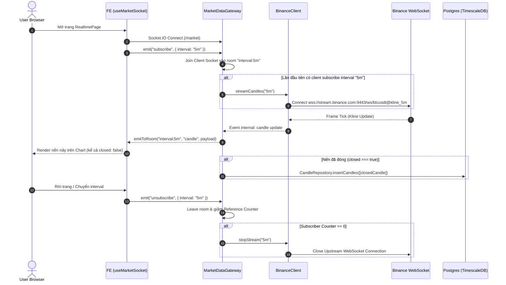
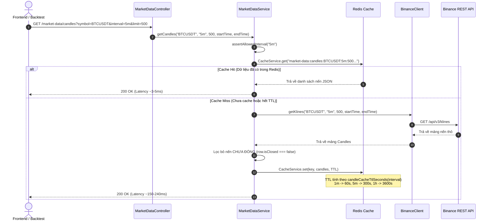
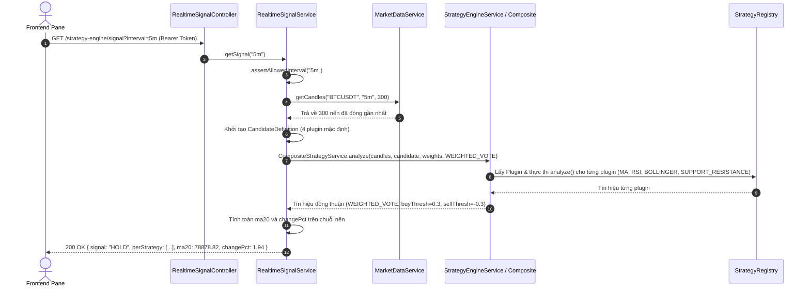

# Phân Tích Kiến Trúc & Cách Hoạt Động Luồng Market-Realtime

> **Tài liệu tham chiếu trong dự án**:
> - [architecture-c4-level-3-market-realtime.puml](file:///home/van/dev/Architecture/crypto-strategy-lab/artifacts/architecture-c4-level-3-market-realtime.puml)
> - [architecture.md](file:///home/van/dev/Architecture/crypto-strategy-lab/artifacts/architecture.md)
> - [api-contract.md](file:///home/van/dev/Architecture/crypto-strategy-lab/artifacts/api-contract.md)
> - [cache.md](file:///home/van/dev/Architecture/crypto-strategy-lab/artifacts/cache.md)
> - [event-catalog.md](file:///home/van/dev/Architecture/crypto-strategy-lab/artifacts/event-catalog.md)

---

## 1. Tổng Quan Luồng Market-Realtime

Luồng **Market-Realtime** đóng vai trò là xương sống phục vụ trải nghiệm thời gian thực cho người dùng trên giao diện ứng dụng (`RealtimePage`). Luồng này đảm nhận 3 nhiệm vụ chính:

1. **Streaming Dữ Liệu Nến (Candle) và Khớp Lệnh (Tick/Trade)** thời gian thực từ sàn Binance tới Frontend qua kết nối WebSocket hai chiều (Socket.IO).
2. **Tính Toán Tín Hiệu Giao Dịch Thời Gian Thực (Realtime Strategy Signal)** trực tiếp tại Backend thông qua Strategy Engine Module & Registry Plugin, loại bỏ hoàn toàn việc Frontend tự tính toán hoặc đoán tín hiệu BUY/SELL.
3. **Quản Lý & Phục Vụ Nến Lịch Sử (Historical Candles)** qua REST API với mô hình Caching tối ưu (Cache-Aside Pattern) kết hợp cơ sở dữ liệu chuỗi thời gian PostgreSQL + TimescaleDB.

---

## 2. Sơ Đồ Kiến Trúc Hệ Thống (C4 Level 3 — Market Realtime)

```
┌──────────────────────────────────────────────────────────────────────────────────────────────────┐
│                                    FRONTEND (React 19 + Vite)                                    │
│                                                                                                  │
│  ┌────────────────────────────────────────────────────────────────────────────────────────────┐  │
│  │ RealtimePage (4 pane chart 1m/5m/15m/1h/4h)                                                │  │
│  └─────────────┬────────────────────────────────┬────────────────────────────┬────────────────┘  │
│                │                                │                            │                   │
│                ▼                                ▼                            ▼                   │
│      hooks/useMarketSocket           hooks/useStrategySignal             api/client.ts               │
│                │                                │                            │                   │
│                ▼                                │                            │                   │
│      lib/marketSocket.ts                        │                            │                   │
│     (socket.io-client)                          │                            │                   │
└────────────────┬────────────────────────────────┼────────────────────────────┼───────────────────┘
                 │ (WebSocket /market)            │ (GET /strategy-engine/...) │ (REST GET/POST)
                 ▼                                ▼                            ▼
┌──────────────────────────────────────────────────────────────────────────────────────────────────┐
│                                      BACKEND (NestJS Monolith)                                   │
│                                                                                                  │
│  ┌────────────────────────────────────────────────────────┐  ┌─────────────────────────────────┐  │
│  │                  Market Data Module                    │  │     Realtime Signal Module      │  │
│  │                                                        │  │                                 │  │
│  │  ┌──────────────────────┐    ┌──────────────────────┐  │  │  ┌───────────────────────────┐  │  │
│  │  │ MarketDataController │    │  MarketDataGateway   │  │  │  │ RealtimeSignalController  │  │  │
│  │  │ (/market-data/...)   │    │  (Socket.IO /market) │──┼──┼─▶│ (/strategy-engine/signal) │  │  │
│  │  └──────────┬───────────┘    └──────────┬───────────┘  │  │  └─────────────┬─────────────┘  │  │
│  │             │                           │              │  │                │                │  │
│  │             ▼                           ▼              │  │                ▼                │  │
│  │  ┌──────────────────────┐    ┌──────────────────────┐  │  │  ┌───────────────────────────┐  │  │
│  │  │  MarketDataService   │    │    BinanceClient     │  │  │  │   RealtimeSignalService   │  │  │
│  │  └──────────┬───────────┘    └──────────┬───────────┘  │  │  └─────────────┬─────────────┘  │  │
│  │             │                           │              │  │                │                │  │
│  │             ▼                           │              │  │                ▼                │  │
│  │  ┌──────────────────────┐               │              │  │  ┌───────────────────────────┐  │  │
│  │  │   CandleRepository   │◀──────────────┘              │  │  │  StrategyEngineService    │  │  │
│  │  └──────────┬───────────┘                              │  │  └─────────────┬─────────────┘  │  │
│  │             │                                          │  │                │                │  │
│  │             │                                          │  │                ▼                │  │
│  │             │                                          │  │  ┌───────────────────────────┐  │  │
│  │             │                                          │  │  │     StrategyRegistry      │  │  │
│  │             │                                          │  │  └─────────────┬─────────────┘  │  │
│  │             │                                          │  │                │                │  │
│  │             │                                          │  │                ▼                │  │
│  │             │                                          │  │  ┌───────────────────────────┐  │  │
│  │             │                                          │  │  │  Plugins (MA, RSI, etc.)  │  │  │
│  │             │                                          │  │  └───────────────────────────┘  │  │
│  └─────────────┼──────────────────────────────────────────┘  └─────────────────────────────────┘  │
│                │                                                                                 │
│  ┌─────────────▼───────────┐                                                                     │
│  │      CacheService       │ (@Global Module)                                                    │
│  └─────────────┬───────────┘                                                                     │
└────────────────┼─────────────────────────────────────────────────────────────────────────────────┘
                 │
                 ▼
┌──────────────────────────────────────────────────────────────────────────────────────────────────┐
│                                     INFRASTRUCTURE & EXTERNAL                                    │
│                                                                                                  │
│   ┌──────────────────────────┐   ┌──────────────────────────┐   ┌─────────────────────────────┐  │
│   │  PostgreSQL + Timescale  │   │       Redis Cache        │   │    Binance REST + WS API    │  │
│   │   (candles hypertable)   │   │  (market-data:candles)   │   │  (stream.binance.com:9443)   │  │
│   └──────────────────────────┘   └──────────────────────────┘   └─────────────────────────────┘  │
└──────────────────────────────────────────────────────────────────────────────────────────────────┘
```

---

## 3. Phân Tích Chi Tiết Thành Phần Các Module (Component Breakdown)

### 3.1. Frontend Layer (`web-platform`)
- **`RealtimePage`**: Giao diện hiển thị đồng thời 4 pane biểu đồ tương ứng với 4 khung thời gian (`1m`, `5m`, `15m`, `1h`, `4h`).
- **`hooks/useMarketSocket`**: Custom Hook chịu trách nhiệm kết nối Socket.IO namespace `/market`. Quản lý lifecycle đăng ký/hủy đăng ký (subscribe/unsubscribe) theo khung thời gian của pane.
- **`lib/marketSocket.ts`**: Client Socket.IO Singleton kết nối tới WebSocket server Backend.
- **`hooks/useStrategySignal`**: Hook fetch tín hiệu giao dịch thời gian thực theo khung thời gian từ API REST `/strategy-engine/signal`.
- **`api/client.ts`**: Client REST dùng để tải nến lịch sử hoặc nạp nến mới.

### 3.2. Backend Market Data Module (`modules/market-data`)
- **`MarketDataController`**: 
  - `GET /market-data/candles`: Lấy mảng nến lịch sử (truy vấn Binance, qua Redis Cache).
  - `POST /market-data/import`: Tải nến từ Binance và ghi persistent xuống PostgreSQL.
- **`MarketDataService`**: Quản lý nghiệp vụ nến lịch sử. Áp dụng mô hình **Cache-Aside Pattern** dùng Redis. Validate khung thời gian qua `assertAllowedInterval`.
- **`MarketDataGateway`**: Gateway WebSocket Socket.IO (namespace `/market`). Phân phối room (`interval:<value>`, `trades`) cho các client Socket.IO.
- **`BinanceClient`**: Đảm nhiệm kết nối ra ngoài (upstream) tới Binance REST API (`/api/v3/klines`) và WebSocket stream (`wss://stream.binance.com:9443/ws/...`). Cấu hình tự động kết nối lại (Exponential Backoff Reconnect).
- **`CandleRepository`**: Persistence layer thao tác với PostgreSQL + TimescaleDB hypertable (`candles`).
- **`config.ts`**: Chứa danh sách khung thời gian được phép duy nhất (`ALLOWED_INTERVALS`: `1m`, `5m`, `15m`, `1h`, `4h`).

### 3.3. Backend Realtime Signal Module (`modules/strategy-engine`)
- **`RealtimeSignalController`**: REST endpoint `GET /strategy-engine/signal?interval=...` (yêu cầu JWT token).
- **`RealtimeSignalService`**:
  1. Lấy tối đa 300 nến đã đóng gần nhất từ `MarketDataService`.
  2. Tạo bộ cấu hình `CandidateDefinition` mặc định gồm 4 Plugin (`MA`, `RSI`, `BOLLINGER`, `SUPPORT_RESISTANCE`).
  3. Kích hoạt `CompositeStrategyService.analyze()` để tính tín hiệu đồng thuận theo phương pháp **WEIGHTED_VOTE** với ngưỡng buy `0.3`, sell `-0.3`.
  4. Tính toán chỉ số phụ server-side (`ma20`, `changePct`).
- **`StrategyEngineService` & `StrategyRegistry`**: Đăng ký và ủy quyền phân tích cho các strategy plugin theo Registry Pattern.

---

## 4. Chi Tiết Các Luồng Dữ Liệu & Cách Hoạt Động

### 4.1. Luồng Push Nến & Tick Realtime (WebSocket Stream)



#### Các cơ chế nổi bật:
1. **Single Upstream Connection per Interval (Multiplexing)**: Nhiều client cùng xem khung `5m` chỉ mở **một** kết nối WebSocket duy nhất từ Backend lên Binance. Backend phân phối lại qua các room Socket.IO.
2. **Reference-Counted Teardown**: Khi client disconnect hoặc `unsubscribe`, gateway giảm counter subscriber. Nếu counter = 0, Backend ngắt ngay lập tức WebSocket upstream tới Binance để giải phóng tài nguyên.
3. **Phân biệt Nến Chưa Đóng (`closed: false`) và Nến Đã Đóng (`closed: true`)**:
   - Nến dở dang (`closed: false`) vẫn được push lên Frontend để vẽ animation nảy giá.
   - **Chỉ nến `closed: true` mới được ghi vào Postgres/TimescaleDB** nhằm bảo vệ dữ liệu lịch sử chuẩn xác cho Backtest.
4. **Exponential Backoff Reconnect**: Tự động kết nối lại khi Binance rớt mạng với backoff từ `1s` đến max `30s`.

---

### 4.2. Luồng Trích Xuất Nến Lịch Sử & Cache-Aside Pattern



#### Nguyên tắc Bất Biến (Invariant) của Historical Endpoint:
- **Loại bỏ nến chưa đóng (`isClosed === false`)**: Phần tử cuối trang Binance trả về là cây nến chưa đóng. Endpoint lịch sử chủ động cắt bỏ nến này để đảm bảo *"Mọi nến trả về từ Historical API đều đã đóng"*.
- **Fail-Fast Redis Cache**: Cấu hình `enableOfflineQueue: false` giúp `CacheService` fail ngay nếu Redis rớt, chuyển sang đọc trực tiếp Binance mà không làm treo request HTTP.
- **TTL Cache Động**: TTL đặt bằng đúng độ dài interval (`1m` -> 60s, `5m` -> 300s, `1h` -> 3600s), tự hết hạn khi nến tiếp theo đóng.

---

### 4.3. Luồng Tính Tín Hiệu Realtime (Realtime Strategy Signal)



#### Điểm sáng kiến trúc:
- **Single Source of Truth**: Loại bỏ logic tự tính chỉ báo ở Frontend (`RealtimePage.tsx`). Mọi kết quả tín hiệu realtime dùng chung `StrategyEngineService` và `StrategyRegistry` với Backtest & Search Engine.
- **Weighted Vote Consensus**: Kết hợp đồng thuận 4 Plugin với trọng số cân bằng và ngưỡng `0.3` (BUY) / `-0.3` (SELL).

---

## 5. Danh Sách API & WebSocket Contracts

### 5.1. REST API Contracts

| Endpoint | Method | Path | Auth | Mô tả |
|---|---|---|---|---|
| Historical Candles | `GET` | `/market-data/candles` | Nợ Tech | Lấy nến đã đóng từ Binance (có Redis Cache & startTime/endTime). |
| Import Candles | `POST` | `/market-data/import` | Nợ Tech | Nạp nến từ Binance ghi xuống PostgreSQL TimescaleDB. |
| Realtime Signal | `GET` | `/strategy-engine/signal` | JWT `Bearer` | Lấy tín hiệu giao dịch thời gian thực (BUY/SELL/HOLD) từ Strategy Engine. |

### 5.2. WebSocket Contracts (Namespace `/market`)

#### Events từ Client -> Server:
- `subscribe`: `{ "interval": "1m" | "5m" | "15m" | "1h" | "4h" }`
- `unsubscribe`: `{ "interval": "..." }`
- `subscribeTrades`: *(không payload)*
- `unsubscribeTrades`: *(không payload)*

#### Events từ Server -> Client:
- `candle`: `{ interval, timestamp, open, high, low, close, volume, closed }`
- `trade`: `{ tradeId, timestamp, price, quantity, buyerIsMaker }`
- `status`: `{ connected, interval, lastMessageAt }`
- `error`: `{ message }`

---

## 6. Mô Hình Lưu Trữ & Hạ Tầng

- **TimescaleDB Hypertable (`candles`)**: Primary Key `(timeframe, timestamp)`. Chỉ upsert các nến đã đóng (`closed === true`).
- **Redis Cache**: Key `market-data:candles:{symbol}:{interval}:{limit}` với TTL tự nhiên theo khung thời gian.

---

## 7. Nợ Kỹ Thuật & Rào Cản An Toàn (Tech Debts & Safeguards)

1. **Authentication**: `/market-data/candles`, `/market-data/import` và WebSocket `/market` chưa có JWT Guard (cần bổ sung).
2. **Safeguard Nến Chưa Đóng**: Ngăn tuyệt đối nến chưa đóng đi vào DB hoặc Historical API.
3. **Safeguard Leak Connection**: Reference counter đóng upstream ngay khi 0 subscriber.
