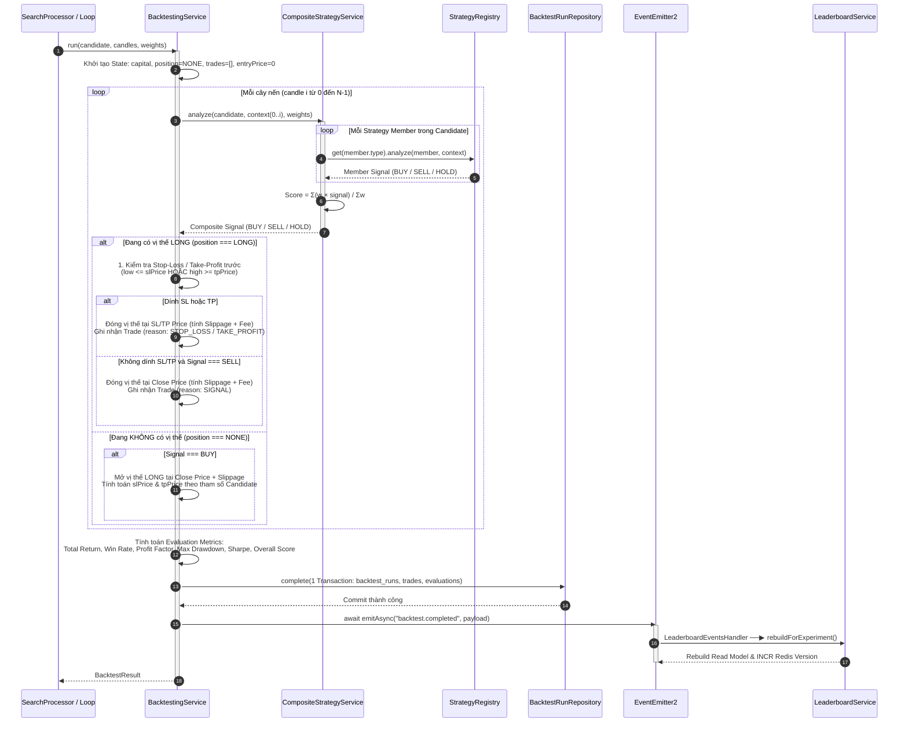

# Phân Tích Kiến Trúc & Cách Hoạt Động Luồng Backtest Engine

> **Tài liệu tham chiếu trong dự án**:
> - [architecture-c4-level-3-backtest.puml](file:///home/van/dev/Architecture/crypto-strategy-lab/artifacts/architecture-c4-level-3-backtest.puml)
> - [architecture-flow-search-backtest.puml](file:///home/van/dev/Architecture/crypto-strategy-lab/artifacts/architecture-flow-search-backtest.puml)
> - [architecture.md](file:///home/van/dev/Architecture/crypto-strategy-lab/artifacts/architecture.md)
> - [cqrs.md](file:///home/van/dev/Architecture/crypto-strategy-lab/artifacts/cqrs.md)
> - [database.md](file:///home/van/dev/Architecture/crypto-strategy-lab/artifacts/database.md)
> - [decisions.md](file:///home/van/dev/Architecture/crypto-strategy-lab/artifacts/decisions.md)
> - [event-catalog.md](file:///home/van/dev/Architecture/crypto-strategy-lab/artifacts/event-catalog.md)

---

## 1. Tổng Quan Luồng Backtest Engine

**Backtest Engine** là trái tim mô phỏng chiến thuật của hệ thống `crypto-strategy-lab`. Engine chịu trách nhiệm thực thi các phép kiểm thử giả lập trên chuỗi dữ liệu nến lịch sử (Candlesticks) nhằm đánh giá hiệu năng giao dịch của một tổ hợp chiến thuật (Candidate).

### Nhiệm vụ cốt lõi:
1. **Mô phỏng khớp lệnh từng cây nến (Candle-by-Candle Simulation)**: Duyệt qua chuỗi nến lịch sử theo thứ tự thời gian, đánh giá tín hiệu giao dịch từ Strategy Engine tại từng thời điểm.
2. **Tính toán thực tế (Realism Requirements)**: Tính toán đầy đủ chi phí giao dịch (Maker/Taker Fee), độ trượt giá (Slippage), và các quy tắc quản trị rủi ro như Cắt lỗ (Stop-Loss - SL) / Chốt lời (Take-Profit - TP).
3. **Đo đạc chỉ số (Performance Evaluation)**: Tính toán tập chỉ số hiệu năng đa mục tiêu (Total Return, Win Rate, Max Drawdown, Profit Factor, Sharpe Ratio, Overall Score).
4. **Lưu trữ kiểm chứng (Provenance & Immutability)**: Ghi lại toàn bộ lịch sử lệnh khớp (`trades`) và đánh giá (`evaluations`) vào PostgreSQL dưới dạng immutable records, đảm bảo khả năng tái lập và kiểm chứng kết quả.

---

## 2. Sơ Đồ Kiến Trúc Hệ Thống (C4 Level 3 — Backtest Engine)

```
┌──────────────────────────────────────────────────────────────────────────────────────────────────┐
│                                    FRONTEND (React 19 + Vite)                                    │
│                                                                                                  │
│  ┌────────────────────────────────────────────────────────────────────────────────────────────┐  │
│  │ BacktestPage / StrategyEnginePage (WeightedVotingTable, ParameterPanel, ConfirmRerunDialog)│  │
│  └─────────────┬─────────────────────────────────────────────────┬────────────────────────────┘  │
│                │                                                 │                               │
│                ▼                                                 ▼                               │
│      hooks/useExperiment / useTopCandidates             hooks/useCandidateDetail                 │
│                │                                                 │                               │
│                └────────────────────────────────┬────────────────┘                               │
│                                                 │                                                │
│                                                 ▼                                                │
│                                        api/client.ts                                             │
└─────────────────────────────────────────────────┬────────────────────────────────────────────────┘
                                                  │ (HTTP POST/GET)
                                                  ▼
┌──────────────────────────────────────────────────────────────────────────────────────────────────┐
│                                      BACKEND (NestJS Monolith)                                   │
│                                                                                                  │
│  ┌────────────────────────────────────────────────────────────────────────────────────────────┐  │
│  │ Strategy Search Module                                                                     │  │
│  │  StrategySearchController ──▶ StrategySearchService ──▶ SearchQueueService (BullMQ)         │  │
│  │                                 │ (chạy trong Worker)                                      │  │
│  └─────────────────────────────────┼──────────────────────────────────────────────────────────┘  │
│                                    │                                                             │
│                                    ▼                                                             │
│  ┌────────────────────────────────────────────────────────────────────────────────────────────┐  │
│  │ Backtesting Module                                                                         │  │
│  │                                                                                            │  │
│  │  ┌──────────────────────────────────────────────────────────────────────────────────────┐  │  │
│  │  │ BacktestingService.run(candidate, candles, weights)                                    │  │  │
│  │  │  • Giả lập nến (Candle Loop)   • Phí & Slippage   • SL/TP   • Trades & Metrics           │  │  │
│  │  └──────────┬──────────────────────────────────────────────────┬────────────────────────┘  │  │
│  │             │                                                  │                           │  │
│  │             ▼                                                  ▼                           │  │
│  │  ┌─────────────────────────────┐                    ┌───────────────────────────────────┐  │  │
│  │  │ Strategy Engine / Registry  │                    │      BacktestRunRepository        │  │  │
│  │  │  • CompositeStrategyService │                    │ (1 Transaction: runs, trades,     │  │  │
│  │  │  • StrategyRegistry (Plugins)│                    │  evaluations)                     │  │  │
│  │  └─────────────────────────────┘                    └──────────────────┬────────────────┘  │  │
│  └────────────────────────────────────────────────────────────────────────┼───────────────────┘  │
│                                                                           │                      │
│                                                                           ▼                      │
│  ┌─────────────────────────────┐                      ┌───────────────────────────────────────┐  │
│  │ Domain Events               │                      │ Database Module                       │  │
│  │  EventEmitter2 (In-Process) │                      │  DatabaseService (raw pg.Pool)        │  │
│  │  backtest.completed         │                      └──────────────────┬────────────────────┘  │
│  └─────────────┬───────────────┘                                         │                       │
└────────────────┼─────────────────────────────────────────────────────────┼───────────────────────┘
                 │ (In-Process Event)                                      │
                 ▼                                                         │
┌──────────────────────────────────────────────────────────┐               │
│ Leaderboard Module                                       │               │
│  LeaderboardEventsHandler ──▶ LeaderboardService.rebuild │               │
└────────────────┬─────────────────────────┬───────────────┘               │
                 │                         │                               │
                 │ (Bump Version)          │ (Write Read Model)            │
                 ▼                         ▼                               ▼
┌──────────────────────────────────────────────────────────────────────────────────────────────────┐
│                                     INFRASTRUCTURE & DATABASE                                    │
│                                                                                                  │
│   ┌──────────────────────────┐   ┌──────────────────────────┐   ┌─────────────────────────────┐  │
│   │   Redis Cache / Queue    │   │ PostgreSQL + TimescaleDB │   │    Python AI Worker Process   │  │
│   │ (leaderboard:version)    │   │ (backtest_runs, trades)  │   │  (Whole-series execution)   │  │
│   └──────────────────────────┘   └──────────────────────────┘   └─────────────────────────────┘  │
└──────────────────────────────────────────────────────────────────────────────────────────────────┘
```

---

## 3. Phân Tích Chi Tiết Các Module Thành Phần

### 3.1. Strategy Search Module (`modules/strategy-search`)
- **`StrategySearchController`**: Phục vụ các endpoint khởi tạo experiment (`POST /strategy-search/experiments`), xem tiến độ (`GET /experiments/:id`), xem Top-K candidate (`GET /experiments/:id/top`), và chi tiết candidate (`GET /candidates/:id`).
- **`StrategySearchService`**: Nhạc trưởng điều phối. Khi nhận lệnh chạy, dịch vụ khởi tạo Experiment và đẩy Job vào BullMQ (`SearchQueueService`). 
- **`SearchProcessor` (Worker Process)**: Tiến trình Worker chạy `StrategySearchService.run(experimentId)` độc lập với API Process. Mỗi vòng lặp (iteration):
  1. `DomainGuidedRandomGenerator` sinh ra 1 Candidate ngẫu nhiên thỏa mãn tham sốcatalog.
  2. `CandidateFingerprintService` tính toán mã băm SHA256 (fingerprint) để chống trùng lặp candidate.
  3. Gọi `BacktestingService.run(...)` để thực thi mô phỏng.

### 3.2. Backtesting Module (`modules/backtesting`)
- **`BacktestingService`**: Module trung tâm xử lý mô phỏng backtest với hàm duy nhất `run(candidate, candles, weights)`:
  - Duyệt mảng nến theo thứ tự thời gian.
  - Phân tích tín hiệu từng nến qua `CompositeStrategyService`.
  - Giả lập vào/ra lệnh, kiểm tra SL/TP, tính toán phí và trượt giá.
  - Tổng hợp chỉ số hiệu năng (`evaluations`).
- **`BacktestRunRepository`**: Ghi toàn bộ dữ liệu lượt chạy gồm 3 bảng `backtest_runs`, `trades`, `evaluations` trong **đúng 1 DB Transaction duy nhất**. Đảm bảo tính toàn vẹn dữ liệu: hoặc lưu đầy đủ kết quả, hoặc rollback hoàn toàn nếu lỗi.

### 3.3. Strategy Engine & Plugin Registry (`modules/strategy-engine` & `strategy-plugin`)
- **`CompositeStrategyService`**: Tính toán tín hiệu tổng hợp theo công thức Weighted Voting:
  $$\text{Score} = \frac{\sum (w_i \times \text{signal}_i)}{\sum w_i}$$
  So sánh `Score` với `buyThreshold` / `sellThreshold` để đưa ra quyết định mở/đóng vị thế (`BUY`, `SELL`, `HOLD`).
- **`StrategyEngineService` & `StrategyRegistry`**: Áp dụng Plugin Registry Pattern (Open/Closed Principle). `StrategyEngineService` không chứa logic tính chỉ báo kỹ thuật mà ủy quyền trực tiếp cho từng Plugin đăng ký trong Registry (`MA`, `RSI`, `BOLLINGER`, `SUPPORT_RESISTANCE`, `AiStrategyPluginAdapter`).

### 3.4. AI Strategy Module (`modules/ai-strategy`)
- **`AiStrategySignalPrecomputeService`**: Xử lý các chiến thuật AI viết bằng Python. Áp dụng cơ chế **Whole-Series Execution**:
  - Không gọi Python subprocess trên từng cây nến (tránh chi phí spawn process $O(N)$ lần).
  - Truyền toàn bộ chuỗi nến sang Python worker 1 lần duy nhất trước khi backtest bắt đầu, thu về mảng tín hiệu `signals[]`.
  - Trong quá trình duyệt nến của BacktestingService, `AiStrategyPluginAdapter` chỉ việc tra cứu phần tử tương ứng trong mảng với độ phức tạp $O(1)$.

### 3.5. Leaderboard Module & Domain Events (`modules/leaderboard` & `@nestjs/event-emitter`)
- Sau khi `BacktestingService` hoàn tất 1 lượt chạy và ghi DB thành công, nó phát sự kiện `await emitAsync("backtest.completed")`.
- **`LeaderboardEventsHandler`** nhận sự kiện và kích hoạt `LeaderboardService.rebuildForExperiment()`.
- `LeaderboardService` tính toán lại danh sách Top-K, ghi xuống read model `leaderboard_entries`, và thực hiện tăng số phiên bản `INCR leaderboard:version:<expId>` trên Redis để vô hiệu hóa cache phía API (Tactical CQRS).

---

## 4. Chi Tiết Luồng Thực Thi Mô Phỏng (Backtest Simulation Engine Logic)



### Chi Tiết Thuật Toán Trong Vòng Lặp Nến (`Candle Loop`):

1. **Quản Lý Vị Thế & Thứ Tự Ưu Tiên Thao Tác (Execution Order)**:
   Tại mỗi cây nến, Backtest Engine thực hiện kiểm tra theo đúng thứ tự ưu tiên nhằm đảm bảo tính chính xác so với giao dịch thực tế:
   - **Ưu tiên 1 — Cắt lỗ / Chốt lời (SL/TP Check)**: Nếu đang giữ vị thế LONG, engine kiểm tra giá thấp nhất nến (`low`) so với `slPrice` và giá cao nhất nến (`high`) so me `tpPrice`. Nếu vi phạm, vị thế bị đóng ngay lập tức ở mức giá chỉ định (kèm trượt giá).
   - **Ưu tiên 2 — Tín hiệu thoát lệnh (Signal Exit)**: Nếu không dính SL/TP nhưng tín hiệu tổng hợp chuyển thành `SELL`, lệnh được đóng ở giá đóng cửa (`close`) của nến hiện tại.
   - **Ưu tiên 3 — Mở vị thế mới (Signal Entry)**: Nếu chưa có vị thế và tín hiệu tổng hợp là `BUY`, lệnh LONG được kích hoạt ở giá `close` cộng trượt giá (Slippage).

2. **Chi Phí Giao Dịch & Trượt Giá (Fee & Slippage Model)**:
   - **Phí giao dịch (`feeRate`)**: Áp dụng trên giá trị giao dịch cả khi khớp lệnh vào (Entry) và ra (Exit).
     $$\text{Fee} = \text{Price} \times \text{Quantity} \times \text{feeRate}$$
   - **Độ trượt giá (`slippageRate`)**: Giá vào lệnh thực tế sẽ bất lợi hơn giá lý thuyết:
     $$\text{Entry Price} = \text{Close Price} \times (1 + \text{slippageRate})$$
     $$\text{Exit Price} = \text{Close Price} \times (1 - \text{slippageRate})$$

3. **Công Thức Đánh Giá Hiệu Năng (Evaluation Metrics)**:
   - **Total Return (%)**: $\frac{\text{Vốn Cuối} - \text{Vốn Đầu}}{\text{Vốn Đầu}} \times 100$
   - **Win Rate (%)**: $\frac{\text{Số Lệnh Thắng}}{\text{Tổng Số Lệnh}} \times 100$
   - **Profit Factor**: $\frac{\text{Tổng Lãi (Gross Profit)}}{\text{Tổng Lỗ (Gross Loss)}}$
   - **Max Drawdown (%)**: Phần trăm sụt giảm tài sản lớn nhất từ đỉnh (Peak-to-Trough).
   - **Overall Score**: Hàm fitness tổng hợp đa mục tiêu được dùng để xếp hạng Candidate trên Leaderboard.

---

## 5. Các Quyết Định Kiến Trúc Quan Trọng (Key Architectural Decisions - ADRs)

| Mã ADR | Tên Quyết Định | Nội Dung & Lý Do Kiến Trúc |
|---|---|---|
| **ADR-002** | **Runtime Weight Injection** | Weight (trọng số) là thuộc tính của Experiment Config, **không** nhúng vào Candidate Fingerprint. Giúp cùng 1 bộ tham số kỹ thuật không bị tạo duplicate candidate giữa các experiment khác weight. |
| **ADR-004** | **Whole-Series AI Execution** | Chạy Python worker 1 lần duy nhất cho toàn bộ mảng nến thay vì spawn process theo từng nến. Giảm chi phí giao tiếp IPC từ $O(N)$ xuống $O(1)$. |
| **ADR-005** | **Tactical CQRS cho Leaderboard** | Tách riêng đường ghi (Worker rebuild `leaderboard_entries`) và đường đọc (API query read model). Vô hiệu hóa cache cross-process qua Redis Version Counter (`leaderboard:version:<id>`). |
| **Event-Driven Decoupling** | **Search ⇄ Leaderboard Decoupling** | Module Search không phụ thuộc trực tiếp vào `LeaderboardService`. Search chỉ phát event `backtest.completed` qua `EventEmitter2`, `LeaderboardEventsHandler` độc lập lắng nghe và xử lý. |

---

## 6. Sơ Đồ Cơ Sở Dữ Liệu Liên Quan (Database Schema Relationships)

```
┌─────────────────┐       1:N       ┌──────────────────┐
│   experiments   │─────────────────▶  experiment_     │
└────────┬────────┘                 │  configs         │
         │                          └────────┬─────────┘
         │ 1:N                               │ 1:N
         ▼                                   ▼
┌─────────────────┐                 ┌──────────────────┐
│   experiment_   │                 │ experiment_config│
│   iterations    │                 │ _strategies      │ (Lưu Weight)
└────────┬────────┘                 └──────────────────┘
         │ 1:1
         ▼
┌─────────────────┐       1:N       ┌──────────────────┐
│   candidates    │─────────────────▶ candidate_       │ (Lưu tham số
└────────┬────────┘                 │ strategies       │  Strategy)
         │                          └──────────────────┘
         │ 1:N
         ▼
┌─────────────────┐       1:1       ┌──────────────────┐
│  backtest_runs  │─────────────────▶   evaluations    │ (Metrics: Return,
└────────┬────────┘                 └──────────────────┘  WinRate, Sharpe)
         │
         │ 1:N
         ▼
┌─────────────────┐
│     trades      │ (Chi tiết từng lệnh: entry, exit, pnl, exit_reason)
└─────────────────┘
```

---

## 7. Các Điểm Kiểm Thử & Đảm Bảo Chất Lượng (Verification Guardrails)

1. **Regression Guard Test**: Trong `service/src/modules/backtesting/backtesting.service.spec.ts`, test suite cố tình sử dụng **Strategy Registry thật và 4 Plugin thật** (không mock) để làm guardrail: mọi thay đổi refactor code nếu làm thay đổi dù chỉ 0.0001% kết quả số liệu backtest sẽ bị phát hiện ngay lập tức.
2. **Transactional Integrity**: Thao tác lưu kết quả `backtest_runs`, `trades` và `evaluations` được bọc trong 1 DB Transaction duy nhất. Ngăn ngừa tình trạng rác dữ liệu khi xảy ra sự cố sập nguồn giữa chừng.
3. **User Data Isolation Guard**: Tất cả query đọc kết quả Candidate hoặc Trade detail đều được nối cứng điều kiện `WHERE e.user_id = $userId` trực tiếp trong SQL, ngăn chặn triệt để lỗ hổng rò rỉ dữ liệu giữa các tài khoản khác nhau.
