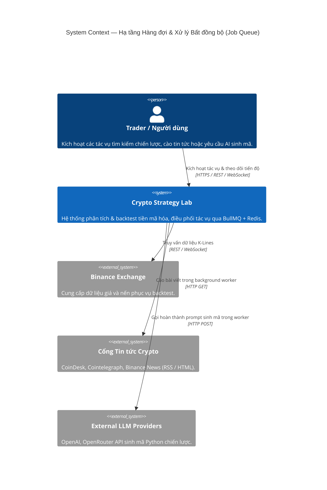
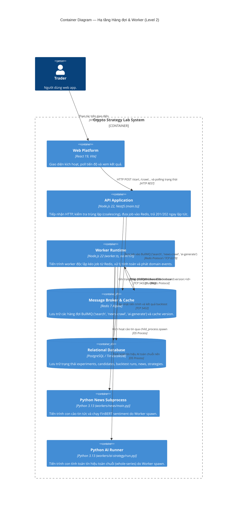

# Phân Tích Kiến Trúc & Cách Hoạt Động Hạ Tầng Job Queue & Worker

> **Tài liệu tham chiếu trong dự án**:
> - [01-repository-architecture-evidence.md](file:///home/ltp/Code/Course/Software_Architecture/Project/crypto-strategy-lab/temp/01-repository-architecture-evidence.md)
> - [03-strategy-search-queue-worker-analysis.md](file:///home/ltp/Code/Course/Software_Architecture/Project/crypto-strategy-lab/temp/03-strategy-search-queue-worker-analysis.md)
> - [report-job-queue.md](file:///home/ltp/Code/Course/Software_Architecture/Project/crypto-strategy-lab/temp/report-job-queue.md)
> - [architecture-c4-component-strategy-search-queue.puml](file:///home/ltp/Code/Course/Software_Architecture/Project/crypto-strategy-lab/temp/architecture-c4-component-strategy-search-queue.puml)
> - [flow-strategy-search-queue-worker.puml](file:///home/ltp/Code/Course/Software_Architecture/Project/crypto-strategy-lab/temp/flow-strategy-search-queue-worker.puml)

---

## 1. Tổng Quan Hạ Tầng Job Queue

**Job Queue & Worker Infrastructure** trong hệ thống `crypto-strategy-lab` **không phải là một business domain module riêng biệt**, mà là một **hạ tầng kiến trúc dùng chung (Shared Architectural Infrastructure)**. Hạ tầng này dựa trên **BullMQ** và **Redis 7**, chịu trách nhiệm tách rời việc tiếp nhận yêu cầu HTTP đồng bộ từ người dùng khỏi các tác vụ tính toán chuyên sâu (CPU-intensive) hoặc phụ thuộc mạng ngoài có độ trễ lớn (I/O-intensive).

### 1.1. Vì sao hệ thống cần Hàng đợi ("Từ for-loop sang Queue + Worker")
Trong các phiên bản thử nghiệm ban đầu, các tác vụ tính toán (như tìm kiếm tổ hợp chiến lược, cào tin tức, gọi LLM) chạy tuần tự ngay trong luồng xử lý HTTP request của Node.js:
1. **HTTP Timeouts**: Trình duyệt hoặc reverse proxy (Nginx/Cloudflare) tự động ngắt kết nối sau 30–60 giây đối với các lượt tìm kiếm kéo dài hàng chục phút.
2. **Nghẽn luồng sự kiện (Event Loop Starvation)**: Việc chạy vòng lặp tính toán nến trên tiến trình chính khiến toàn bộ API và kết nối WebSocket trực tiếp (Real-time Market Ticks) bị tê liệt.
3. **Không có khả năng phục hồi khi sập tiến trình (Zero Crash Recovery)**: Nếu tiến trình gặp sự cố (OOM), toàn bộ dữ liệu và tiến độ của đợt thử nghiệm bị mất hoàn toàn.
4. **Không thể mở rộng ngang (Lack of Horizontal Scalability)**: Không thể phân tải công việc sang nhiều container worker độc lập.

### 1.2. Ranh giới & Cơ chế cách ly
Hệ thống giải quyết triệt để vấn đề trên bằng cách phân tách thành 2 tiến trình Node.js riêng biệt:
- **API Process (`main.ts` / `AppModule`)**: Đóng vai trò **Producer**, chỉ tiếp nhận HTTP, ghi nhận bản ghi khởi tạo `PENDING` vào database, đẩy job vào Redis và trả ngay HTTP 201/202 (thời gian phản hồi < 50ms).
- **Worker Process (`worker.ts` / `WorkerModule`)**: Đóng vai trò **Consumer**, chạy độc lập, **không mở cổng HTTP** (ngoại trừ cổng metrics nội bộ 9102), kéo job từ Redis và thực thi logic tính toán nặng.

---

## 2. Sơ Đồ Kiến Trúc Hệ Thống (C4 Level 1 → Level 3)

### 2.1. C4 Level 1 — System Context



### 2.2. C4 Level 2 — Container View



### 2.3. C4 Level 3 — Component Diagram

```mermaid
C4Component
    title Component Diagram — Phân hệ Hàng đợi & Worker (Level 3)

    Container_Boundary(api_zone, "API Process (service/src/modules)") {
        Component(sqs, "SearchQueueService", "BullMQ Producer", "Đẩy experimentId vào hàng đợi 'search', kiểm tra coalescing, cấu hình backoff.")
        Component(ncqs, "NewsCrawlQueueService", "BullMQ Producer", "Đẩy job cào tin vào 'news-crawl', chống trùng lặp job đang chạy.")
        Component(aiqs, "AiGenerateQueueService", "BullMQ Producer", "Đẩy prompt sinh mã vào 'ai-generate'.")
        Component(qhs, "QueueHealthService", "NestJS Service", "Truy vấn thống kê số lượng job (waiting, active, failed...) phục vụ /health/queue.")
    }

    Container_Boundary(redis_box, "Redis 7 (Broker & State)") {
        ComponentQueue(q_search, "Queue 'search'", "BullMQ Queue", "Hàng đợi tìm kiếm tổ hợp chiến lược & backtest.")
        ComponentQueue(q_news, "Queue 'news-crawl'", "BullMQ Queue", "Hàng đợi cào tin tức đa nguồn.")
        ComponentQueue(q_ai, "Queue 'ai-generate'", "BullMQ Queue", "Hàng đợi sinh mã chiến lược LLM bất đồng bộ.")
    }

    Container_Boundary(worker_zone, "Worker Process (service/src/worker.ts)") {
        Component(sp, "SearchProcessor", "BullMQ Consumer (concurrency: 5)", "Kéo job 'search', thiết lập AsyncLocalStorage correlationId, gọi StrategySearchService.run().")
        Component(ncp, "NewsCrawlProcessor", "BullMQ Consumer (concurrency: 1)", "Kéo job 'news-crawl', theo dõi cờ hủy cancelRequested, điều phối crawl.")
        Component(aip, "AiGenerateProcessor", "BullMQ Consumer (concurrency: 2)", "Kéo job 'ai-generate', gọi AiStrategyService để sinh mã từ LLM.")
        Component(sss, "StrategySearchService (Worker)", "Worker Execution Service", "Vòng lặp sinh candidate, fingerprinting SHA-256, chạy backtest và lưu DB.")
        Component(ncs, "NewsCrawlService", "Subprocess Launcher", "Spawn workers/news/main.py, giám sát timeout 10 phút, đọc JSON summary.")
        Component(evt, "EventEmitter2", "In-Process Event Bus", "Phát sự kiện BacktestCompleted nội bộ tiến trình sau mỗi candidate.")
        Component(leh, "LeaderboardEventsHandler", "Event Handler", "Tái xây dựng leaderboard_entries và tăng counter version trên Redis.")
    }

    ContainerDb(db, "PostgreSQL Database", "Tables: experiments, candidates, runs, news, strategies", "Lưu trữ dữ liệu nghiệp vụ.")

    Rel(sqs, q_search, "queue.add('run', data)", "Redis Protocol")
    Rel(ncqs, q_news, "queue.add('crawl', data)", "Redis Protocol")
    Rel(aiqs, q_ai, "queue.add('generate', data)", "Redis Protocol")

    Rel(q_search, sp, "Dispatch job", "BullMQ")
    Rel(q_news, ncp, "Dispatch job", "BullMQ")
    Rel(q_ai, aip, "Dispatch job", "BullMQ")

    Rel(sp, sss, "run(experimentId)", "Method Call")
    Rel(ncp, ncs, "execute(timeout)", "Method Call")

    Rel(sss, evt, "emitAsync(BacktestCompleted)", "In-process Event")
    Rel(evt, leh, "handle(event)", "Event Listener")
    Rel(leh, db, "rebuildLeaderboard()", "SQL Update")
    Rel(leh, redis_box, "INCR leaderboard:version:<id>", "Redis Protocol")
    Rel(sss, db, "Ghi candidates, backtest_runs", "SQL Insert")
    Rel(qhs, redis_box, "Kiểm tra số lượng job các trạng thái", "Redis API")
```

---

## 3. Phân Tích Chi Tiết Các Thành Phần

### 3.1. Bảng Thành phần (Component Inventory)

| Component | Trách nhiệm | Input | Output | Phụ thuộc |
| :--- | :--- | :--- | :--- | :--- |
| **SearchQueueService** | Producer hàng đợi tìm kiếm chiến lược | `experimentId`, `correlationId` | Đưa job vào queue `'search'`, trả về thể hiện `Job` | BullMQ `Queue`, Redis |
| **SearchProcessor** | Consumer xử lý tìm kiếm & backtest | Job data (`experimentId`, `correlationId`) | Điều phối vòng lặp search, cập nhật DB, ghi nhận metrics | `StrategySearchService`, BullMQ |
| **NewsCrawlQueueService** | Producer hàng đợi cào tin tức | Yêu cầu cào tin tức từ controller | Đưa job vào queue `'news-crawl'`, chống cào trùng lặp | BullMQ `Queue`, Redis |
| **NewsCrawlProcessor** | Consumer xử lý cào tin tức | Job data cào tin | Giám sát tiến trình Python cào tin, kiểm tra cờ hủy | `NewsCrawlService`, BullMQ |
| **AiGenerateQueueService** | Producer hàng đợi sinh mã AI | `userId`, `prompt`, tham số model | Đưa job vào queue `'ai-generate'` | BullMQ `Queue`, Redis |
| **AiGenerateProcessor** | Consumer xử lý sinh mã AI | Job data chứa prompt và userId | Đặt mã Python và kết quả kiểm duyệt vào returnvalue của job | `AiStrategyService`, BullMQ |
| **QueueHealthService** | Giám sát tình trạng sức khỏe hàng đợi | Yêu cầu probe từ route `/health/queue` | Báo cáo chi tiết số lượng job theo trạng thái | BullMQ Queue instances |

---

## 4. Các Loại Hàng Đợi & Đặc Tính Tải Công Việc

Các hằng số hàng đợi được khai báo tập trung trong `service/src/queue/queue.constants.ts`:

| Queue Name | Constant | Concurrency | Đặc điểm tải công việc (Workload) | Cơ chế thực thi |
| :--- | :--- | :--- | :--- | :--- |
| `"search"` | `SEARCH_QUEUE` | `5` | Tác vụ CPU-intensive nặng nhất: duyệt hàng trăm candidate, tính toán nến, đo lường PnL, Sharpe ratio, Max Drawdown. | Worker chạy vòng lặp sinh candidate, tạo SHA-256 fingerprint, gọi `BacktestingService`, phát domain event. |
| `"news-crawl"` | `NEWS_CRAWL_QUEUE` | `1` | Tác vụ mạng I/O và ML inference. Cần chạy tuần tự (`concurrency: 1`) để tránh bị chặn IP từ các nguồn tin. | Worker spawn tiến trình `workers/news/main.py`, kiểm tra cờ hủy mỗi 1s, hard timeout 10 phút. |
| `"ai-generate"` | `AI_GENERATE_QUEUE` | `2` | Tác vụ gọi LLM API ngoài (OpenAI/OpenRouter), thời gian chờ từ 10–90 giây. | Worker gọi LLM thông qua `LlmProviderFactory`, bọc contract prompt và kiểm duyệt AST. |

---

## 5. Vòng Đời Tác Vụ, Chống Trùng Lặp & Xử Lý Lỗi

### 5.1. Vòng đời của một Job (Job Lifecycle)
```
[WAITING] ──> [ACTIVE / RUNNING] ──┬──> [COMPLETED] ──> Tự động dọn dẹp (removeOnComplete: 50)
                                   │
                                   └──> [FAILED] ──> Thử lại theo Exponential Backoff (nếu còn lượt)
                                                      └── Hết lượt ──> Lưu vết lỗi vào DB & Redis
```

### 5.2. Chống trùng lặp (Idempotency & Coalescing)
- **Producer Coalescing**: Trước khi thêm job mới, các Producer quét danh sách job đang chờ (`waiting`) hoặc đang chạy (`active`). Nếu đã có job cùng tham số (cùng `experimentId` hoặc crawl đang chạy), Producer trả về `jobId` hiện tại thay vì đẩy thêm job mới.
- **Candidate Fingerprinting**: Trong quá trình search, `CandidateFingerprintService` chuẩn hóa thứ tự các tham số của candidate và băm thành chuỗi SHA-256. Nếu ứng viên bị trùng lặp trong vòng lặp, hệ thống bỏ qua bước backtest.

### 5.3. Chính sách Thử lại (Retry & Backoff Policy)
- **Hàng đợi Search**: Cấu hình `attempts: 3` kèm `backoff: { type: 'exponential', delay: 10000 }` (thử lại sau 10 giây và tăng dần theo hàm mũ).
- **Hàng đợi AI & News**: Cấu hình `attempts: 1`. Không tự động retry vì gọi lại LLM sẽ lãng phí token, còn lỗi cào tin nên để người dùng chủ động kích hoạt lại.
- **Dọn dẹp tự động**: Áp dụng `removeOnComplete: { count: 50 }` và `removeOnFail: { count: 50 }` để tránh làm phình bộ nhớ Redis.

---

## 6. Mối Quan Hệ Giữa Queue và Mô Hình Tactical CQRS

Job Queue đóng vai trò là xương sống kết nối giữa đường ghi (Command) và đường đọc (Query) của hệ thống:
1. Khi Worker thực thi xong một candidate trong vòng lặp search, nó lưu kết quả vào PostgreSQL và phát sự kiện nội bộ `BacktestCompleted` thông qua `EventEmitter2`.
2. `LeaderboardEventsHandler` độc lập lắng nghe sự kiện này, cập nhật bảng xếp hạng trong bảng `leaderboard_entries` và thực hiện lệnh Redis `INCR leaderboard:version:<experimentId>`.
3. Khi người dùng gửi request `GET /experiments/:id/top` tới tiến trình API, API chỉ việc đọc cache Redis. Nếu version trên Redis lớn hơn version trong cache của API, API sẽ truy vấn read model mới nhất từ DB, đảm bảo hiệu năng đọc cực nhanh mà không cần lock bảng.

---

## 7. Ghi Chú Kiến Trúc Thực Tế (Architectural Notes)

> [!NOTE]
> **Độ mịn của Job trên Hàng đợi (Queue Granularity - CON-001)**:  
> Về mặt lý thuyết, mỗi ứng viên chiến lược (candidate) có thể được xếp thành 1 job riêng trên hàng đợi để chia cho hàng trăm worker kéo song song. Tuy nhiên, kiến trúc thực tế (AS-IS) nhóm toàn bộ một đợt thử nghiệm (`experimentId`) thành **1 Job duy nhất**, và các candidate được duyệt tuần tự bên trong Worker.  
> **Lý do kiến trúc:**  
> 1. Tránh truyền tải hàng chục nghìn thanh nến qua Redis cho hàng nghìn job nhỏ (tránh nghẽn băng thông mạng của Redis).  
> 2. Cho phép tính toán trước tín hiệu AI và Sentiment (**Whole-Series Precomputation**) **đúng một lần duy nhất** cho toàn bộ đợt thử nghiệm, thay vì phải tính lại hoặc truyền tín hiệu qua mạng ở từng candidate.
