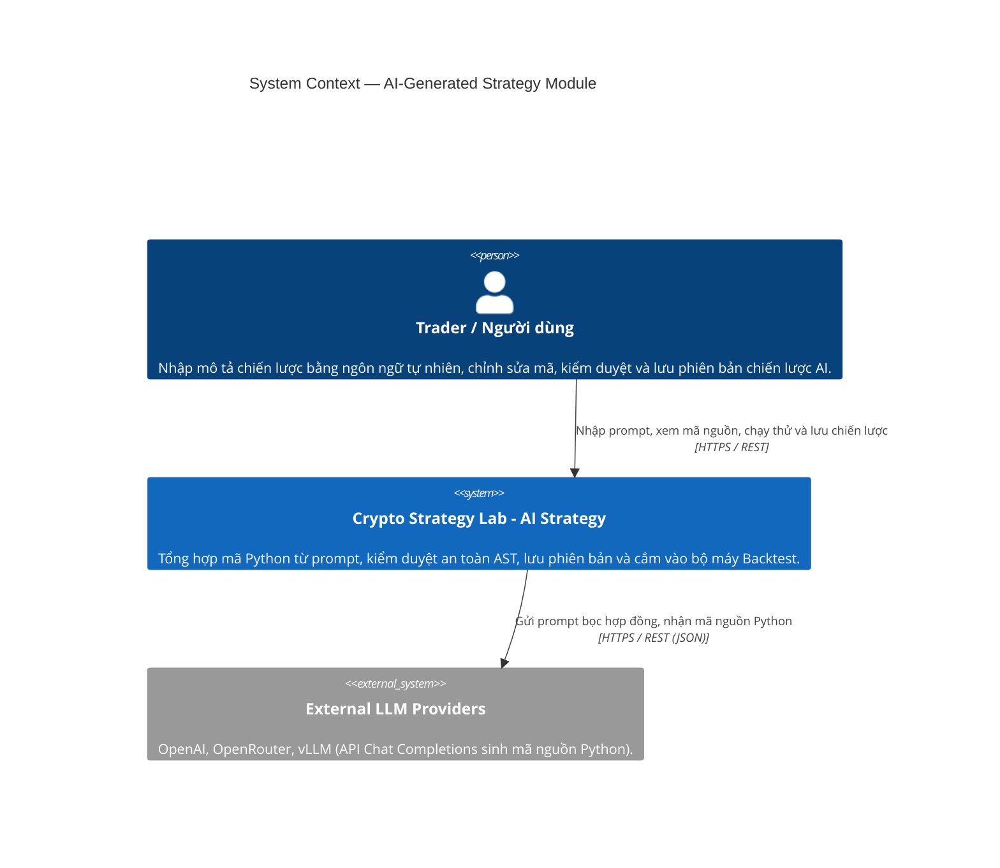
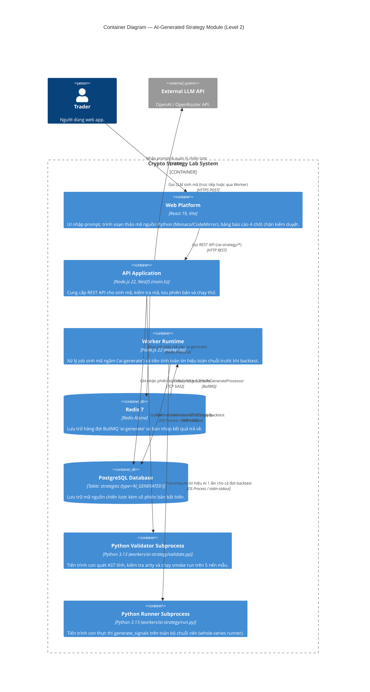
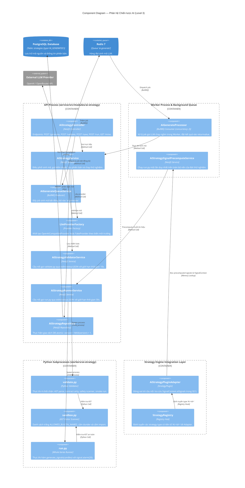
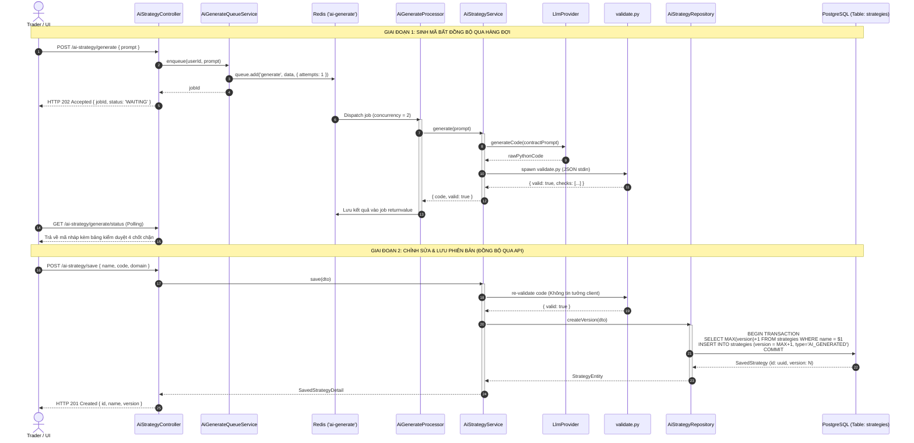

# Phân Tích Kiến Trúc & Cách Hoạt Động Phân Hệ Chiến Lược AI (AI-Generated Strategy Module)

> **Tài liệu tham chiếu trong dự án**:
> - [01-repository-architecture-evidence.md](file:///home/ltp/Code/Course/Software_Architecture/Project/crypto-strategy-lab/temp/01-repository-architecture-evidence.md)
> - [04-ai-generated-strategy-deep-analysis.md](file:///home/ltp/Code/Course/Software_Architecture/Project/crypto-strategy-lab/temp/04-ai-generated-strategy-deep-analysis.md)
> - [report-ai-strategy.md](file:///home/ltp/Code/Course/Software_Architecture/Project/crypto-strategy-lab/temp/report-ai-strategy.md)
> - [architecture-c4-component-ai-strategy.puml](file:///home/ltp/Code/Course/Software_Architecture/Project/crypto-strategy-lab/temp/architecture-c4-component-ai-strategy.puml)
> - [flow-ai-strategy-generation.puml](file:///home/ltp/Code/Course/Software_Architecture/Project/crypto-strategy-lab/temp/flow-ai-strategy-generation.puml)

---

## 1. Tổng Quan Phân Hệ Chiến Lược Do AI Tự Động Sinh

**AI-Generated Strategy Module (Mô-đun 12 / Artifact 24)** là phân hệ cho phép người dùng mô tả chiến lược giao dịch bằng ngôn ngữ tự nhiên (ví dụ: *"Mua khi giá vượt lên trên MA 20 và RSI dưới 60, bán khi giá chạm dải trên Bollinger Bands"*). Hệ thống sử dụng mô hình ngôn ngữ lớn (LLM) để tổng hợp thành mã nguồn hàm Python thực thi được, kiểm duyệt an toàn tĩnh và động qua 4 lớp chốt chặn AST, lưu trữ dưới dạng các phiên bản bất biến, và kết nối liền mạch vào bộ máy Backtest thông qua một Plugin Adapter không trạng thái.

### Nhiệm vụ cốt lõi:
1. **Tổng hợp chiến lược bằng LLM (Natural Language Synthesis)**: Chuyển đổi prompt tự do của người dùng thành một hàm Python tuân thủ nghiêm ngặt hợp đồng giao diện kỹ thuật (`contract-prompt.ts`).
2. **Cổng kiểm duyệt an toàn hai lớp (Dual Safety Validation Gate)**: Quét cây cú pháp trừu tượng (AST) để loại trừ triệt để mã độc hại (cấm lệnh `import`, cấm truy cập dunder `__subclasses__`, cấm hàm hệ thống `os`, `sys`, `subprocess`...) và thực thi chạy thử (smoke run) trên nến mẫu.
3. **Quản lý phiên bản bất biến (Immutable Versioning)**: Mỗi lần người dùng lưu chiến lược, hệ thống luôn ghi một bản ghi mới với `version = MAX(version) + 1`, không bao giờ ghi đè, đảm bảo khả năng tái lập và kiểm chứng kết quả trong quá khứ.
4. **Cô lập bộ máy cốt lõi qua Adapter Pattern**: Bộ máy Backtest và Engine hoàn toàn không cần biết chi tiết triển khai của AI. Chúng tương tác với chiến lược AI thông qua `AiStrategyPluginAdapter` như một `StrategyPlugin` tiêu chuẩn.
5. **Tiền tính toán toàn chuỗi nến (Whole-Series Precomputation)**: Thực thi hàm Python **đúng một lần duy nhất** cho toàn bộ dải nến của đợt thử nghiệm, giảm thiểu chi phí khởi tạo tiến trình hệ điều hành từ $O(10^7)$ lần xuống còn $O(1)$ lần.

---

## 2. Sơ Đồ Kiến Trúc Hệ Thống (C4 Level 1 → Level 3)

### 2.1. C4 Level 1 — System Context



### 2.2. C4 Level 2 — Container View



### 2.3. C4 Level 3 — Component Diagram



---

## 3. Phân Tích Chi Tiết Các Thành Phần

### 3.1. Bảng Thành phần (Component Inventory)

| Component | Trách nhiệm | Input | Output | Phụ thuộc |
| :--- | :--- | :--- | :--- | :--- |
| **AiStrategyController** | REST API tiếp nhận yêu cầu liên quan đến AI | HTTP Requests (`/generate`, `/validate`, `/save`, `/run`, `/mine`) | HTTP JSON Response | `AiStrategyService`, `AiGenerateQueueService` |
| **AiStrategyService** | Điều phối nghiệp vụ sinh mã và kiểm duyệt | Prompt người dùng hoặc mã nguồn chỉnh sửa | Thực thể chiến lược đã kiểm duyệt an toàn | `LlmProviderFactory`, `AiStrategyValidatorService`, `AiStrategyRepository` |
| **AiGenerateQueueService** | Producer hàng đợi sinh mã AI | `userId`, `prompt`, cấu hình model | Đưa job vào queue `'ai-generate'` | BullMQ `Queue` |
| **AiGenerateProcessor** | Consumer hàng đợi sinh mã AI | Job data chứa prompt | Đặt mã nguồn và kết quả kiểm duyệt vào returnvalue của job | `AiStrategyService`, BullMQ |
| **LlmProviderFactory** | Lựa chọn bộ cung cấp mô hình ngôn ngữ | Biến môi trường `AI_STRATEGY_LLM_PROVIDER` | Đối tượng triển khai interface `LlmProvider` | `OpenAiCompatibleProvider`, `FakeProvider` |
| **OpenAiCompatibleProvider** | Kết nối trực tiếp với LLM API | Prompt đã bọc hợp đồng, API Key, Base URL | Chuỗi mã Python trích xuất từ phản hồi của model | OpenAI / OpenRouter / vLLM API |
| **FakeProvider** | Bộ giả lập sinh mã ngoại tuyến (Offline) | Prompt người dùng | Mã Python hợp lệ định sẵn phục vụ test và CI/CD | Không |
| **AiStrategyValidatorService** | Cầu nối kiểm duyệt an toàn mã nguồn | Chuỗi mã nguồn Python | Kết quả kiểm duyệt 4 chốt chặn (`valid`, `checks`) | `python-process.util`, `validate.py` |
| **AiStrategyRunnerService** | Cầu nối thực thi kiểm thử mã nguồn | Mã Python và danh sách nến giả lập | Mảng tín hiệu đầu ra (`['BUY', 'SELL', 'HOLD']`) | `python-process.util`, `run.py` |
| **AiStrategyRepository** | Quản lý lưu trữ phiên bản chiến lược | Dữ liệu chiến lược (`name`, `code`, `prompt`, `domain`) | Bản ghi chiến lược với `version` tăng tự động | `DatabaseService` (PostgreSQL) |
| **AiStrategySignalPrecomputeService** | Tiền tính toán tín hiệu toàn chuỗi nến | Mảng nến của đợt thử nghiệm, ID chiến lược AI | Mảng tín hiệu gán vào `SignalContext.aiSignals` | `AiStrategyRunnerService` |
| **AiStrategyPluginAdapter** | Adapter kết nối với Core Strategy Engine | Yêu cầu phân tích nến từ Engine | Tín hiệu `BUY`/`SELL`/`HOLD` lấy từ bộ nhớ trong $O(1)$ | `SignalContext.aiSignals` |
| **StrategyRegistry** | Đăng ký và định tuyến chiến lược | Loại chiến lược có tiền tố `'AI:'` | Thể hiện singleton của `AiStrategyPluginAdapter` | `AiStrategyPluginAdapter` |
| **validate.py (Python)** | Kiểm tra AST và chạy thử smoke test | Mã nguồn qua JSON stdin | Báo cáo chi tiết qua JSON stdout | Python `ast`, restricted globals |
| **run.py (Python)** | Thực thi mã trên toàn bộ chuỗi nến | Mã nguồn và chuỗi nến qua JSON stdin | Mảng tín hiệu qua JSON stdout | `signal.alarm(20)` |
| **sandbox.py (Python)** | Quét cây cú pháp trừu tượng (AST) | Cây cú pháp của mã nguồn | Báo cáo các vi phạm bảo mật | Python `ast.NodeVisitor` |

---

## 4. Quy Trình 3 Giai Đoạn Của AI Strategy



---

## 5. Cổng Kiểm Duyệt An Toàn Hai Lớp (AST Safety Gate)

Trước khi bất kỳ đoạn mã Python do AI sinh ra được phép lưu vào cơ sở dữ liệu hoặc chạy trong hệ thống, nó phải vượt qua **4 chốt chặn kiểm duyệt nghiêm ngặt** trong `workers/ai-strategy/validate.py`:

| Chốt chặn | Phương thức kiểm tra | Tiêu chuẩn vượt qua |
| :--- | :--- | :--- |
| **1. parses** | `ast.parse(source)` | Mã nguồn tuân thủ đúng ngữ pháp Python, không có lỗi syntax. |
| **2. contract** | Phân tích cây AST hàm định nghĩa | Tồn tại đúng hàm `def generate_signals(candles: list[dict]) -> list[str]` với đúng 1 tham số vị trí duy nhất. |
| **3. safety** | Bộ duyệt `ast.NodeVisitor` trong `sandbox.py` | **Cấm toàn bộ các lệnh `import` và `import from`**. Cấm truy cập thuộc tính dunder (`__class__`, `__subclasses__`...). Cấm các hàm/module nhạy cảm (`eval`, `exec`, `open`, `globals`, `os`, `sys`, `subprocess`...). Chỉ cho phép danh sách trắng các hàm cơ bản (`abs`, `min`, `max`, `len`, `sum`, `range`...). |
| **4. smoke** | Chạy thử nghiệm trong sandbox | Thực thi hàm trên 5 cây nến mẫu với môi trường `restricted globals` (`__builtins__ = safe_builtins`). Kiểm tra kết quả trả về phải là một mảng chuỗi có độ dài khớp chính xác với mảng nến và chỉ chứa các giá trị `'BUY'`, `'SELL'`, hoặc `'HOLD'`. |

### Giới hạn thời gian hai lớp (Dual-Timer Protection):
- **Tầng Python**: Sử dụng `signal.alarm(20)` (20 giây) để ngắt các vòng lặp vô tận (infinite loops) bên trong mã của người dùng.
- **Tầng Node.js**: Tiện ích `python-process.util` áp đặt giới hạn cứng của hệ điều hành (10 giây cho validate, 30 giây cho runner); nếu vượt quá thời gian, Node.js sẽ gửi tín hiệu `SIGKILL` để hủy tiến trình con ngay lập tức.

---

## 6. Tiền Tính Toán Toàn Chuỗi & Mối Quan Hệ Với Strategy Plugin

### 6.1. Bài toán chi phí giao tiếp tiến trình (IPC Cost Asymmetry)
- Một plugin kỹ thuật viết bằng TypeScript (`MAPlugin`, `RSIPlugin`) tính toán tín hiệu cho 1 cây nến trong khoảng $10\,\mu\text{s}$.
- Nếu mỗi cây nến đều spawn một tiến trình Python con để tính toán, trong 1 đợt tìm kiếm gồm 1.000 nến và 10.000 ứng viên sẽ cần tới $10^7$ lần spawn process, tiêu tốn hàng trăm giờ CPU!

### 6.2. Giải pháp kiến trúc: Whole-Series Precomputation
Hệ thống giải quyết triệt để vấn đề này qua mô hình 3 lớp phân cấp:

```
[AI-generated Strategy (Mã Python)]
                │
                ▼ (Chạy 1 lần duy nhất trước khi Backtest: Whole-Series Precomputation)
[SignalContext.aiSignals: Mảng tín hiệu BUY/SELL/HOLD trong bộ nhớ]
                │
                ▼ (Tra cứu theo index cây nến trong O(1))
[AiStrategyPluginAdapter (Triển khai interface StrategyPlugin)]
                │
                ▼ (Đăng ký vào kho định tuyến)
[StrategyRegistry (Điều phối type 'AI:<id>')]
                │
                ▼ (Nhận tín hiệu chuẩn hóa)
[StrategyEngineService / BacktestingService]
```

1. **Thực thi một lần duy nhất (`AiStrategySignalPrecomputeService`)**: Trước khi vòng lặp backtest bắt đầu, tiến trình Node.js truyền toàn bộ chuỗi nến qua stdin tới `workers/ai-strategy/run.py` đúng một lần. Kết quả mảng tín hiệu `['BUY', 'HOLD', ...]` được lưu trữ trực tiếp trên đối tượng bộ nhớ `SignalContext.aiSignals[strategyId]`.
2. **Adapter không trạng thái (`AiStrategyPluginAdapter`)**: Khi `BacktestingService` duyệt qua từng cây nến $i$, `StrategyRegistry` điều phối yêu cầu tới `AiStrategyPluginAdapter`. Adapter chỉ việc đọc phần tử thứ $i$ từ `SignalContext` với độ phức tạp **$O(1)$**.
3. **Tính độc lập của Core Engine**: Bộ máy `StrategyEngineService` không hề biết chiến lược này được sinh ra bởi AI hay viết bằng Python. Đối với Engine, nó chỉ là một `StrategyPlugin` hợp lệ trả về tín hiệu giao dịch.

---

## 7. Các Quyết Định Kiến Trúc Quan Trọng (ADR & Guardrails)

| Mã Quyết Định | Tên Quyết Định | Nội Dung & Lý Do Kiến Trúc |
| :--- | :--- | :--- |
| **ADR-004** | **Whole-Series AI Execution** | Chạy tiến trình Python 1 lần duy nhất cho toàn bộ mảng nến thay vì spawn process theo từng nến. Giảm chi phí giao tiếp IPC từ $O(N)$ xuống $O(1)$. |
| **DEC-006** | **Stateless Plugin Adapter** | Sử dụng `AiStrategyPluginAdapter` làm cầu nối giúp Core Strategy Engine không bị ô nhiễm bởi các chi tiết kỹ thuật của LLM và Python. |
| **DEC-007** | **Cổng Kiểm Duyệt AST Gate** | Quét cây cú pháp tĩnh kết hợp smoke run trên 5 nến mẫu giúp chặn đứng mã độc trước khi mã được phép lưu vào cơ sở dữ liệu. |
| **DEC-008** | **Phiên Bản Hóa Bất Biến (Immutable Versioning)** | Không bao giờ dùng lệnh SQL UPDATE trên mã nguồn chiến lược. Luôn INSERT phiên bản mới (`version = MAX + 1`) để đảm bảo các kết quả backtest trong quá khứ có thể tái lập 100%. |
