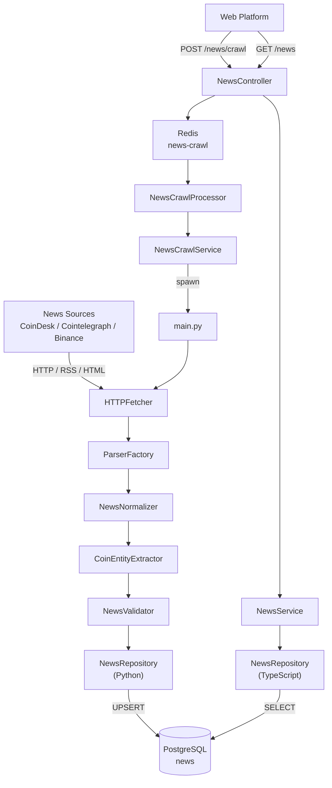

```mermaid
graph TD
    %% External sources
    Sources["News Sources<br/>CoinDesk / Cointelegraph / Binance"]

    %% Crawl pipeline
    Fetch["HTTPFetcher"]
    Parser["ParserFactory"]
    Normalize["NewsNormalizer"]
    Extract["CoinEntityExtractor"]
    Validate["NewsValidator"]
    RepoPy["NewsRepository<br/>(Python)"]

    %% Queue / Worker
    Queue["Redis<br/>news-crawl"]
    Processor["NewsCrawlProcessor"]
    Manager["NewsCrawlService"]
    Main["main.py"]

    %% Database
    DB[("PostgreSQL<br/>news")]

    %% API
    Controller["NewsController"]
    Service["NewsService"]
    RepoTS["NewsRepository<br/>(TypeScript)"]
    Web["Web Platform"]

    %% Crawl flow
    Sources -->|"HTTP / RSS / HTML"| Fetch
    Fetch --> Parser
    Parser --> Normalize
    Normalize --> Extract
    Extract --> Validate
    Validate --> RepoPy
    RepoPy -->|"UPSERT"| DB

    %% Queue flow
    Web -->|"POST /news/crawl"| Controller
    Controller --> Queue
    Queue --> Processor
    Processor --> Manager
    Manager -->|"spawn"| Main
    Main --> Fetch

    %% Query flow
    Web -->|"GET /news"| Controller
    Controller --> Service
    Service --> RepoTS
    RepoTS -->|"SELECT"| DB
```
