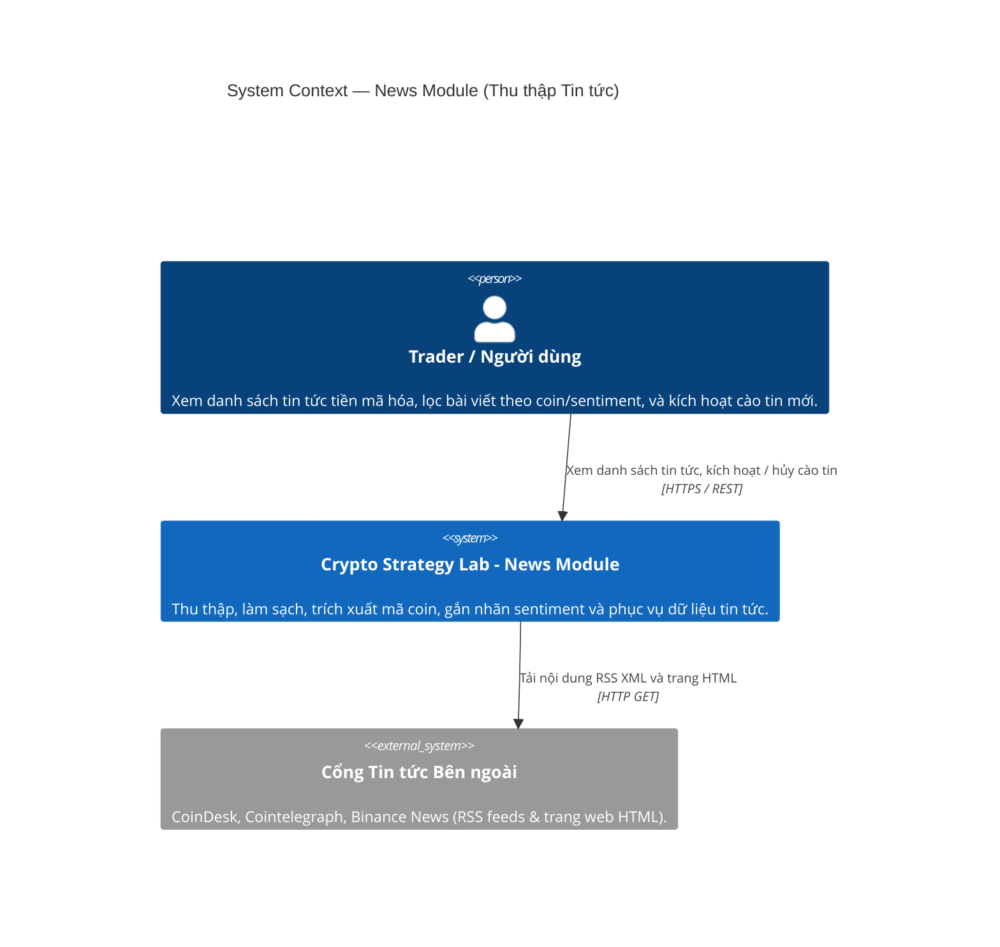
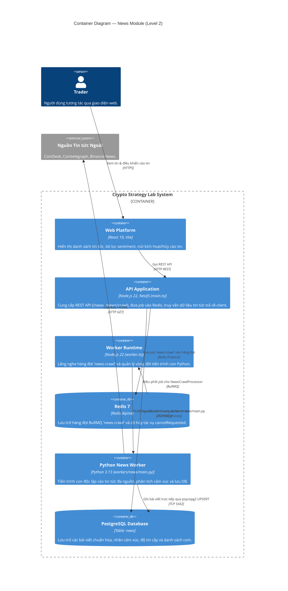
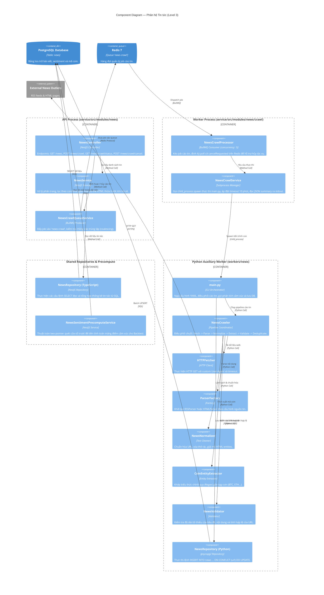
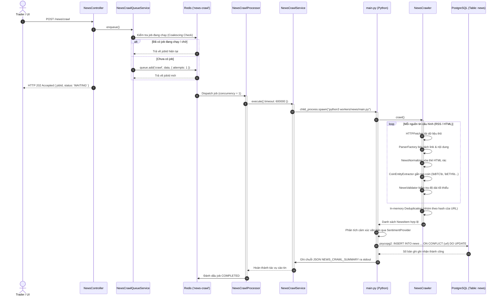

# Phân Tích Kiến Trúc & Cách Hoạt Động Phân Hệ Tin Tức (News Module)

> **Tài liệu tham chiếu trong dự án**:
>
> - [01-repository-architecture-evidence.md](file:///home/ltp/Code/Course/Software_Architecture/Project/crypto-strategy-lab/temp/01-repository-architecture-evidence.md)
> - [02-news-sentiment-deep-analysis.md](file:///home/ltp/Code/Course/Software_Architecture/Project/crypto-strategy-lab/temp/02-news-sentiment-deep-analysis.md)
> - [report-news.md](file:///home/ltp/Code/Course/Software_Architecture/Project/crypto-strategy-lab/temp/report-news.md)
> - [architecture-c4-component-news.puml](file:///home/ltp/Code/Course/Software_Architecture/Project/crypto-strategy-lab/temp/architecture-c4-component-news.puml)
> - [flow-news-crawl.puml](file:///home/ltp/Code/Course/Software_Architecture/Project/crypto-strategy-lab/temp/flow-news-crawl.puml)

---

## 1. Tổng Quan Phân Hệ Tin Tức

**News Module (Mô-đun 10)** là phân hệ chịu trách nhiệm thu thập thông tin thị trường phi cấu trúc từ các nguồn tin tức công khai (RSS, HTML Web, REST API), thực hiện chuẩn hóa dữ liệu, bóc tách thực thể tiền mã hóa (coin tags), đánh giá cảm xúc văn bản, và lưu trữ vào cơ sở dữ liệu để phục vụ hiển thị cho người dùng cũng như cung cấp tín hiệu định lượng cho bộ máy Backtest.

### Nhiệm vụ cốt lõi:

1. **Thu thập tin tức đa nguồn (Multi-Source Ingestion)**: Cào dữ liệu theo chu kỳ từ các trang báo crypto lớn (CoinDesk, Cointelegraph, Binance News) dựa trên cấu hình YAML.
2. **Làm sạch & Chuẩn hóa (Cleaning & Normalization)**: Loại bỏ thẻ HTML rác, unescape các thực thể ký tự đặc biệt, chuẩn hóa URL tuyệt đối để phục vụ định danh duy nhất.
3. **Bóc tách thực thể (Coin Entity Extraction)**: Tự động quét và nhận diện các mã coin được nhắc tới trong tiêu đề và nội dung bài viết (`BTC`, `ETH`, `SOL`, `XRP`...).
4. **Cô lập kiến trúc & Độc lập dữ liệu (Architectural Decoupling)**: Hoàn toàn không phụ thuộc vào luồng dữ liệu giá thời gian thực (`MarketDataModule`). Sự cố mạng khi cào tin tức không thể làm gián đoạn việc khớp lệnh hay luồng WebSocket đẩy giá.
5. **Mô hình tiến trình kép (Dual-Runtime Architecture)**: Tầng HTTP REST và hàng đợi chạy trong **Node.js 22 (NestJS)**; toàn bộ tác vụ cào tin nặng và xử lý văn bản chạy trong một tiến trình con ngắn hạn **Python 3.13** (`workers/news/main.py`).

---

## 2. Sơ Đồ Kiến Trúc Hệ Thống (C4 Level 1 → Level 3)

### 2.1. C4 Level 1 — System Context



### 2.2. C4 Level 2 — Container View



### 2.3. C4 Level 3 — Component Diagram



---

## 3. Phân Tích Chi Tiết Các Thành Phần

### 3.1. Bảng Thành phần (Component Inventory)

| Component                                | Trách nhiệm                                   | Input                                                                | Output                                                           | Phụ thuộc                                       |
| :--------------------------------------- | :---------------------------------------------- | :------------------------------------------------------------------- | :--------------------------------------------------------------- | :------------------------------------------------ |
| **NewsController**                 | Cung cấp REST endpoints cho tin tức           | HTTP Requests (`/news`, `/news/crawl`, `/status`, `/cancel`) | HTTP JSON Response                                               | `NewsService`, `NewsCrawlQueueService`        |
| **NewsService**                    | Nghiệp vụ hiển thị tin tức                 | Tham số lọc (coin, khoảng thời gian, sentiment, trang)           | Danh sách bài viết sạch thẻ HTML                            | `NewsRepository (TypeScript)`                   |
| **NewsCrawlQueueService**          | Producer hàng đợi cào tin tức              | Yêu cầu cào tin từ người dùng                                 | Thêm job vào`'news-crawl'`, chống trùng lặp job           | BullMQ`Queue`                                   |
| **NewsCrawlProcessor**             | Consumer hàng đợi cào tin tức              | Job data từ BullMQ (concurrency = 1)                                | Điều phối tiến trình con Python, lắng nghe cờ hủy        | `NewsCrawlService`, BullMQ                      |
| **NewsCrawlService**               | Quản lý tiến trình cào tin bên ngoài     | Lệnh chạy kèm thời gian timeout 10 phút                         | Chuỗi JSON tổng hợp (`NEWS_CRAWL_SUMMARY`) từ stdout       | `child_process.spawn`, Python CLI               |
| **NewsRepository (TypeScript)**    | Truy vấn dữ liệu tin tức từ SQL            | Điều kiện lọc SQL                                                | Danh sách bài viết và các thống kê phân trang            | `DatabaseService` (PostgreSQL)                  |
| **NewsSentimentPrecomputeService** | Tiền tính toán điểm cảm xúc cho Backtest | Dải nến (`candles`) của đợt thử nghiệm                      | Mảng điểm cảm xúc`SignalContext.sentimentScores`          | `DatabaseService`                               |
| **main.py (Python)**               | Điểm vào của tiến trình cào tin tức     | Cấu hình nguồn tin từ YAML                                       | Điều phối crawler, gọi sentiment và lưu DB                 | `NewsCrawler`, `NewsRepository (Python)`      |
| **NewsCrawler (Python)**           | Điều phối luồng xử lý cào tin            | Danh sách cấu hình nguồn tin                                     | Mảng`NewsItem` đã làm sạch và loại trùng               | Fetcher, Parser, Normalizer, Extractor, Validator |
| **HTTPFetcher (Python)**           | Tải mã nguồn HTML và RSS feed               | URL nguồn tin, User-Agent, timeout                                  | Chuỗi thô HTML / XML                                           | `requests` / `urllib`                         |
| **ParserFactory (Python)**         | Khởi tạo parser theo loại nguồn tin         | Định dạng nguồn (`rss`, `html`, `api`)                     | Thể hiện tương ứng (`RSSParser`, `HTMLParser`)          | `BeautifulSoup4`, `feedparser`                |
| **NewsNormalizer (Python)**        | Làm sạch và chuẩn hóa văn bản            | Dữ liệu văn bản thô, URL ban đầu                              | Văn bản sạch, unescape HTML, URL tuyệt đối                 | Python built-ins                                  |
| **CoinEntityExtractor (Python)**   | Bóc tách mã coin liên quan                  | Tiêu đề và nội dung bài viết                                  | Danh sách mã coin (`["BTC", "ETH"]`...)                      | Regex Token Patterns                              |
| **NewsValidator (Python)**         | Xác thực bài viết hợp lệ                  | Dữ liệu bài viết                                                 | `True` / `False` (loại bỏ bài thiếu trường bắt buộc) | Quy tắc độ dài tối thiểu                    |
| **NewsRepository (Python)**        | Lưu bài viết trực tiếp vào database       | Danh sách`NewsItem` hợp lệ                                      | Số lượng bài thêm mới và cập nhật                       | `psycopg2`, PostgreSQL                          |

---

## 4. Chi Tiết Đường Ống Cào Tin & Xử Lý (Crawl Pipeline Flow)



---

## 5. Hợp Đồng Dữ Liệu & Nguồn Tin Ngoại Bộ

### 5.1. Cấu trúc Mô hình Bài viết (`NewsItem`)

```python
class NewsItem(BaseModel):
    id: str                 # Mã SHA-256 tạo từ URL chuẩn hóa (Primary Key)
    title: str              # Tiêu đề bài viết sau khi làm sạch
    content: str            # Tóm tắt hoặc nội dung chính
    url: str                # URL gốc chuẩn hóa (Ràng buộc UNIQUE)
    source: str             # Định danh nguồn tin (ví dụ: "coindesk", "cointelegraph")
    published_at: datetime  # Thời gian xuất bản (UTC)
    coins: list[str]        # Danh sách mã coin liên quan (ví dụ: ["BTC", "ETH"])
    sentiment: Optional[str]# 'positive' | 'negative' | 'neutral'
    sentiment_score: Optional[float] # Điểm tin cậy (0.0 đến 1.0)
```

### 5.2. Nhận diện Mã Coin & Cấu hình Nguồn tin

- **Bóc tách thực thể Coin**: `CoinEntityExtractor` sử dụng các biểu thức chính quy với ranh giới từ (`\bBTC\b`, `\bBITCOIN\b`, `\bETH\b`, `\bETHEREUM\b`, `\bSOL\b`...) để quét qua cả tiêu đề và nội dung bài viết.
- **Nguồn tin ngoại bộ**: Được cấu hình bằng YAML trong `workers/news/config/`:
  - `rss_sources.yml`: Cấu hình danh sách RSS feeds (CoinDesk, Cointelegraph).
  - `html_sources.yml`: Cấu hình CSS selector cho các trang web HTML phức tạp (Binance News).
  - Thêm nguồn tin mới chỉ cần bổ sung file YAML mà không cần sửa đổi mã nguồn crawler.

---

## 6. Mối Quan Hệ Với Các Phân Hệ Khác

1. **Với Job Queue**:
   - Sử dụng hàng đợi `NEWS_CRAWL_QUEUE` (`"news-crawl"`) với `concurrency: 1` để đảm bảo cào tin tuần tự, tránh bị nhà cung cấp dịch vụ mạng chặn truy cập (HTTP 429 Rate Limit).
   - Cơ chế hủy mềm (Cooperative Cancellation): Khi có request `POST /news/crawl/cancel`, API đặt `cancelRequested: true` trên Redis. Worker thăm dò cờ này định kỳ mỗi 1 giây để gửi tín hiệu `SIGTERM` tắt tiến trình Python một cách an toàn.
2. **Với Sentiment Module**:
   - Ngay sau khi cào và loại bỏ bài viết trùng lặp, `main.py` chuyển tiếp trực tiếp nội dung bài báo tới `SentimentProvider` (FinBERT hoặc bộ từ vựng Lexicon). Nhờ đó, điểm số cảm xúc được ghi trực tiếp vào các cột `sentiment` và `sentiment_score` của bảng `news` trong cùng một lượt ghi.
3. **Với Backtest Engine (`NewsSentimentPrecomputeService`)**:
   - Trước khi đợt thử nghiệm chiến lược bắt đầu, `NewsSentimentPrecomputeService` nạp toàn bộ bài viết trong khoảng `[firstCandle - 48h, lastCandle]`.
   - Áp dụng thuật toán **hai con trỏ (Two-pointer Sliding Window)** duyệt đồng thời chuỗi nến và chuỗi tin tức với độ phức tạp $O(\text{candles} + \text{news})$ để tiền tính toán mảng điểm cảm xúc.
   - Trong quá trình chạy giả lập, `NewsSentimentPlugin` chỉ việc tra cứu mảng điểm này trong bộ nhớ theo $O(1)$, tuân thủ tuyệt đối quy tắc cấm query database trong vòng lặp nến.

---

## 7. Các Điểm Kiểm Thử & Đảm Bảo Tính Toàn Vẹn (Verification Guardrails)

1. **Cô lập lỗi theo từng bài viết (Per-Article Try/Catch Containment)**: Trong `HTMLParser`, việc truy cập và bóc tách từng bài viết được bọc trong khối `try/catch` riêng biệt. Nếu một bài báo bị lỗi kết nối hoặc cấu trúc DOM bị hỏng, lỗi chỉ được ghi vào log cảnh báo và tiến trình tiếp tục xử lý các bài báo khác mà không bị sập.
2. **Tính Idempotent trong Cơ sở dữ liệu**: Bảng `news` thiết lập ràng buộc duy nhất trên cột `url`. Câu lệnh `psycopg2` áp dụng cú pháp:
   ```sql
   INSERT INTO news (id, title, content, url, source, published_at, coins, sentiment, sentiment_score, created_at)
   VALUES (%s, %s, %s, %s, %s, %s, %s, %s, %s, NOW())
   ON CONFLICT (url) DO UPDATE SET
       title = EXCLUDED.title,
       content = EXCLUDED.content,
       coins = EXCLUDED.coins,
       sentiment = EXCLUDED.sentiment,
       sentiment_score = EXCLUDED.sentiment_score;
   ```
   Sử dụng điều kiện hệ thống PostgreSQL `xmax = 0` để phân biệt chính xác số lượng bài viết thực sự thêm mới so với các bài viết chỉ cập nhật dữ liệu.
3. **Giới hạn thời gian cứng (Hard Timeout)**: Tiến trình Node.js quản lý tiến trình con Python với bộ đếm thời gian tối đa 10 phút (`timeout: 600000`). Nếu tiến trình cào tin bị nghẽn mạng, Node.js sẽ gửi tín hiệu `SIGTERM`, và nếu sau 10 giây tiến trình không dừng, sẽ gửi tiếp `SIGKILL` để giải phóng tài nguyên.
