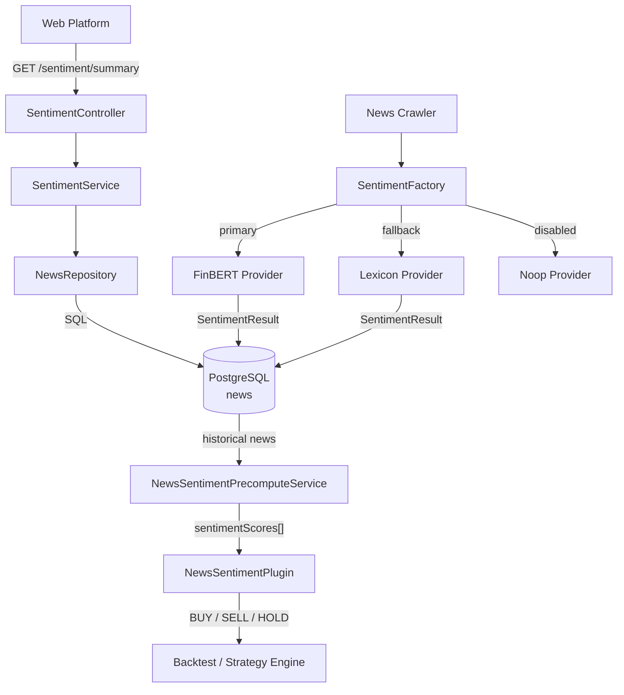

```mermaid
graph TD
    %% API flow
    Web["Web Platform"]
    Controller["SentimentController"]
    Service["SentimentService"]
    Repo["NewsRepository"]
    DB[("PostgreSQL<br/>news")]

    %% Sentiment processing
    Crawler["News Crawler"]
    Factory["SentimentFactory"]
    FinBERT["FinBERT Provider"]
    Lexicon["Lexicon Provider"]
    Noop["Noop Provider"]

    %% Backtest
    Precompute["NewsSentimentPrecomputeService"]
    Plugin["NewsSentimentPlugin"]
    Strategy["Backtest / Strategy Engine"]

    %% API flow
    Web -->|"GET /sentiment/summary"| Controller
    Controller --> Service
    Service --> Repo
    Repo -->|"SQL"| DB

    %% Sentiment flow
    Crawler --> Factory
    Factory -->|"primary"| FinBERT
    Factory -->|"fallback"| Lexicon
    Factory -->|"disabled"| Noop
    FinBERT -->|"SentimentResult"| DB
    Lexicon -->|"SentimentResult"| DB

    %% Backtest flow
    DB -->|"historical news"| Precompute
    Precompute -->|"sentimentScores[]"| Plugin
    Plugin -->|"BUY / SELL / HOLD"| Strategy
```
