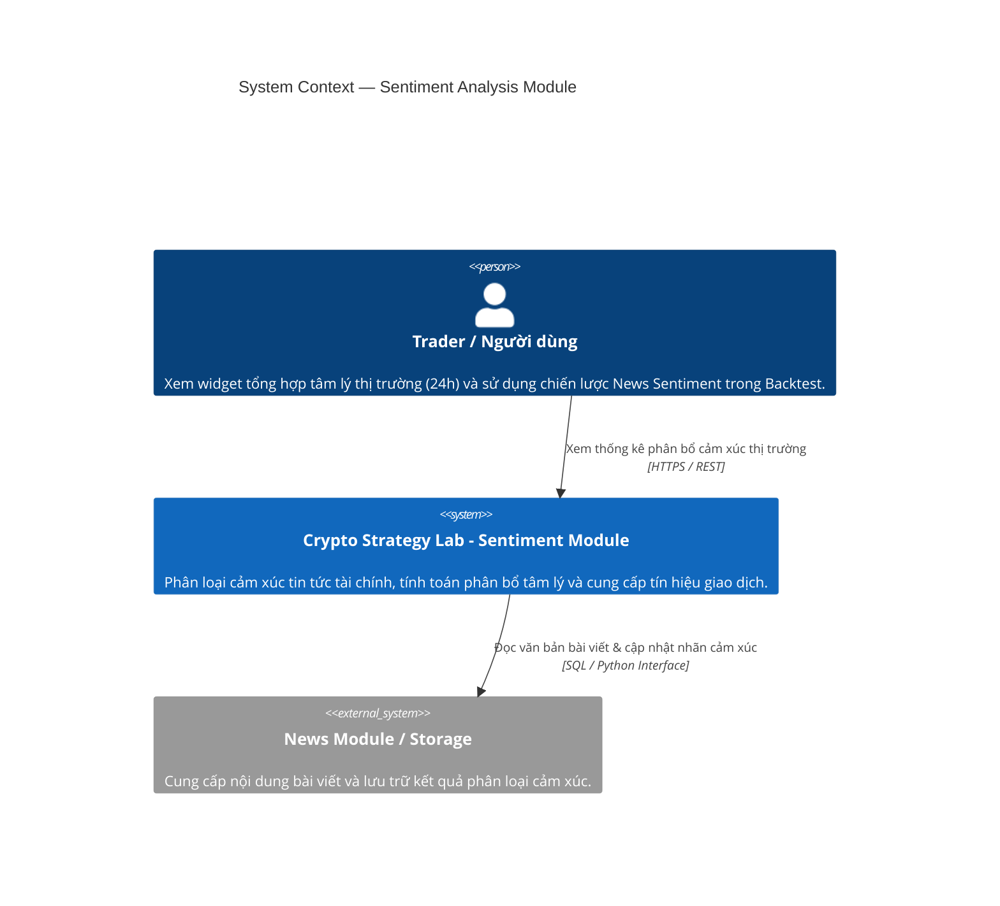
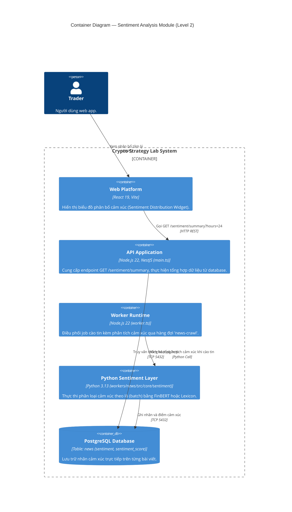
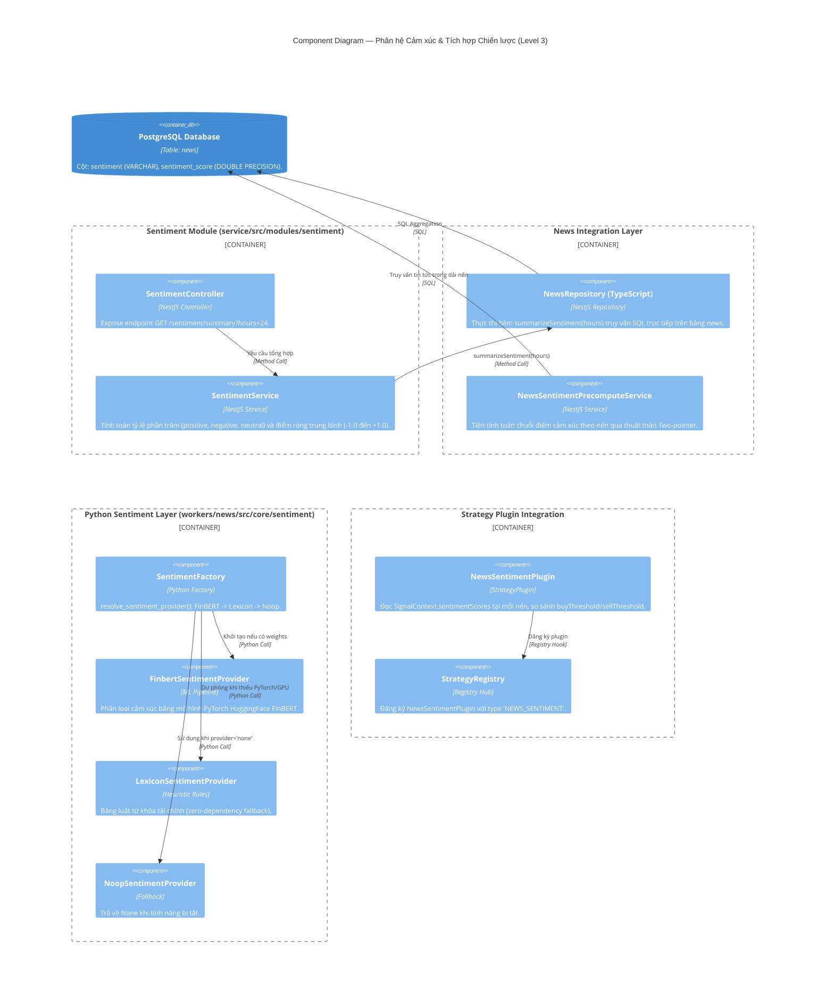

# Phân Tích Kiến Trúc & Cách Hoạt Động Phân Hệ Phân Tích Cảm Xúc (Sentiment Analysis Module)

> **Tài liệu tham chiếu trong dự án**:
>
> - [01-repository-architecture-evidence.md](file:///home/ltp/Code/Course/Software_Architecture/Project/crypto-strategy-lab/temp/01-repository-architecture-evidence.md)
> - [02-news-sentiment-deep-analysis.md](file:///home/ltp/Code/Course/Software_Architecture/Project/crypto-strategy-lab/temp/02-news-sentiment-deep-analysis.md)
> - [report-sentiment.md](file:///home/ltp/Code/Course/Software_Architecture/Project/crypto-strategy-lab/temp/report-sentiment.md)
> - [architecture-c4-component-sentiment.puml](file:///home/ltp/Code/Course/Software_Architecture/Project/crypto-strategy-lab/temp/architecture-c4-component-sentiment.puml)
> - [flow-news-sentiment.puml](file:///home/ltp/Code/Course/Software_Architecture/Project/crypto-strategy-lab/temp/flow-news-sentiment.puml)

---

## 1. Tổng Quan Phân Hệ Phân Tích Cảm Xúc

**Sentiment Analysis Module (Mô-đun 11)** là phân hệ độc lập chịu trách nhiệm phân loại cảm xúc của các văn bản tài chính, tổng hợp chỉ số tâm lý thị trường theo các cửa sổ thời gian, và chuyển đổi dữ liệu cảm xúc lịch sử thành các tín hiệu giao dịch định lượng cho bộ máy Backtest.

### Nhiệm vụ cốt lõi:

1. **Phân loại cảm xúc văn bản (Text Classification)**: Gắn nhãn cảm xúc (`positive`, `negative`, `neutral`) kèm điểm tin cậy (`score` từ 0.0 đến 1.0) cho từng bài viết tin tức.
2. **Tổng hợp chỉ số tâm lý thị trường (Rolling Sentiment Distribution)**: Tính toán phân bổ tỷ lệ phần trăm bài viết tích cực/tiêu cực/trung tính và điểm số ròng tổng hợp trong một khoảng thời gian (ví dụ: 24 giờ qua) qua REST API.
3. **Cơ chế dự phòng đa tầng (Graceful Degradation Hierarchy)**: Thiết kế mô hình suy luận linh hoạt: ưu tiên mô hình học máy chuyên sâu FinBERT (PyTorch); nếu thiếu trọng số hoặc môi trường không có GPU, tự động chuyển xuống bộ luật từ vựng Lexicon dự phòng nhằm đảm bảo tiến trình không bao giờ bị lỗi.
4. **Tích hợp tín hiệu chiến lược với độ phức tạp $O(1)$**: Cung cấp dữ liệu cho `NewsSentimentPlugin` thông qua cơ chế tiền tính toán (Precompute), triệt tiêu hoàn toàn chi phí query cơ sở dữ liệu hoặc gọi mô hình ML bên trong vòng lặp nến của Backtest.

---

## 2. Sơ Đồ Kiến Trúc Hệ Thống (C4 Level 1 → Level 3)

### 2.1. C4 Level 1 — System Context



### 2.2. C4 Level 2 — Container View



### 2.3. C4 Level 3 — Component Diagram



---

## 3. Phân Tích Chi Tiết Các Thành Phần

### 3.1. Bảng Thành phần (Component Inventory)

| Component                                   | Trách nhiệm                                    | Input                                            | Output                                                              | Phụ thuộc                          |
| :------------------------------------------ | :----------------------------------------------- | :----------------------------------------------- | :------------------------------------------------------------------ | :----------------------------------- |
| **SentimentController**               | REST Controller phục vụ thống kê cảm xúc   | Query param`hours` (mặc định: 24)           | HTTP JSON`SentimentSummaryResponse`                               | `SentimentService`                 |
| **SentimentService**                  | Tính toán chỉ số cảm xúc tổng hợp        | Thời gian khảo sát (`hours`)                | Tỷ lệ phần trăm và điểm ròng (-1.0 đến +1.0)              | `NewsRepository (TypeScript)`      |
| **NewsRepository (TypeScript)**       | Truy vấn tổng hợp từ SQL                     | Khoảng thời gian`NOW() - INTERVAL 'X hours'` | Thống kê số lượng bài viết theo nhãn và điểm trung bình | `DatabaseService` (PostgreSQL)     |
| **SentimentFactory (Python)**         | Quyết định provider phân tích cảm xúc     | Cấu hình env`SENTIMENT_PROVIDER`             | Thể hiện cụ thể của`SentimentProvider`                       | `workers/news/models/finbert`      |
| **FinbertSentimentProvider (Python)** | Phân loại cảm xúc chuyên sâu tài chính   | Danh sách văn bản bài báo (`texts`)       | Danh sách`SentimentResult(label, score)`                         | PyTorch, HuggingFace pipeline        |
| **LexiconSentimentProvider (Python)** | Bộ phân tích từ khóa dự phòng (Fallback)  | Danh sách văn bản bài báo (`texts`)       | Danh sách`SentimentResult` dựa trên bảng từ vựng            | Không phụ thuộc thư viện ngoài |
| **NoopSentimentProvider (Python)**    | Giả lập khi tắt phân tích cảm xúc         | Danh sách văn bản                             | Danh sách toàn giá trị`None`                                  | Không                               |
| **NewsSentimentPrecomputeService**    | Tiền tính toán chuỗi cảm xúc cho Backtest  | Dải nến (`candles`) của đợt thử nghiệm  | Mảng`SignalContext.sentimentScores`                              | `DatabaseService`                  |
| **NewsSentimentPlugin**               | Strategy Plugin phát sinh tín hiệu giao dịch | `SignalContext.sentimentScores[candleIndex]`   | Tín hiệu`BUY`, `SELL`, hoặc `HOLD`                         | `StrategyRegistry`                 |

---

## 4. Quy Trình Suy Luận & Cơ Chế Dự Phòng Đa Tầng (Fallback Hierarchy)

Phân tích cảm xúc diễn ra trong tiến trình `workers/news/main.py` ngay sau khi cào tin tức và loại trùng lặp:


.
├── artifacts
│   ├── ai-strategy.md
│   ├── api-contract.md
│   ├── architecture-analysis-news-sentiment-ai.md
│   ├── architecture-c4-level-1.png
│   ├── architecture-c4-level-1.puml
│   ├── architecture-c4-level-2.png
│   ├── architecture-c4-level-2.puml
│   ├── architecture-c4-level-3-news-sentiment-ai.puml
│   ├── architecture-c4-level-3.png
│   ├── architecture-c4-level-3.puml
│   ├── architecture-c4-level-3-strategy.png
│   ├── architecture-c4-level-3-strategy.puml
│   ├── architecture-flow-search-backtest.png
│   ├── architecture-flow-search-backtest.puml
│   ├── architecture.md
│   ├── cache.md
│   ├── cqrs.md
│   ├── database.md
│   ├── decisions.md
│   ├── event-catalog.md
│   ├── extension-points.md
│   ├── observability.md
│   ├── plugin_engine_composite.md
│   ├── queue.md
│   ├── README.md
│   └── service-mesh-evolution.md
├── .claude
│   ├── launch.json
│   └── skills
│       └── resolve-before-coding
│           └── SKILL.md
├── CLAUDE.md
├── crypto_strategy_lab.dump
├── database
│   ├── check.js
│   ├── create-database.js
│   ├── design.dbdiagram
│   ├── design.dbml
│   ├── document_json_format.json
│   ├── .env
│   ├── .env.example
│   ├── migrate.js
│   ├── migrations
│   │   ├── 001_initial_schema.sql
│   │   ├── 002_domain_guided_search.sql
│   │   ├── 003_candidate_auth_schema.sql
│   │   ├── 004_experiment_search_config.sql
│   │   └── 005_candidate_fingerprint.sql
│   ├── package.json
│   ├── package-lock.json
│   ├── README.md
│   ├── seed.js
│   └── seeds
│       ├── 001_initial_seed.sql
│       ├── 002_system_strategies.sql
│       └── 003_system_parameter_versions.sql
├── docker-compose.yml
├── DOCKER_GUIDE.md
├── docs
│   ├── about-projects
│   │   ├── 01-what-is-this-project.md
│   │   ├── 02-architecture-goals.md
│   │   ├── 03-anti-patterns-to-avoid.md
│   │   ├── 04-examples-in-the-brief.md
│   │   ├── 05-required-flows.md
│   │   ├── 06-checklist.md
│   │   └── CLAUDE.md
│   ├── ACTUAL-module-specs
│   │   ├── ai-generated-strategy.md
│   │   ├── architecture-c4-level-3-ai-strategy.puml
│   │   ├── architecture-c4-level-3-continuous-loop.puml
│   │   ├── BackTest Engine
│   │   │   ├── architecture-c4-level-3-backtest.png
│   │   │   ├── architecture-c4-level-3-backtest.puml
│   │   │   └── backtest-engine.md
│   │   ├── continuous-strategy-loop.md
│   │   ├── .gitkeep
│   │   ├── job-queue.md
│   │   ├── Market Realtime
│   │   │   ├── architecture-c4-level-3-market-realtime.png
│   │   │   ├── architecture-c4-level-3-market-realtime.puml
│   │   │   └── market-realtime.md
│   │   ├── news.md
│   │   ├── sentiment-ai-generated.md
│   │   └── strategy_plugin_engine_composite
│   │       ├── architecture-c4-level-3-strategy.png
│   │       ├── architecture-c4-level-3-strategy.puml
│   │       └── plugin_engine_composite.md
│   ├── database
│   │   ├── CLAUDE.md
│   │   ├── design.dbdiagram
│   │   ├── design.dbml
│   │   ├── news_format.json
│   │   └── Schema explanation.md
│   ├── modules-specification
│   │   ├── CLAUDE.md
│   │   ├── news_crawler.md
│   │   ├── realtime-candles-with-redis.md
│   │   ├── sentiment.md
│   │   ├── strategy-engine.md
│   │   └── strategy-plugin.md
│   ├── software-architecture
│   │   ├── CLAUDE.md
│   │   ├── data.md
│   │   ├── decisions.md
│   │   ├── modules.md
│   │   ├── README.md
│   │   └── system.md
│   └── ui-prototype
│       ├── CLAUDE.md
│       └── Design giao diện web đồ án
│           ├── Crypto Strategy Lab.dc.html
│           ├── Crypto Strategy Lab.html
│           ├── _ds
│           │   └── industry-fb2ceb04-be8a-434d-b15a-3ac4e9e25054
│           │       ├── _adherence.oxlintrc.json
│           │       ├── _ds_bundle.js
│           │       ├── _ds_manifest.json
│           │       ├── readme.md
│           │       └── styles.css
│           ├── support.js
│           ├── .thumbnail
│           └── uploads
│               ├── pasted-1787370604412-0.png
│               ├── pasted-1787370608876-0.png
│               ├── pasted-1787370613279-0.png
│               ├── pasted-1787370618646-0.png
│               ├── pasted-1787370622585-0.png
│               ├── pasted-1787371198381-0.png
│               ├── pasted-1787371205984-0.png
│               ├── pasted-1787373663775-0.png
│               └── pasted-1787486989538-0.png
├── .gitignore
├── README.md
├── service
│   ├── dist
│   │   ├── app.controller.d.ts
│   │   ├── app.controller.js
│   │   ├── app.controller.js.map
│   │   ├── app.module.d.ts
│   │   ├── app.module.js
│   │   ├── app.module.js.map
│   │   ├── app.service.d.ts
│   │   ├── app.service.js
│   │   ├── app.service.js.map
│   │   ├── cache
│   │   │   ├── cache.constants.d.ts
│   │   │   ├── cache.constants.js
│   │   │   ├── cache.constants.js.map
│   │   │   ├── cache.module.d.ts
│   │   │   ├── cache.module.js
│   │   │   ├── cache.module.js.map
│   │   │   ├── cache.service.d.ts
│   │   │   ├── cache.service.js
│   │   │   ├── cache.service.js.map
│   │   │   ├── redis-connection.d.ts
│   │   │   ├── redis-connection.js
│   │   │   └── redis-connection.js.map
│   │   ├── common
│   │   │   ├── python-bin.d.ts
│   │   │   ├── python-bin.js
│   │   │   └── python-bin.js.map
│   │   ├── database
│   │   │   ├── database.module.d.ts
│   │   │   ├── database.module.js
│   │   │   ├── database.module.js.map
│   │   │   ├── database.service.d.ts
│   │   │   ├── database.service.js
│   │   │   ├── database.service.js.map
│   │   │   ├── index.d.ts
│   │   │   ├── index.js
│   │   │   ├── index.js.map
│   │   │   ├── types.d.ts
│   │   │   ├── types.js
│   │   │   └── types.js.map
│   │   ├── domain-events
│   │   │   ├── event-names.d.ts
│   │   │   ├── event-names.js
│   │   │   ├── event-names.js.map
│   │   │   ├── index.d.ts
│   │   │   ├── index.js
│   │   │   ├── index.js.map
│   │   │   ├── payloads.d.ts
│   │   │   ├── payloads.js
│   │   │   └── payloads.js.map
│   │   ├── main.d.ts
│   │   ├── main.js
│   │   ├── main.js.map
│   │   ├── modules
│   │   │   ├── ai-strategy
│   │   │   │   ├── ai-strategy.config.d.ts
│   │   │   │   ├── ai-strategy.config.js
│   │   │   │   ├── ai-strategy.config.js.map
│   │   │   │   ├── ai-strategy.controller.d.ts
│   │   │   │   ├── ai-strategy.controller.js
│   │   │   │   ├── ai-strategy.controller.js.map
│   │   │   │   ├── ai-strategy.module.d.ts
│   │   │   │   ├── ai-strategy.module.js
│   │   │   │   ├── ai-strategy.module.js.map
│   │   │   │   ├── ai-strategy-runner.service.d.ts
│   │   │   │   ├── ai-strategy-runner.service.js
│   │   │   │   ├── ai-strategy-runner.service.js.map
│   │   │   │   ├── ai-strategy.service.d.ts
│   │   │   │   ├── ai-strategy.service.js
│   │   │   │   ├── ai-strategy.service.js.map
│   │   │   │   ├── ai-strategy-signal-precompute.service.d.ts
│   │   │   │   ├── ai-strategy-signal-precompute.service.js
│   │   │   │   ├── ai-strategy-signal-precompute.service.js.map
│   │   │   │   ├── ai-strategy.types.d.ts
│   │   │   │   ├── ai-strategy.types.js
│   │   │   │   ├── ai-strategy.types.js.map
│   │   │   │   ├── ai-strategy-validator.service.d.ts
│   │   │   │   ├── ai-strategy-validator.service.js
│   │   │   │   ├── ai-strategy-validator.service.js.map
│   │   │   │   ├── contract-prompt.d.ts
│   │   │   │   ├── contract-prompt.js
│   │   │   │   ├── contract-prompt.js.map
│   │   │   │   ├── dto
│   │   │   │   │   ├── ai-strategy.dto.d.ts
│   │   │   │   │   ├── ai-strategy.dto.js
│   │   │   │   │   └── ai-strategy.dto.js.map
│   │   │   │   ├── index.d.ts
│   │   │   │   ├── index.js
│   │   │   │   ├── index.js.map
│   │   │   │   ├── providers
│   │   │   │   │   ├── fake.provider.d.ts
│   │   │   │   │   ├── fake.provider.js
│   │   │   │   │   ├── fake.provider.js.map
│   │   │   │   │   ├── llm-provider.factory.d.ts
│   │   │   │   │   ├── llm-provider.factory.js
│   │   │   │   │   ├── llm-provider.factory.js.map
│   │   │   │   │   ├── openai-compatible.provider.d.ts
│   │   │   │   │   ├── openai-compatible.provider.js
│   │   │   │   │   └── openai-compatible.provider.js.map
│   │   │   │   ├── python-process.util.d.ts
│   │   │   │   ├── python-process.util.js
│   │   │   │   ├── python-process.util.js.map
│   │   │   │   └── repositories
│   │   │   │       ├── ai-strategy.repository.d.ts
│   │   │   │       ├── ai-strategy.repository.js
│   │   │   │       └── ai-strategy.repository.js.map
│   │   │   ├── auth
│   │   │   │   ├── auth.controller.d.ts
│   │   │   │   ├── auth.controller.js
│   │   │   │   ├── auth.controller.js.map
│   │   │   │   ├── auth.module.d.ts
│   │   │   │   ├── auth.module.js
│   │   │   │   ├── auth.module.js.map
│   │   │   │   ├── auth.service.d.ts
│   │   │   │   ├── auth.service.js
│   │   │   │   ├── auth.service.js.map
│   │   │   │   ├── decorators
│   │   │   │   │   ├── current-user.decorator.d.ts
│   │   │   │   │   ├── current-user.decorator.js
│   │   │   │   │   └── current-user.decorator.js.map
│   │   │   │   ├── dto
│   │   │   │   │   ├── auth.dto.d.ts
│   │   │   │   │   ├── auth.dto.js
│   │   │   │   │   └── auth.dto.js.map
│   │   │   │   ├── guards
│   │   │   │   │   ├── jwt-auth.guard.d.ts
│   │   │   │   │   ├── jwt-auth.guard.js
│   │   │   │   │   └── jwt-auth.guard.js.map
│   │   │   │   ├── repositories
│   │   │   │   │   ├── refresh-token.repository.d.ts
│   │   │   │   │   ├── refresh-token.repository.js
│   │   │   │   │   ├── refresh-token.repository.js.map
│   │   │   │   │   ├── user.repository.d.ts
│   │   │   │   │   ├── user.repository.js
│   │   │   │   │   └── user.repository.js.map
│   │   │   │   └── strategies
│   │   │   │       ├── jwt.strategy.d.ts
│   │   │   │       ├── jwt.strategy.js
│   │   │   │       └── jwt.strategy.js.map
│   │   │   ├── backtesting
│   │   │   │   ├── backtesting.controller.d.ts
│   │   │   │   ├── backtesting.controller.js
│   │   │   │   ├── backtesting.controller.js.map
│   │   │   │   ├── backtesting.module.d.ts
│   │   │   │   ├── backtesting.module.js
│   │   │   │   ├── backtesting.module.js.map
│   │   │   │   ├── backtesting.service.d.ts
│   │   │   │   ├── backtesting.service.js
│   │   │   │   ├── backtesting.service.js.map
│   │   │   │   ├── backtesting.types.d.ts
│   │   │   │   ├── backtesting.types.js
│   │   │   │   ├── backtesting.types.js.map
│   │   │   │   ├── index.d.ts
│   │   │   │   ├── index.js
│   │   │   │   ├── index.js.map
│   │   │   │   └── repositories
│   │   │   │       ├── backtest-run.repository.d.ts
│   │   │   │       ├── backtest-run.repository.js
│   │   │   │       └── backtest-run.repository.js.map
│   │   │   ├── chart
│   │   │   │   ├── chart.controller.d.ts
│   │   │   │   ├── chart.controller.js
│   │   │   │   ├── chart.controller.js.map
│   │   │   │   ├── chart.module.d.ts
│   │   │   │   ├── chart.module.js
│   │   │   │   ├── chart.module.js.map
│   │   │   │   ├── chart.service.d.ts
│   │   │   │   ├── chart.service.js
│   │   │   │   ├── chart.service.js.map
│   │   │   │   ├── index.d.ts
│   │   │   │   ├── index.js
│   │   │   │   └── index.js.map
│   │   │   ├── composite-strategy
│   │   │   │   ├── composite-strategy.controller.d.ts
│   │   │   │   ├── composite-strategy.controller.js
│   │   │   │   ├── composite-strategy.controller.js.map
│   │   │   │   ├── composite-strategy.module.d.ts
│   │   │   │   ├── composite-strategy.module.js
│   │   │   │   ├── composite-strategy.module.js.map
│   │   │   │   ├── composite-strategy.service.d.ts
│   │   │   │   ├── composite-strategy.service.js
│   │   │   │   ├── composite-strategy.service.js.map
│   │   │   │   ├── index.d.ts
│   │   │   │   ├── index.js
│   │   │   │   └── index.js.map
│   │   │   ├── continuous-loop
│   │   │   │   ├── continuous-loop.controller.d.ts
│   │   │   │   ├── continuous-loop.controller.js
│   │   │   │   ├── continuous-loop.controller.js.map
│   │   │   │   ├── continuous-loop.module.d.ts
│   │   │   │   ├── continuous-loop.module.js
│   │   │   │   ├── continuous-loop.module.js.map
│   │   │   │   ├── continuous-loop.service.d.ts
│   │   │   │   ├── continuous-loop.service.js
│   │   │   │   ├── continuous-loop.service.js.map
│   │   │   │   ├── index.d.ts
│   │   │   │   ├── index.js
│   │   │   │   └── index.js.map
│   │   │   ├── leaderboard
│   │   │   │   ├── index.d.ts
│   │   │   │   ├── index.js
│   │   │   │   ├── index.js.map
│   │   │   │   ├── leaderboard-cache-keys.d.ts
│   │   │   │   ├── leaderboard-cache-keys.js
│   │   │   │   ├── leaderboard-cache-keys.js.map
│   │   │   │   ├── leaderboard.controller.d.ts
│   │   │   │   ├── leaderboard.controller.js
│   │   │   │   ├── leaderboard.controller.js.map
│   │   │   │   ├── leaderboard-events.handler.d.ts
│   │   │   │   ├── leaderboard-events.handler.js
│   │   │   │   ├── leaderboard-events.handler.js.map
│   │   │   │   ├── leaderboard.module.d.ts
│   │   │   │   ├── leaderboard.module.js
│   │   │   │   ├── leaderboard.module.js.map
│   │   │   │   ├── leaderboard.service.d.ts
│   │   │   │   ├── leaderboard.service.js
│   │   │   │   └── leaderboard.service.js.map
│   │   │   ├── market-data
│   │   │   │   ├── clients
│   │   │   │   │   ├── binance.client.d.ts
│   │   │   │   │   ├── binance.client.js
│   │   │   │   │   └── binance.client.js.map
│   │   │   │   ├── config.d.ts
│   │   │   │   ├── config.js
│   │   │   │   ├── config.js.map
│   │   │   │   ├── index.d.ts
│   │   │   │   ├── index.js
│   │   │   │   ├── index.js.map
│   │   │   │   ├── market-data.controller.d.ts
│   │   │   │   ├── market-data.controller.js
│   │   │   │   ├── market-data.controller.js.map
│   │   │   │   ├── market-data-core.module.d.ts
│   │   │   │   ├── market-data-core.module.js
│   │   │   │   ├── market-data-core.module.js.map
│   │   │   │   ├── market-data.gateway.d.ts
│   │   │   │   ├── market-data.gateway.js
│   │   │   │   ├── market-data.gateway.js.map
│   │   │   │   ├── market-data.module.d.ts
│   │   │   │   ├── market-data.module.js
│   │   │   │   ├── market-data.module.js.map
│   │   │   │   ├── market-data.service.d.ts
│   │   │   │   ├── market-data.service.js
│   │   │   │   ├── market-data.service.js.map
│   │   │   │   └── repositories
│   │   │   │       ├── candle.repository.d.ts
│   │   │   │       ├── candle.repository.js
│   │   │   │       └── candle.repository.js.map
│   │   │   ├── news
│   │   │   │   ├── crawl
│   │   │   │   │   ├── news-crawl.config.d.ts
│   │   │   │   │   ├── news-crawl.config.js
│   │   │   │   │   ├── news-crawl.config.js.map
│   │   │   │   │   ├── news-crawl.processor.d.ts
│   │   │   │   │   ├── news-crawl.processor.js
│   │   │   │   │   ├── news-crawl.processor.js.map
│   │   │   │   │   ├── news-crawl-queue.service.d.ts
│   │   │   │   │   ├── news-crawl-queue.service.js
│   │   │   │   │   ├── news-crawl-queue.service.js.map
│   │   │   │   │   ├── news-crawl.service.d.ts
│   │   │   │   │   ├── news-crawl.service.js
│   │   │   │   │   └── news-crawl.service.js.map
│   │   │   │   ├── dto
│   │   │   │   │   ├── news-query.dto.d.ts
│   │   │   │   │   ├── news-query.dto.js
│   │   │   │   │   └── news-query.dto.js.map
│   │   │   │   ├── index.d.ts
│   │   │   │   ├── index.js
│   │   │   │   ├── index.js.map
│   │   │   │   ├── news.constants.d.ts
│   │   │   │   ├── news.constants.js
│   │   │   │   ├── news.constants.js.map
│   │   │   │   ├── news.controller.d.ts
│   │   │   │   ├── news.controller.js
│   │   │   │   ├── news.controller.js.map
│   │   │   │   ├── news.module.d.ts
│   │   │   │   ├── news.module.js
│   │   │   │   ├── news.module.js.map
│   │   │   │   ├── news-sentiment-precompute.service.d.ts
│   │   │   │   ├── news-sentiment-precompute.service.js
│   │   │   │   ├── news-sentiment-precompute.service.js.map
│   │   │   │   ├── news.service.d.ts
│   │   │   │   ├── news.service.js
│   │   │   │   ├── news.service.js.map
│   │   │   │   └── repositories
│   │   │   │       ├── news.repository.d.ts
│   │   │   │       ├── news.repository.js
│   │   │   │       └── news.repository.js.map
│   │   │   ├── sentiment
│   │   │   │   ├── config.d.ts
│   │   │   │   ├── config.js
│   │   │   │   ├── config.js.map
│   │   │   │   ├── dto
│   │   │   │   │   ├── sentiment-query.dto.d.ts
│   │   │   │   │   ├── sentiment-query.dto.js
│   │   │   │   │   └── sentiment-query.dto.js.map
│   │   │   │   ├── index.d.ts
│   │   │   │   ├── index.js
│   │   │   │   ├── index.js.map
│   │   │   │   ├── sentiment.controller.d.ts
│   │   │   │   ├── sentiment.controller.js
│   │   │   │   ├── sentiment.controller.js.map
│   │   │   │   ├── sentiment.module.d.ts
│   │   │   │   ├── sentiment.module.js
│   │   │   │   ├── sentiment.module.js.map
│   │   │   │   ├── sentiment.service.d.ts
│   │   │   │   ├── sentiment.service.js
│   │   │   │   └── sentiment.service.js.map
│   │   │   ├── strategy-engine
│   │   │   │   ├── index.d.ts
│   │   │   │   ├── index.js
│   │   │   │   ├── index.js.map
│   │   │   │   ├── indicators
│   │   │   │   │   ├── base.indicator.d.ts
│   │   │   │   │   ├── base.indicator.js
│   │   │   │   │   ├── base.indicator.js.map
│   │   │   │   │   ├── sma.indicator.d.ts
│   │   │   │   │   ├── sma.indicator.js
│   │   │   │   │   └── sma.indicator.js.map
│   │   │   │   ├── realtime-signal.controller.d.ts
│   │   │   │   ├── realtime-signal.controller.js
│   │   │   │   ├── realtime-signal.controller.js.map
│   │   │   │   ├── realtime-signal.module.d.ts
│   │   │   │   ├── realtime-signal.module.js
│   │   │   │   ├── realtime-signal.module.js.map
│   │   │   │   ├── realtime-signal.service.d.ts
│   │   │   │   ├── realtime-signal.service.js
│   │   │   │   ├── realtime-signal.service.js.map
│   │   │   │   ├── strategies
│   │   │   │   │   ├── base.strategy.d.ts
│   │   │   │   │   ├── base.strategy.js
│   │   │   │   │   └── base.strategy.js.map
│   │   │   │   ├── strategy-engine.controller.d.ts
│   │   │   │   ├── strategy-engine.controller.js
│   │   │   │   ├── strategy-engine.controller.js.map
│   │   │   │   ├── strategy-engine.module.d.ts
│   │   │   │   ├── strategy-engine.module.js
│   │   │   │   ├── strategy-engine.module.js.map
│   │   │   │   ├── strategy-engine.service.d.ts
│   │   │   │   ├── strategy-engine.service.js
│   │   │   │   ├── strategy-engine.service.js.map
│   │   │   │   ├── strategy.types.d.ts
│   │   │   │   ├── strategy.types.js
│   │   │   │   ├── strategy.types.js.map
│   │   │   │   ├── types.d.ts
│   │   │   │   ├── types.js
│   │   │   │   └── types.js.map
│   │   │   ├── strategy-plugin
│   │   │   │   ├── dto
│   │   │   │   │   ├── save-strategy-version.dto.d.ts
│   │   │   │   │   ├── save-strategy-version.dto.js
│   │   │   │   │   └── save-strategy-version.dto.js.map
│   │   │   │   ├── index.d.ts
│   │   │   │   ├── index.js
│   │   │   │   ├── index.js.map
│   │   │   │   ├── plugins
│   │   │   │   │   ├── ai-strategy-plugin.adapter.d.ts
│   │   │   │   │   ├── ai-strategy-plugin.adapter.js
│   │   │   │   │   ├── ai-strategy-plugin.adapter.js.map
│   │   │   │   │   ├── bollinger.plugin.d.ts
│   │   │   │   │   ├── bollinger.plugin.js
│   │   │   │   │   ├── bollinger.plugin.js.map
│   │   │   │   │   ├── ma.plugin.d.ts
│   │   │   │   │   ├── ma.plugin.js
│   │   │   │   │   ├── ma.plugin.js.map
│   │   │   │   │   ├── news-sentiment.plugin.d.ts
│   │   │   │   │   ├── news-sentiment.plugin.js
│   │   │   │   │   ├── news-sentiment.plugin.js.map
│   │   │   │   │   ├── rsi.plugin.d.ts
│   │   │   │   │   ├── rsi.plugin.js
│   │   │   │   │   ├── rsi.plugin.js.map
│   │   │   │   │   ├── support-resistance.plugin.d.ts
│   │   │   │   │   ├── support-resistance.plugin.js
│   │   │   │   │   └── support-resistance.plugin.js.map
│   │   │   │   ├── strategy-plugin.controller.d.ts
│   │   │   │   ├── strategy-plugin.controller.js
│   │   │   │   ├── strategy-plugin.controller.js.map
│   │   │   │   ├── strategy-plugin.module.d.ts
│   │   │   │   ├── strategy-plugin.module.js
│   │   │   │   ├── strategy-plugin.module.js.map
│   │   │   │   ├── strategy-plugin.service.d.ts
│   │   │   │   ├── strategy-plugin.service.js
│   │   │   │   ├── strategy-plugin.service.js.map
│   │   │   │   ├── strategy-plugin.types.d.ts
│   │   │   │   ├── strategy-plugin.types.js
│   │   │   │   ├── strategy-plugin.types.js.map
│   │   │   │   ├── strategy-registry.d.ts
│   │   │   │   ├── strategy-registry.js
│   │   │   │   └── strategy-registry.js.map
│   │   │   └── strategy-search
│   │   │       ├── catalog
│   │   │       │   ├── strategy-catalog.d.ts
│   │   │       │   ├── strategy-catalog.js
│   │   │       │   └── strategy-catalog.js.map
│   │   │       ├── domain
│   │   │       │   ├── search.types.d.ts
│   │   │       │   ├── search.types.js
│   │   │       │   └── search.types.js.map
│   │   │       ├── dto
│   │   │       │   ├── extend-search.dto.d.ts
│   │   │       │   ├── extend-search.dto.js
│   │   │       │   ├── extend-search.dto.js.map
│   │   │       │   ├── regenerate-for-strategy.dto.d.ts
│   │   │       │   ├── regenerate-for-strategy.dto.js
│   │   │       │   └── regenerate-for-strategy.dto.js.map
│   │   │       ├── generators
│   │   │       │   ├── domain-guided-random.generator.d.ts
│   │   │       │   ├── domain-guided-random.generator.js
│   │   │       │   └── domain-guided-random.generator.js.map
│   │   │       ├── index.d.ts
│   │   │       ├── index.js
│   │   │       ├── index.js.map
│   │   │       ├── repositories
│   │   │       │   ├── candidate.repository.d.ts
│   │   │       │   ├── candidate.repository.js
│   │   │       │   ├── candidate.repository.js.map
│   │   │       │   ├── experiment-config.repository.d.ts
│   │   │       │   ├── experiment-config.repository.js
│   │   │       │   ├── experiment-config.repository.js.map
│   │   │       │   ├── experiment-iteration.repository.d.ts
│   │   │       │   ├── experiment-iteration.repository.js
│   │   │       │   ├── experiment-iteration.repository.js.map
│   │   │       │   ├── experiment.repository.d.ts
│   │   │       │   ├── experiment.repository.js
│   │   │       │   ├── experiment.repository.js.map
│   │   │       │   ├── strategy.repository.d.ts
│   │   │       │   ├── strategy.repository.js
│   │   │       │   └── strategy.repository.js.map
│   │   │       ├── search.processor.d.ts
│   │   │       ├── search.processor.js
│   │   │       ├── search.processor.js.map
│   │   │       ├── services
│   │   │       │   ├── candidate-fingerprint.service.d.ts
│   │   │       │   ├── candidate-fingerprint.service.js
│   │   │       │   ├── candidate-fingerprint.service.js.map
│   │   │       │   ├── search-queue.service.d.ts
│   │   │       │   ├── search-queue.service.js
│   │   │       │   ├── search-queue.service.js.map
│   │   │       │   ├── seeded-random.d.ts
│   │   │       │   ├── seeded-random.js
│   │   │       │   └── seeded-random.js.map
│   │   │       ├── strategy-search.controller.d.ts
│   │   │       ├── strategy-search.controller.js
│   │   │       ├── strategy-search.controller.js.map
│   │   │       ├── strategy-search.module.d.ts
│   │   │       ├── strategy-search.module.js
│   │   │       ├── strategy-search.module.js.map
│   │   │       ├── strategy-search.service.d.ts
│   │   │       ├── strategy-search.service.js
│   │   │       └── strategy-search.service.js.map
│   │   ├── observability
│   │   │   ├── correlation
│   │   │   │   ├── correlation-context.d.ts
│   │   │   │   ├── correlation-context.js
│   │   │   │   ├── correlation-context.js.map
│   │   │   │   ├── observability.middleware.d.ts
│   │   │   │   ├── observability.middleware.js
│   │   │   │   └── observability.middleware.js.map
│   │   │   ├── health
│   │   │   │   ├── health.controller.d.ts
│   │   │   │   ├── health.controller.js
│   │   │   │   ├── health.controller.js.map
│   │   │   │   ├── health.service.d.ts
│   │   │   │   ├── health.service.js
│   │   │   │   └── health.service.js.map
│   │   │   ├── logging
│   │   │   │   ├── redact.d.ts
│   │   │   │   ├── redact.js
│   │   │   │   ├── redact.js.map
│   │   │   │   ├── structured-logger.service.d.ts
│   │   │   │   ├── structured-logger.service.js
│   │   │   │   └── structured-logger.service.js.map
│   │   │   ├── metrics
│   │   │   │   ├── metrics.controller.d.ts
│   │   │   │   ├── metrics.controller.js
│   │   │   │   ├── metrics.controller.js.map
│   │   │   │   ├── metrics.service.d.ts
│   │   │   │   ├── metrics.service.js
│   │   │   │   └── metrics.service.js.map
│   │   │   ├── observability.module.d.ts
│   │   │   ├── observability.module.js
│   │   │   ├── observability.module.js.map
│   │   │   ├── worker-metrics-server.d.ts
│   │   │   ├── worker-metrics-server.js
│   │   │   └── worker-metrics-server.js.map
│   │   ├── queue
│   │   │   ├── queue.constants.d.ts
│   │   │   ├── queue.constants.js
│   │   │   ├── queue.constants.js.map
│   │   │   ├── queue-health.controller.d.ts
│   │   │   ├── queue-health.controller.js
│   │   │   ├── queue-health.controller.js.map
│   │   │   ├── queue-health.service.d.ts
│   │   │   ├── queue-health.service.js
│   │   │   ├── queue-health.service.js.map
│   │   │   ├── queue.module.d.ts
│   │   │   ├── queue.module.js
│   │   │   ├── queue.module.js.map
│   │   │   ├── with-timeout.d.ts
│   │   │   ├── with-timeout.js
│   │   │   └── with-timeout.js.map
│   │   ├── scripts
│   │   │   ├── seed-candles.d.ts
│   │   │   ├── seed-candles.js
│   │   │   └── seed-candles.js.map
│   │   ├── tsconfig.build.tsbuildinfo
│   │   ├── worker.d.ts
│   │   ├── worker.js
│   │   ├── worker.js.map
│   │   ├── worker.module.d.ts
│   │   ├── worker.module.js
│   │   └── worker.module.js.map
│   ├── Dockerfile
│   ├── .dockerignore
│   ├── .env
│   ├── .env.example
│   ├── eslint.config.mjs
│   ├── nest-cli.json
│   ├── package.json
│   ├── package-lock.json
│   ├── .prettierignore
│   ├── .prettierrc
│   ├── README.md
│   ├── src
│   │   ├── app.controller.spec.ts
│   │   ├── app.controller.ts
│   │   ├── app.module.ts
│   │   ├── app.service.ts
│   │   ├── cache
│   │   │   ├── cache.constants.ts
│   │   │   ├── cache.module.ts
│   │   │   ├── cache.service.spec.ts
│   │   │   ├── cache.service.ts
│   │   │   └── redis-connection.ts
│   │   ├── common
│   │   │   ├── market-scope.ts
│   │   │   ├── python-bin.spec.ts
│   │   │   └── python-bin.ts
│   │   ├── database
│   │   │   ├── database.module.ts
│   │   │   ├── database.service.ts
│   │   │   ├── index.ts
│   │   │   └── types.ts
│   │   ├── domain-events
│   │   │   ├── event-names.ts
│   │   │   ├── index.ts
│   │   │   └── payloads.ts
│   │   ├── main.ts
│   │   ├── modules
│   │   │   ├── ai-strategy
│   │   │   │   ├── ai-generate.processor.spec.ts
│   │   │   │   ├── ai-generate.processor.ts
│   │   │   │   ├── ai-generate-queue.service.spec.ts
│   │   │   │   ├── ai-generate-queue.service.ts
│   │   │   │   ├── ai-strategy.config.ts
│   │   │   │   ├── ai-strategy.controller.ts
│   │   │   │   ├── ai-strategy.module.ts
│   │   │   │   ├── ai-strategy-runner.service.spec.ts
│   │   │   │   ├── ai-strategy-runner.service.ts
│   │   │   │   ├── ai-strategy.service.spec.ts
│   │   │   │   ├── ai-strategy.service.ts
│   │   │   │   ├── ai-strategy-signal-precompute.service.ts
│   │   │   │   ├── ai-strategy.types.ts
│   │   │   │   ├── ai-strategy-validator.service.spec.ts
│   │   │   │   ├── ai-strategy-validator.service.ts
│   │   │   │   ├── contract-prompt.spec.ts
│   │   │   │   ├── contract-prompt.ts
│   │   │   │   ├── dto
│   │   │   │   │   ├── ai-strategy.dto.spec.ts
│   │   │   │   │   └── ai-strategy.dto.ts
│   │   │   │   ├── index.ts
│   │   │   │   ├── providers
│   │   │   │   │   ├── llm-provider.factory.spec.ts
│   │   │   │   │   ├── llm-provider.factory.ts
│   │   │   │   │   └── openai-compatible.provider.ts
│   │   │   │   ├── python-process.util.spec.ts
│   │   │   │   ├── python-process.util.ts
│   │   │   │   └── repositories
│   │   │   │       ├── ai-strategy.repository.spec.ts
│   │   │   │       └── ai-strategy.repository.ts
│   │   │   ├── auth
│   │   │   │   ├── auth.controller.spec.ts
│   │   │   │   ├── auth.controller.ts
│   │   │   │   ├── auth.module.ts
│   │   │   │   ├── auth.service.spec.ts
│   │   │   │   ├── auth.service.ts
│   │   │   │   ├── decorators
│   │   │   │   │   └── current-user.decorator.ts
│   │   │   │   ├── dto
│   │   │   │   │   └── auth.dto.ts
│   │   │   │   ├── guards
│   │   │   │   │   └── jwt-auth.guard.ts
│   │   │   │   ├── repositories
│   │   │   │   │   ├── refresh-token.repository.ts
│   │   │   │   │   └── user.repository.ts
│   │   │   │   └── strategies
│   │   │   │       └── jwt.strategy.ts
│   │   │   ├── backtesting
│   │   │   │   ├── backtesting.controller.ts
│   │   │   │   ├── backtesting-costs.spec.ts
│   │   │   │   ├── backtesting.module.ts
│   │   │   │   ├── backtesting.service.spec.ts
│   │   │   │   ├── backtesting.service.ts
│   │   │   │   ├── backtesting.types.ts
│   │   │   │   ├── index.ts
│   │   │   │   └── repositories
│   │   │   │       ├── backtest-run.repository.spec.ts
│   │   │   │       └── backtest-run.repository.ts
│   │   │   ├── chart
│   │   │   │   ├── chart.controller.ts
│   │   │   │   ├── chart.module.ts
│   │   │   │   ├── chart.service.ts
│   │   │   │   └── index.ts
│   │   │   ├── composite-strategy
│   │   │   │   ├── composite-strategy.controller.ts
│   │   │   │   ├── composite-strategy.module.ts
│   │   │   │   ├── composite-strategy.service.spec.ts
│   │   │   │   ├── composite-strategy.service.ts
│   │   │   │   └── index.ts
│   │   │   ├── continuous-loop
│   │   │   │   ├── continuous-loop.controller.ts
│   │   │   │   ├── continuous-loop.module.ts
│   │   │   │   ├── continuous-loop.service.ts
│   │   │   │   └── index.ts
│   │   │   ├── leaderboard
│   │   │   │   ├── index.ts
│   │   │   │   ├── leaderboard-cache-keys.ts
│   │   │   │   ├── leaderboard.controller.ts
│   │   │   │   ├── leaderboard-events.handler.spec.ts
│   │   │   │   ├── leaderboard-events.handler.ts
│   │   │   │   ├── leaderboard.module.ts
│   │   │   │   ├── leaderboard.service.spec.ts
│   │   │   │   └── leaderboard.service.ts
│   │   │   ├── market-data
│   │   │   │   ├── candle-coverage.spec.ts
│   │   │   │   ├── clients
│   │   │   │   │   ├── binance.client.spec.ts
│   │   │   │   │   └── binance.client.ts
│   │   │   │   ├── config.ts
│   │   │   │   ├── index.ts
│   │   │   │   ├── market-data.controller.ts
│   │   │   │   ├── market-data-core.module.spec.ts
│   │   │   │   ├── market-data-core.module.ts
│   │   │   │   ├── market-data.gateway.spec.ts
│   │   │   │   ├── market-data.gateway.ts
│   │   │   │   ├── market-data.module.ts
│   │   │   │   ├── market-data.service.spec.ts
│   │   │   │   ├── market-data.service.ts
│   │   │   │   ├── providers
│   │   │   │   │   └── market-data-provider.ts
│   │   │   │   └── repositories
│   │   │   │       └── candle.repository.ts
│   │   │   ├── news
│   │   │   │   ├── crawl
│   │   │   │   │   ├── news-crawl.config.ts
│   │   │   │   │   ├── news-crawl.processor.ts
│   │   │   │   │   ├── news-crawl-queue.service.spec.ts
│   │   │   │   │   ├── news-crawl-queue.service.ts
│   │   │   │   │   ├── news-crawl.service.spec.ts
│   │   │   │   │   └── news-crawl.service.ts
│   │   │   │   ├── dto
│   │   │   │   │   ├── news-query.dto.spec.ts
│   │   │   │   │   └── news-query.dto.ts
│   │   │   │   ├── index.ts
│   │   │   │   ├── news.constants.ts
│   │   │   │   ├── news.controller.ts
│   │   │   │   ├── news.module.ts
│   │   │   │   ├── news-sentiment-precompute.service.spec.ts
│   │   │   │   ├── news-sentiment-precompute.service.ts
│   │   │   │   ├── news.service.spec.ts
│   │   │   │   ├── news.service.ts
│   │   │   │   └── repositories
│   │   │   │       ├── news.repository.spec.ts
│   │   │   │       └── news.repository.ts
│   │   │   ├── sentiment
│   │   │   │   ├── config.ts
│   │   │   │   ├── dto
│   │   │   │   │   ├── sentiment-query.dto.spec.ts
│   │   │   │   │   └── sentiment-query.dto.ts
│   │   │   │   ├── index.ts
│   │   │   │   ├── sentiment.controller.ts
│   │   │   │   ├── sentiment.module.ts
│   │   │   │   ├── sentiment.service.spec.ts
│   │   │   │   └── sentiment.service.ts
│   │   │   ├── strategy-engine
│   │   │   │   ├── index.ts
│   │   │   │   ├── indicators
│   │   │   │   │   ├── base.indicator.ts
│   │   │   │   │   └── sma.indicator.ts
│   │   │   │   ├── realtime-signal.controller.ts
│   │   │   │   ├── realtime-signal.module.ts
│   │   │   │   ├── realtime-signal.service.spec.ts
│   │   │   │   ├── realtime-signal.service.ts
│   │   │   │   ├── strategies
│   │   │   │   │   └── base.strategy.ts
│   │   │   │   ├── strategy-engine.controller.ts
│   │   │   │   ├── strategy-engine.module.ts
│   │   │   │   ├── strategy-engine.service.spec.ts
│   │   │   │   ├── strategy-engine.service.ts
│   │   │   │   ├── strategy.types.ts
│   │   │   │   └── types.ts
│   │   │   ├── strategy-plugin
│   │   │   │   ├── dto
│   │   │   │   │   └── save-strategy-version.dto.ts
│   │   │   │   ├── index.ts
│   │   │   │   ├── plugins
│   │   │   │   │   ├── ai-strategy-plugin.adapter.ts
│   │   │   │   │   ├── bollinger.plugin.ts
│   │   │   │   │   ├── ma.plugin.ts
│   │   │   │   │   ├── news-sentiment.plugin.spec.ts
│   │   │   │   │   ├── news-sentiment.plugin.ts
│   │   │   │   │   ├── rsi.plugin.ts
│   │   │   │   │   └── support-resistance.plugin.ts
│   │   │   │   ├── strategy-plugin.controller.ts
│   │   │   │   ├── strategy-plugin.module.ts
│   │   │   │   ├── strategy-plugin.service.spec.ts
│   │   │   │   ├── strategy-plugin.service.ts
│   │   │   │   ├── strategy-plugin.types.ts
│   │   │   │   ├── strategy-registry.spec.ts
│   │   │   │   └── strategy-registry.ts
│   │   │   └── strategy-search
│   │   │       ├── catalog
│   │   │       │   └── strategy-catalog.ts
│   │   │       ├── domain
│   │   │       │   └── search.types.ts
│   │   │       ├── dto
│   │   │       │   ├── extend-search.dto.ts
│   │   │       │   └── regenerate-for-strategy.dto.ts
│   │   │       ├── generators
│   │   │       │   ├── domain-guided-random.generator.spec.ts
│   │   │       │   └── domain-guided-random.generator.ts
│   │   │       ├── index.ts
│   │   │       ├── repositories
│   │   │       │   ├── candidate.repository.spec.ts
│   │   │       │   ├── candidate.repository.ts
│   │   │       │   ├── experiment-config.repository.ts
│   │   │       │   ├── experiment-iteration.repository.ts
│   │   │       │   ├── experiment.repository.ts
│   │   │       │   ├── strategy.repository.spec.ts
│   │   │       │   └── strategy.repository.ts
│   │   │       ├── search.processor.ts
│   │   │       ├── services
│   │   │       │   ├── candidate-fingerprint.service.spec.ts
│   │   │       │   ├── candidate-fingerprint.service.ts
│   │   │       │   ├── search-queue.service.spec.ts
│   │   │       │   ├── search-queue.service.ts
│   │   │       │   └── seeded-random.ts
│   │   │       ├── strategy-search.controller.ts
│   │   │       ├── strategy-search.module.ts
│   │   │       ├── strategy-search.service.spec.ts
│   │   │       └── strategy-search.service.ts
│   │   ├── observability
│   │   │   ├── correlation
│   │   │   │   ├── correlation-context.ts
│   │   │   │   └── observability.middleware.ts
│   │   │   ├── health
│   │   │   │   ├── health.controller.ts
│   │   │   │   ├── health.service.spec.ts
│   │   │   │   └── health.service.ts
│   │   │   ├── logging
│   │   │   │   ├── redact.spec.ts
│   │   │   │   ├── redact.ts
│   │   │   │   ├── structured-logger.service.spec.ts
│   │   │   │   └── structured-logger.service.ts
│   │   │   ├── metrics
│   │   │   │   ├── metrics.controller.ts
│   │   │   │   └── metrics.service.ts
│   │   │   ├── observability.module.ts
│   │   │   └── worker-metrics-server.ts
│   │   ├── queue
│   │   │   ├── queue.constants.ts
│   │   │   ├── queue-health.controller.ts
│   │   │   ├── queue-health.service.spec.ts
│   │   │   ├── queue-health.service.ts
│   │   │   ├── queue.module.ts
│   │   │   └── with-timeout.ts
│   │   ├── scripts
│   │   │   ├── seed-candles.spec.ts
│   │   │   └── seed-candles.ts
│   │   ├── worker.module.ts
│   │   └── worker.ts
│   ├── test
│   │   ├── app.e2e-spec.ts
│   │   └── jest-e2e.json
│   ├── tsconfig.build.json
│   └── tsconfig.json
├── temp
│   ├── 01-repository-architecture-evidence.md
│   ├── 02-news-sentiment-deep-analysis.md
│   ├── 03-strategy-search-queue-worker-analysis.md
│   ├── 04-ai-generated-strategy-deep-analysis.md
│   ├── 05-architecture-drivers-ssearm.md
│   ├── 06-adr-tradeoff-analysis.md
│   ├── 07-checklist-answers.md
│   ├── 08-traceability-matrix.md
│   ├── 09-architecture-gaps-and-contradictions.md
│   ├── architecture-c4-component-ai-strategy.puml
│   ├── architecture-c4-component-news.puml
│   ├── architecture-c4-component-sentiment.puml
│   ├── architecture-c4-component-strategy-search-queue.puml
│   ├── architecture-c4-container-news-sentiment-ai.puml
│   ├── architecture-c4-context-news-sentiment-ai.puml
│   ├── c4-job-queue-level-1.mmd
│   ├── c4-job-queue-level-2.mmd
│   ├── c4-job-queue-level-3.mmd
│   ├── c4-news-level-1.mmd
│   ├── c4-news-level-2.mmd
│   ├── c4-news-level-3.mmd
│   ├── c4-sentiment-ai-level-1.mmd
│   ├── c4-sentiment-ai-level-2.mmd
│   ├── c4-sentiment-ai-level-3.mmd
│   ├── flow-ai-strategy-generation.puml
│   ├── flow-news-crawl.puml
│   ├── flow-news-sentiment.puml
│   ├── flow-strategy-search-queue-worker.puml
│   ├── report-ai-strategy.md
│   ├── report-job-queue.md
│   ├── report-news.md
│   └── report-sentiment.md
├── tree.txt
├── web-platform
│   ├── .gitignore
│   ├── index.html
│   ├── .oxlintrc.json
│   ├── package.json
│   ├── package-lock.json
│   ├── public
│   │   ├── favicon.svg
│   │   └── icons.svg
│   ├── README.md
│   ├── src
│   │   ├── api
│   │   │   ├── client.ts
│   │   │   └── types.ts
│   │   ├── App.tsx
│   │   ├── assets
│   │   │   └── hero.png
│   │   ├── auth
│   │   │   ├── AuthContext.tsx
│   │   │   └── jwt.ts
│   │   ├── components
│   │   │   ├── BlueprintCorners.tsx
│   │   │   ├── CandleChart.tsx
│   │   │   ├── Chip.tsx
│   │   │   ├── ConfirmRerunDialog.tsx
│   │   │   ├── DataTable.tsx
│   │   │   ├── HeroPanel.tsx
│   │   │   ├── Panel.tsx
│   │   │   ├── ParameterPanel.tsx
│   │   │   ├── SignalBadge.tsx
│   │   │   └── WeightedVotingTable.tsx
│   │   ├── hooks
│   │   │   ├── useAiProvider.ts
│   │   │   ├── useAiStrategy.ts
│   │   │   ├── useCandidateDetail.ts
│   │   │   ├── useCandleHistory.ts
│   │   │   ├── useExperiment.ts
│   │   │   ├── useMarketSocket.ts
│   │   │   ├── useMarketTicks.ts
│   │   │   ├── useNews.ts
│   │   │   ├── useSentimentSummary.ts
│   │   │   ├── useStrategySignal.ts
│   │   │   ├── useStrategyVersions.ts
│   │   │   └── useTopCandidates.ts
│   │   ├── lib
│   │   │   ├── datetime.ts
│   │   │   ├── marketScope.ts
│   │   │   └── marketSocket.ts
│   │   ├── main.tsx
│   │   ├── pages
│   │   │   ├── AiStrategyPage.tsx
│   │   │   ├── AuthPage.tsx
│   │   │   ├── BacktestPage.tsx
│   │   │   ├── LandingPage.tsx
│   │   │   ├── LeaderboardPage.tsx
│   │   │   ├── NewsPage.tsx
│   │   │   ├── PlaceholderPage.tsx
│   │   │   ├── RealtimePage.tsx
│   │   │   └── StrategyEnginePage.tsx
│   │   ├── state
│   │   │   ├── AiGenerateContext.tsx
│   │   │   ├── ExperimentContext.tsx
│   │   │   ├── NewsCrawlContext.tsx
│   │   │   └── StrategySelectionContext.tsx
│   │   ├── styles
│   │   │   ├── global.css
│   │   │   └── tokens.css
│   │   └── workspace
│   │       ├── navConfig.tsx
│   │       ├── NavRail.tsx
│   │       └── WorkspaceLayout.tsx
│   ├── tsconfig.app.json
│   ├── tsconfig.json
│   ├── tsconfig.node.json
│   └── vite.config.ts
└── workers
    ├── ai-strategy
    │   ├── run.py
    │   ├── sandbox.py
    │   └── validate.py
    └── news
        ├── config
        │   ├── api_sources.yml
        │   ├── html_sources.yml
        │   └── rss_sources.yml
        ├── .gitignore
        ├── main.py
        ├── models
        │   ├── finbert
        │   │   ├── config.json
        │   │   ├── model.safetensors
        │   │   ├── tokenizer_config.json
        │   │   └── tokenizer.json
        │   └── README.md
        ├── pyproject.toml
        ├── README.md
        ├── src
        │   ├── core
        │   │   ├── config
        │   │   │   ├── __init__.py
        │   │   │   └── loader.py
        │   │   ├── crawler
        │   │   │   ├── base.py
        │   │   │   ├── crawler.py
        │   │   │   ├── extractor.py
        │   │   │   ├── fetcher.py
        │   │   │   ├── __init__.py
        │   │   │   ├── normalizer.py
        │   │   │   ├── parser
        │   │   │   │   ├── api_parser.py
        │   │   │   │   ├── factory.py
        │   │   │   │   ├── html_parser.py
        │   │   │   │   ├── __init__.py
        │   │   │   │   └── rss_parser.py
        │   │   │   └── validator.py
        │   │   ├── db
        │   │   │   ├── __init__.py
        │   │   │   └── news_repository.py
        │   │   ├── __init__.py
        │   │   └── sentiment
        │   │       ├── factory.py
        │   │       ├── finbert_provider.py
        │   │       ├── lexicon_provider.py
        │   │       ├── provider.py
        │   │       ├── sentiment.py
        │   │       └── setup.py
        │   └── domain
        │       ├── __init__.py
        │       ├── news.py
        │       └── source.py
        └── test
            └── core
                ├── crawler
                │   ├── crawler_test.py
                │   ├── extractor_test.py
                │   ├── normalizer_test.py
                │   ├── parser
                │   │   ├── html_test.py
                │   │   └── rss_test.py
                │   └── validator_test.py
                ├── db
                │   └── news_repository_test.py
                └── sentiment
                    ├── finbert_provider_test.py
                    └── lexicon_provider_test.py

161 directories, 940 files

.
├── artifacts
│   ├── ai-strategy.md
│   ├── api-contract.md
│   ├── architecture-analysis-news-sentiment-ai.md
│   ├── architecture-c4-level-1.png
│   ├── architecture-c4-level-1.puml
│   ├── architecture-c4-level-2.png
│   ├── architecture-c4-level-2.puml
│   ├── architecture-c4-level-3-news-sentiment-ai.puml
│   ├── architecture-c4-level-3.png
│   ├── architecture-c4-level-3.puml
│   ├── architecture-c4-level-3-strategy.png
│   ├── architecture-c4-level-3-strategy.puml
│   ├── architecture-flow-search-backtest.png
│   ├── architecture-flow-search-backtest.puml
│   ├── architecture.md
│   ├── cache.md
│   ├── cqrs.md
│   ├── database.md
│   ├── decisions.md
│   ├── event-catalog.md
│   ├── extension-points.md
│   ├── observability.md
│   ├── plugin_engine_composite.md
│   ├── queue.md
│   ├── README.md
│   └── service-mesh-evolution.md
├── .claude
│   ├── launch.json
│   └── skills
│       └── resolve-before-coding
│           └── SKILL.md
├── CLAUDE.md
├── crypto_strategy_lab.dump
├── database
│   ├── check.js
│   ├── create-database.js
│   ├── design.dbdiagram
│   ├── design.dbml
│   ├── document_json_format.json
│   ├── .env
│   ├── .env.example
│   ├── migrate.js
│   ├── migrations
│   │   ├── 001_initial_schema.sql
│   │   ├── 002_domain_guided_search.sql
│   │   ├── 003_candidate_auth_schema.sql
│   │   ├── 004_experiment_search_config.sql
│   │   └── 005_candidate_fingerprint.sql
│   ├── package.json
│   ├── package-lock.json
│   ├── README.md
│   ├── seed.js
│   └── seeds
│       ├── 001_initial_seed.sql
│       ├── 002_system_strategies.sql
│       └── 003_system_parameter_versions.sql
├── docker-compose.yml
├── DOCKER_GUIDE.md
├── docs
│   ├── about-projects
│   │   ├── 01-what-is-this-project.md
│   │   ├── 02-architecture-goals.md
│   │   ├── 03-anti-patterns-to-avoid.md
│   │   ├── 04-examples-in-the-brief.md
│   │   ├── 05-required-flows.md
│   │   ├── 06-checklist.md
│   │   └── CLAUDE.md
│   ├── ACTUAL-module-specs
│   │   ├── ai-generated-strategy.md
│   │   ├── architecture-c4-level-3-ai-strategy.puml
│   │   ├── architecture-c4-level-3-continuous-loop.puml
│   │   ├── BackTest Engine
│   │   │   ├── architecture-c4-level-3-backtest.png
│   │   │   ├── architecture-c4-level-3-backtest.puml
│   │   │   └── backtest-engine.md
│   │   ├── continuous-strategy-loop.md
│   │   ├── .gitkeep
│   │   ├── job-queue.md
│   │   ├── Market Realtime
│   │   │   ├── architecture-c4-level-3-market-realtime.png
│   │   │   ├── architecture-c4-level-3-market-realtime.puml
│   │   │   └── market-realtime.md
│   │   ├── news.md
│   │   ├── sentiment-ai-generated.md
│   │   └── strategy_plugin_engine_composite
│   │       ├── architecture-c4-level-3-strategy.png
│   │       ├── architecture-c4-level-3-strategy.puml
│   │       └── plugin_engine_composite.md
│   ├── database
│   │   ├── CLAUDE.md
│   │   ├── design.dbdiagram
│   │   ├── design.dbml
│   │   ├── news_format.json
│   │   └── Schema explanation.md
│   ├── modules-specification
│   │   ├── CLAUDE.md
│   │   ├── news_crawler.md
│   │   ├── realtime-candles-with-redis.md
│   │   ├── sentiment.md
│   │   ├── strategy-engine.md
│   │   └── strategy-plugin.md
│   ├── software-architecture
│   │   ├── CLAUDE.md
│   │   ├── data.md
│   │   ├── decisions.md
│   │   ├── modules.md
│   │   ├── README.md
│   │   └── system.md
│   └── ui-prototype
│       ├── CLAUDE.md
│       └── Design giao diện web đồ án
│           ├── Crypto Strategy Lab.dc.html
│           ├── Crypto Strategy Lab.html
│           ├── _ds
│           │   └── industry-fb2ceb04-be8a-434d-b15a-3ac4e9e25054
│           │       ├── _adherence.oxlintrc.json
│           │       ├── _ds_bundle.js
│           │       ├── _ds_manifest.json
│           │       ├── readme.md
│           │       └── styles.css
│           ├── support.js
│           ├── .thumbnail
│           └── uploads
│               ├── pasted-1787370604412-0.png
│               ├── pasted-1787370608876-0.png
│               ├── pasted-1787370613279-0.png
│               ├── pasted-1787370618646-0.png
│               ├── pasted-1787370622585-0.png
│               ├── pasted-1787371198381-0.png
│               ├── pasted-1787371205984-0.png
│               ├── pasted-1787373663775-0.png
│               └── pasted-1787486989538-0.png
├── .gitignore
├── README.md
├── service
│   ├── dist
│   │   ├── app.controller.d.ts
│   │   ├── app.controller.js
│   │   ├── app.controller.js.map
│   │   ├── app.module.d.ts
│   │   ├── app.module.js
│   │   ├── app.module.js.map
│   │   ├── app.service.d.ts
│   │   ├── app.service.js
│   │   ├── app.service.js.map
│   │   ├── cache
│   │   │   ├── cache.constants.d.ts
│   │   │   ├── cache.constants.js
│   │   │   ├── cache.constants.js.map
│   │   │   ├── cache.module.d.ts
│   │   │   ├── cache.module.js
│   │   │   ├── cache.module.js.map
│   │   │   ├── cache.service.d.ts
│   │   │   ├── cache.service.js
│   │   │   ├── cache.service.js.map
│   │   │   ├── redis-connection.d.ts
│   │   │   ├── redis-connection.js
│   │   │   └── redis-connection.js.map
│   │   ├── common
│   │   │   ├── python-bin.d.ts
│   │   │   ├── python-bin.js
│   │   │   └── python-bin.js.map
│   │   ├── database
│   │   │   ├── database.module.d.ts
│   │   │   ├── database.module.js
│   │   │   ├── database.module.js.map
│   │   │   ├── database.service.d.ts
│   │   │   ├── database.service.js
│   │   │   ├── database.service.js.map
│   │   │   ├── index.d.ts
│   │   │   ├── index.js
│   │   │   ├── index.js.map
│   │   │   ├── types.d.ts
│   │   │   ├── types.js
│   │   │   └── types.js.map
│   │   ├── domain-events
│   │   │   ├── event-names.d.ts
│   │   │   ├── event-names.js
│   │   │   ├── event-names.js.map
│   │   │   ├── index.d.ts
│   │   │   ├── index.js
│   │   │   ├── index.js.map
│   │   │   ├── payloads.d.ts
│   │   │   ├── payloads.js
│   │   │   └── payloads.js.map
│   │   ├── main.d.ts
│   │   ├── main.js
│   │   ├── main.js.map
│   │   ├── modules
│   │   │   ├── ai-strategy
│   │   │   │   ├── ai-strategy.config.d.ts
│   │   │   │   ├── ai-strategy.config.js
│   │   │   │   ├── ai-strategy.config.js.map
│   │   │   │   ├── ai-strategy.controller.d.ts
│   │   │   │   ├── ai-strategy.controller.js
│   │   │   │   ├── ai-strategy.controller.js.map
│   │   │   │   ├── ai-strategy.module.d.ts
│   │   │   │   ├── ai-strategy.module.js
│   │   │   │   ├── ai-strategy.module.js.map
│   │   │   │   ├── ai-strategy-runner.service.d.ts
│   │   │   │   ├── ai-strategy-runner.service.js
│   │   │   │   ├── ai-strategy-runner.service.js.map
│   │   │   │   ├── ai-strategy.service.d.ts
│   │   │   │   ├── ai-strategy.service.js
│   │   │   │   ├── ai-strategy.service.js.map
│   │   │   │   ├── ai-strategy-signal-precompute.service.d.ts
│   │   │   │   ├── ai-strategy-signal-precompute.service.js
│   │   │   │   ├── ai-strategy-signal-precompute.service.js.map
│   │   │   │   ├── ai-strategy.types.d.ts
│   │   │   │   ├── ai-strategy.types.js
│   │   │   │   ├── ai-strategy.types.js.map
│   │   │   │   ├── ai-strategy-validator.service.d.ts
│   │   │   │   ├── ai-strategy-validator.service.js
│   │   │   │   ├── ai-strategy-validator.service.js.map
│   │   │   │   ├── contract-prompt.d.ts
│   │   │   │   ├── contract-prompt.js
│   │   │   │   ├── contract-prompt.js.map
│   │   │   │   ├── dto
│   │   │   │   │   ├── ai-strategy.dto.d.ts
│   │   │   │   │   ├── ai-strategy.dto.js
│   │   │   │   │   └── ai-strategy.dto.js.map
│   │   │   │   ├── index.d.ts
│   │   │   │   ├── index.js
│   │   │   │   ├── index.js.map
│   │   │   │   ├── providers
│   │   │   │   │   ├── fake.provider.d.ts
│   │   │   │   │   ├── fake.provider.js
│   │   │   │   │   ├── fake.provider.js.map
│   │   │   │   │   ├── llm-provider.factory.d.ts
│   │   │   │   │   ├── llm-provider.factory.js
│   │   │   │   │   ├── llm-provider.factory.js.map
│   │   │   │   │   ├── openai-compatible.provider.d.ts
│   │   │   │   │   ├── openai-compatible.provider.js
│   │   │   │   │   └── openai-compatible.provider.js.map
│   │   │   │   ├── python-process.util.d.ts
│   │   │   │   ├── python-process.util.js
│   │   │   │   ├── python-process.util.js.map
│   │   │   │   └── repositories
│   │   │   │       ├── ai-strategy.repository.d.ts
│   │   │   │       ├── ai-strategy.repository.js
│   │   │   │       └── ai-strategy.repository.js.map
│   │   │   ├── auth
│   │   │   │   ├── auth.controller.d.ts
│   │   │   │   ├── auth.controller.js
│   │   │   │   ├── auth.controller.js.map
│   │   │   │   ├── auth.module.d.ts
│   │   │   │   ├── auth.module.js
│   │   │   │   ├── auth.module.js.map
│   │   │   │   ├── auth.service.d.ts
│   │   │   │   ├── auth.service.js
│   │   │   │   ├── auth.service.js.map
│   │   │   │   ├── decorators
│   │   │   │   │   ├── current-user.decorator.d.ts
│   │   │   │   │   ├── current-user.decorator.js
│   │   │   │   │   └── current-user.decorator.js.map
│   │   │   │   ├── dto
│   │   │   │   │   ├── auth.dto.d.ts
│   │   │   │   │   ├── auth.dto.js
│   │   │   │   │   └── auth.dto.js.map
│   │   │   │   ├── guards
│   │   │   │   │   ├── jwt-auth.guard.d.ts
│   │   │   │   │   ├── jwt-auth.guard.js
│   │   │   │   │   └── jwt-auth.guard.js.map
│   │   │   │   ├── repositories
│   │   │   │   │   ├── refresh-token.repository.d.ts
│   │   │   │   │   ├── refresh-token.repository.js
│   │   │   │   │   ├── refresh-token.repository.js.map
│   │   │   │   │   ├── user.repository.d.ts
│   │   │   │   │   ├── user.repository.js
│   │   │   │   │   └── user.repository.js.map
│   │   │   │   └── strategies
│   │   │   │       ├── jwt.strategy.d.ts
│   │   │   │       ├── jwt.strategy.js
│   │   │   │       └── jwt.strategy.js.map
│   │   │   ├── backtesting
│   │   │   │   ├── backtesting.controller.d.ts
│   │   │   │   ├── backtesting.controller.js
│   │   │   │   ├── backtesting.controller.js.map
│   │   │   │   ├── backtesting.module.d.ts
│   │   │   │   ├── backtesting.module.js
│   │   │   │   ├── backtesting.module.js.map
│   │   │   │   ├── backtesting.service.d.ts
│   │   │   │   ├── backtesting.service.js
│   │   │   │   ├── backtesting.service.js.map
│   │   │   │   ├── backtesting.types.d.ts
│   │   │   │   ├── backtesting.types.js
│   │   │   │   ├── backtesting.types.js.map
│   │   │   │   ├── index.d.ts
│   │   │   │   ├── index.js
│   │   │   │   ├── index.js.map
│   │   │   │   └── repositories
│   │   │   │       ├── backtest-run.repository.d.ts
│   │   │   │       ├── backtest-run.repository.js
│   │   │   │       └── backtest-run.repository.js.map
│   │   │   ├── chart
│   │   │   │   ├── chart.controller.d.ts
│   │   │   │   ├── chart.controller.js
│   │   │   │   ├── chart.controller.js.map
│   │   │   │   ├── chart.module.d.ts
│   │   │   │   ├── chart.module.js
│   │   │   │   ├── chart.module.js.map
│   │   │   │   ├── chart.service.d.ts
│   │   │   │   ├── chart.service.js
│   │   │   │   ├── chart.service.js.map
│   │   │   │   ├── index.d.ts
│   │   │   │   ├── index.js
│   │   │   │   └── index.js.map
│   │   │   ├── composite-strategy
│   │   │   │   ├── composite-strategy.controller.d.ts
│   │   │   │   ├── composite-strategy.controller.js
│   │   │   │   ├── composite-strategy.controller.js.map
│   │   │   │   ├── composite-strategy.module.d.ts
│   │   │   │   ├── composite-strategy.module.js
│   │   │   │   ├── composite-strategy.module.js.map
│   │   │   │   ├── composite-strategy.service.d.ts
│   │   │   │   ├── composite-strategy.service.js
│   │   │   │   ├── composite-strategy.service.js.map
│   │   │   │   ├── index.d.ts
│   │   │   │   ├── index.js
│   │   │   │   └── index.js.map
│   │   │   ├── continuous-loop
│   │   │   │   ├── continuous-loop.controller.d.ts
│   │   │   │   ├── continuous-loop.controller.js
│   │   │   │   ├── continuous-loop.controller.js.map
│   │   │   │   ├── continuous-loop.module.d.ts
│   │   │   │   ├── continuous-loop.module.js
│   │   │   │   ├── continuous-loop.module.js.map
│   │   │   │   ├── continuous-loop.service.d.ts
│   │   │   │   ├── continuous-loop.service.js
│   │   │   │   ├── continuous-loop.service.js.map
│   │   │   │   ├── index.d.ts
│   │   │   │   ├── index.js
│   │   │   │   └── index.js.map
│   │   │   ├── leaderboard
│   │   │   │   ├── index.d.ts
│   │   │   │   ├── index.js
│   │   │   │   ├── index.js.map
│   │   │   │   ├── leaderboard-cache-keys.d.ts
│   │   │   │   ├── leaderboard-cache-keys.js
│   │   │   │   ├── leaderboard-cache-keys.js.map
│   │   │   │   ├── leaderboard.controller.d.ts
│   │   │   │   ├── leaderboard.controller.js
│   │   │   │   ├── leaderboard.controller.js.map
│   │   │   │   ├── leaderboard-events.handler.d.ts
│   │   │   │   ├── leaderboard-events.handler.js
│   │   │   │   ├── leaderboard-events.handler.js.map
│   │   │   │   ├── leaderboard.module.d.ts
│   │   │   │   ├── leaderboard.module.js
│   │   │   │   ├── leaderboard.module.js.map
│   │   │   │   ├── leaderboard.service.d.ts
│   │   │   │   ├── leaderboard.service.js
│   │   │   │   └── leaderboard.service.js.map
│   │   │   ├── market-data
│   │   │   │   ├── clients
│   │   │   │   │   ├── binance.client.d.ts
│   │   │   │   │   ├── binance.client.js
│   │   │   │   │   └── binance.client.js.map
│   │   │   │   ├── config.d.ts
│   │   │   │   ├── config.js
│   │   │   │   ├── config.js.map
│   │   │   │   ├── index.d.ts
│   │   │   │   ├── index.js
│   │   │   │   ├── index.js.map
│   │   │   │   ├── market-data.controller.d.ts
│   │   │   │   ├── market-data.controller.js
│   │   │   │   ├── market-data.controller.js.map
│   │   │   │   ├── market-data-core.module.d.ts
│   │   │   │   ├── market-data-core.module.js
│   │   │   │   ├── market-data-core.module.js.map
│   │   │   │   ├── market-data.gateway.d.ts
│   │   │   │   ├── market-data.gateway.js
│   │   │   │   ├── market-data.gateway.js.map
│   │   │   │   ├── market-data.module.d.ts
│   │   │   │   ├── market-data.module.js
│   │   │   │   ├── market-data.module.js.map
│   │   │   │   ├── market-data.service.d.ts
│   │   │   │   ├── market-data.service.js
│   │   │   │   ├── market-data.service.js.map
│   │   │   │   └── repositories
│   │   │   │       ├── candle.repository.d.ts
│   │   │   │       ├── candle.repository.js
│   │   │   │       └── candle.repository.js.map
│   │   │   ├── news
│   │   │   │   ├── crawl
│   │   │   │   │   ├── news-crawl.config.d.ts
│   │   │   │   │   ├── news-crawl.config.js
│   │   │   │   │   ├── news-crawl.config.js.map
│   │   │   │   │   ├── news-crawl.processor.d.ts
│   │   │   │   │   ├── news-crawl.processor.js
│   │   │   │   │   ├── news-crawl.processor.js.map
│   │   │   │   │   ├── news-crawl-queue.service.d.ts
│   │   │   │   │   ├── news-crawl-queue.service.js
│   │   │   │   │   ├── news-crawl-queue.service.js.map
│   │   │   │   │   ├── news-crawl.service.d.ts
│   │   │   │   │   ├── news-crawl.service.js
│   │   │   │   │   └── news-crawl.service.js.map
│   │   │   │   ├── dto
│   │   │   │   │   ├── news-query.dto.d.ts
│   │   │   │   │   ├── news-query.dto.js
│   │   │   │   │   └── news-query.dto.js.map
│   │   │   │   ├── index.d.ts
│   │   │   │   ├── index.js
│   │   │   │   ├── index.js.map
│   │   │   │   ├── news.constants.d.ts
│   │   │   │   ├── news.constants.js
│   │   │   │   ├── news.constants.js.map
│   │   │   │   ├── news.controller.d.ts
│   │   │   │   ├── news.controller.js
│   │   │   │   ├── news.controller.js.map
│   │   │   │   ├── news.module.d.ts
│   │   │   │   ├── news.module.js
│   │   │   │   ├── news.module.js.map
│   │   │   │   ├── news-sentiment-precompute.service.d.ts
│   │   │   │   ├── news-sentiment-precompute.service.js
│   │   │   │   ├── news-sentiment-precompute.service.js.map
│   │   │   │   ├── news.service.d.ts
│   │   │   │   ├── news.service.js
│   │   │   │   ├── news.service.js.map
│   │   │   │   └── repositories
│   │   │   │       ├── news.repository.d.ts
│   │   │   │       ├── news.repository.js
│   │   │   │       └── news.repository.js.map
│   │   │   ├── sentiment
│   │   │   │   ├── config.d.ts
│   │   │   │   ├── config.js
│   │   │   │   ├── config.js.map
│   │   │   │   ├── dto
│   │   │   │   │   ├── sentiment-query.dto.d.ts
│   │   │   │   │   ├── sentiment-query.dto.js
│   │   │   │   │   └── sentiment-query.dto.js.map
│   │   │   │   ├── index.d.ts
│   │   │   │   ├── index.js
│   │   │   │   ├── index.js.map
│   │   │   │   ├── sentiment.controller.d.ts
│   │   │   │   ├── sentiment.controller.js
│   │   │   │   ├── sentiment.controller.js.map
│   │   │   │   ├── sentiment.module.d.ts
│   │   │   │   ├── sentiment.module.js
│   │   │   │   ├── sentiment.module.js.map
│   │   │   │   ├── sentiment.service.d.ts
│   │   │   │   ├── sentiment.service.js
│   │   │   │   └── sentiment.service.js.map
│   │   │   ├── strategy-engine
│   │   │   │   ├── index.d.ts
│   │   │   │   ├── index.js
│   │   │   │   ├── index.js.map
│   │   │   │   ├── indicators
│   │   │   │   │   ├── base.indicator.d.ts
│   │   │   │   │   ├── base.indicator.js
│   │   │   │   │   ├── base.indicator.js.map
│   │   │   │   │   ├── sma.indicator.d.ts
│   │   │   │   │   ├── sma.indicator.js
│   │   │   │   │   └── sma.indicator.js.map
│   │   │   │   ├── realtime-signal.controller.d.ts
│   │   │   │   ├── realtime-signal.controller.js
│   │   │   │   ├── realtime-signal.controller.js.map
│   │   │   │   ├── realtime-signal.module.d.ts
│   │   │   │   ├── realtime-signal.module.js
│   │   │   │   ├── realtime-signal.module.js.map
│   │   │   │   ├── realtime-signal.service.d.ts
│   │   │   │   ├── realtime-signal.service.js
│   │   │   │   ├── realtime-signal.service.js.map
│   │   │   │   ├── strategies
│   │   │   │   │   ├── base.strategy.d.ts
│   │   │   │   │   ├── base.strategy.js
│   │   │   │   │   └── base.strategy.js.map
│   │   │   │   ├── strategy-engine.controller.d.ts
│   │   │   │   ├── strategy-engine.controller.js
│   │   │   │   ├── strategy-engine.controller.js.map
│   │   │   │   ├── strategy-engine.module.d.ts
│   │   │   │   ├── strategy-engine.module.js
│   │   │   │   ├── strategy-engine.module.js.map
│   │   │   │   ├── strategy-engine.service.d.ts
│   │   │   │   ├── strategy-engine.service.js
│   │   │   │   ├── strategy-engine.service.js.map
│   │   │   │   ├── strategy.types.d.ts
│   │   │   │   ├── strategy.types.js
│   │   │   │   ├── strategy.types.js.map
│   │   │   │   ├── types.d.ts
│   │   │   │   ├── types.js
│   │   │   │   └── types.js.map
│   │   │   ├── strategy-plugin
│   │   │   │   ├── dto
│   │   │   │   │   ├── save-strategy-version.dto.d.ts
│   │   │   │   │   ├── save-strategy-version.dto.js
│   │   │   │   │   └── save-strategy-version.dto.js.map
│   │   │   │   ├── index.d.ts
│   │   │   │   ├── index.js
│   │   │   │   ├── index.js.map
│   │   │   │   ├── plugins
│   │   │   │   │   ├── ai-strategy-plugin.adapter.d.ts
│   │   │   │   │   ├── ai-strategy-plugin.adapter.js
│   │   │   │   │   ├── ai-strategy-plugin.adapter.js.map
│   │   │   │   │   ├── bollinger.plugin.d.ts
│   │   │   │   │   ├── bollinger.plugin.js
│   │   │   │   │   ├── bollinger.plugin.js.map
│   │   │   │   │   ├── ma.plugin.d.ts
│   │   │   │   │   ├── ma.plugin.js
│   │   │   │   │   ├── ma.plugin.js.map
│   │   │   │   │   ├── news-sentiment.plugin.d.ts
│   │   │   │   │   ├── news-sentiment.plugin.js
│   │   │   │   │   ├── news-sentiment.plugin.js.map
│   │   │   │   │   ├── rsi.plugin.d.ts
│   │   │   │   │   ├── rsi.plugin.js
│   │   │   │   │   ├── rsi.plugin.js.map
│   │   │   │   │   ├── support-resistance.plugin.d.ts
│   │   │   │   │   ├── support-resistance.plugin.js
│   │   │   │   │   └── support-resistance.plugin.js.map
│   │   │   │   ├── strategy-plugin.controller.d.ts
│   │   │   │   ├── strategy-plugin.controller.js
│   │   │   │   ├── strategy-plugin.controller.js.map
│   │   │   │   ├── strategy-plugin.module.d.ts
│   │   │   │   ├── strategy-plugin.module.js
│   │   │   │   ├── strategy-plugin.module.js.map
│   │   │   │   ├── strategy-plugin.service.d.ts
│   │   │   │   ├── strategy-plugin.service.js
│   │   │   │   ├── strategy-plugin.service.js.map
│   │   │   │   ├── strategy-plugin.types.d.ts
│   │   │   │   ├── strategy-plugin.types.js
│   │   │   │   ├── strategy-plugin.types.js.map
│   │   │   │   ├── strategy-registry.d.ts
│   │   │   │   ├── strategy-registry.js
│   │   │   │   └── strategy-registry.js.map
│   │   │   └── strategy-search
│   │   │       ├── catalog
│   │   │       │   ├── strategy-catalog.d.ts
│   │   │       │   ├── strategy-catalog.js
│   │   │       │   └── strategy-catalog.js.map
│   │   │       ├── domain
│   │   │       │   ├── search.types.d.ts
│   │   │       │   ├── search.types.js
│   │   │       │   └── search.types.js.map
│   │   │       ├── dto
│   │   │       │   ├── extend-search.dto.d.ts
│   │   │       │   ├── extend-search.dto.js
│   │   │       │   ├── extend-search.dto.js.map
│   │   │       │   ├── regenerate-for-strategy.dto.d.ts
│   │   │       │   ├── regenerate-for-strategy.dto.js
│   │   │       │   └── regenerate-for-strategy.dto.js.map
│   │   │       ├── generators
│   │   │       │   ├── domain-guided-random.generator.d.ts
│   │   │       │   ├── domain-guided-random.generator.js
│   │   │       │   └── domain-guided-random.generator.js.map
│   │   │       ├── index.d.ts
│   │   │       ├── index.js
│   │   │       ├── index.js.map
│   │   │       ├── repositories
│   │   │       │   ├── candidate.repository.d.ts
│   │   │       │   ├── candidate.repository.js
│   │   │       │   ├── candidate.repository.js.map
│   │   │       │   ├── experiment-config.repository.d.ts
│   │   │       │   ├── experiment-config.repository.js
│   │   │       │   ├── experiment-config.repository.js.map
│   │   │       │   ├── experiment-iteration.repository.d.ts
│   │   │       │   ├── experiment-iteration.repository.js
│   │   │       │   ├── experiment-iteration.repository.js.map
│   │   │       │   ├── experiment.repository.d.ts
│   │   │       │   ├── experiment.repository.js
│   │   │       │   ├── experiment.repository.js.map
│   │   │       │   ├── strategy.repository.d.ts
│   │   │       │   ├── strategy.repository.js
│   │   │       │   └── strategy.repository.js.map
│   │   │       ├── search.processor.d.ts
│   │   │       ├── search.processor.js
│   │   │       ├── search.processor.js.map
│   │   │       ├── services
│   │   │       │   ├── candidate-fingerprint.service.d.ts
│   │   │       │   ├── candidate-fingerprint.service.js
│   │   │       │   ├── candidate-fingerprint.service.js.map
│   │   │       │   ├── search-queue.service.d.ts
│   │   │       │   ├── search-queue.service.js
│   │   │       │   ├── search-queue.service.js.map
│   │   │       │   ├── seeded-random.d.ts
│   │   │       │   ├── seeded-random.js
│   │   │       │   └── seeded-random.js.map
│   │   │       ├── strategy-search.controller.d.ts
│   │   │       ├── strategy-search.controller.js
│   │   │       ├── strategy-search.controller.js.map
│   │   │       ├── strategy-search.module.d.ts
│   │   │       ├── strategy-search.module.js
│   │   │       ├── strategy-search.module.js.map
│   │   │       ├── strategy-search.service.d.ts
│   │   │       ├── strategy-search.service.js
│   │   │       └── strategy-search.service.js.map
│   │   ├── observability
│   │   │   ├── correlation
│   │   │   │   ├── correlation-context.d.ts
│   │   │   │   ├── correlation-context.js
│   │   │   │   ├── correlation-context.js.map
│   │   │   │   ├── observability.middleware.d.ts
│   │   │   │   ├── observability.middleware.js
│   │   │   │   └── observability.middleware.js.map
│   │   │   ├── health
│   │   │   │   ├── health.controller.d.ts
│   │   │   │   ├── health.controller.js
│   │   │   │   ├── health.controller.js.map
│   │   │   │   ├── health.service.d.ts
│   │   │   │   ├── health.service.js
│   │   │   │   └── health.service.js.map
│   │   │   ├── logging
│   │   │   │   ├── redact.d.ts
│   │   │   │   ├── redact.js
│   │   │   │   ├── redact.js.map
│   │   │   │   ├── structured-logger.service.d.ts
│   │   │   │   ├── structured-logger.service.js
│   │   │   │   └── structured-logger.service.js.map
│   │   │   ├── metrics
│   │   │   │   ├── metrics.controller.d.ts
│   │   │   │   ├── metrics.controller.js
│   │   │   │   ├── metrics.controller.js.map
│   │   │   │   ├── metrics.service.d.ts
│   │   │   │   ├── metrics.service.js
│   │   │   │   └── metrics.service.js.map
│   │   │   ├── observability.module.d.ts
│   │   │   ├── observability.module.js
│   │   │   ├── observability.module.js.map
│   │   │   ├── worker-metrics-server.d.ts
│   │   │   ├── worker-metrics-server.js
│   │   │   └── worker-metrics-server.js.map
│   │   ├── queue
│   │   │   ├── queue.constants.d.ts
│   │   │   ├── queue.constants.js
│   │   │   ├── queue.constants.js.map
│   │   │   ├── queue-health.controller.d.ts
│   │   │   ├── queue-health.controller.js
│   │   │   ├── queue-health.controller.js.map
│   │   │   ├── queue-health.service.d.ts
│   │   │   ├── queue-health.service.js
│   │   │   ├── queue-health.service.js.map
│   │   │   ├── queue.module.d.ts
│   │   │   ├── queue.module.js
│   │   │   ├── queue.module.js.map
│   │   │   ├── with-timeout.d.ts
│   │   │   ├── with-timeout.js
│   │   │   └── with-timeout.js.map
│   │   ├── scripts
│   │   │   ├── seed-candles.d.ts
│   │   │   ├── seed-candles.js
│   │   │   └── seed-candles.js.map
│   │   ├── tsconfig.build.tsbuildinfo
│   │   ├── worker.d.ts
│   │   ├── worker.js
│   │   ├── worker.js.map
│   │   ├── worker.module.d.ts
│   │   ├── worker.module.js
│   │   └── worker.module.js.map
│   ├── Dockerfile
│   ├── .dockerignore
│   ├── .env
│   ├── .env.example
│   ├── eslint.config.mjs
│   ├── nest-cli.json
│   ├── package.json
│   ├── package-lock.json
│   ├── .prettierignore
│   ├── .prettierrc
│   ├── README.md
│   ├── src
│   │   ├── app.controller.spec.ts
│   │   ├── app.controller.ts
│   │   ├── app.module.ts
│   │   ├── app.service.ts
│   │   ├── cache
│   │   │   ├── cache.constants.ts
│   │   │   ├── cache.module.ts
│   │   │   ├── cache.service.spec.ts
│   │   │   ├── cache.service.ts
│   │   │   └── redis-connection.ts
│   │   ├── common
│   │   │   ├── market-scope.ts
│   │   │   ├── python-bin.spec.ts
│   │   │   └── python-bin.ts
│   │   ├── database
│   │   │   ├── database.module.ts
│   │   │   ├── database.service.ts
│   │   │   ├── index.ts
│   │   │   └── types.ts
│   │   ├── domain-events
│   │   │   ├── event-names.ts
│   │   │   ├── index.ts
│   │   │   └── payloads.ts
│   │   ├── main.ts
│   │   ├── modules
│   │   │   ├── ai-strategy
│   │   │   │   ├── ai-generate.processor.spec.ts
│   │   │   │   ├── ai-generate.processor.ts
│   │   │   │   ├── ai-generate-queue.service.spec.ts
│   │   │   │   ├── ai-generate-queue.service.ts
│   │   │   │   ├── ai-strategy.config.ts
│   │   │   │   ├── ai-strategy.controller.ts
│   │   │   │   ├── ai-strategy.module.ts
│   │   │   │   ├── ai-strategy-runner.service.spec.ts
│   │   │   │   ├── ai-strategy-runner.service.ts
│   │   │   │   ├── ai-strategy.service.spec.ts
│   │   │   │   ├── ai-strategy.service.ts
│   │   │   │   ├── ai-strategy-signal-precompute.service.ts
│   │   │   │   ├── ai-strategy.types.ts
│   │   │   │   ├── ai-strategy-validator.service.spec.ts
│   │   │   │   ├── ai-strategy-validator.service.ts
│   │   │   │   ├── contract-prompt.spec.ts
│   │   │   │   ├── contract-prompt.ts
│   │   │   │   ├── dto
│   │   │   │   │   ├── ai-strategy.dto.spec.ts
│   │   │   │   │   └── ai-strategy.dto.ts
│   │   │   │   ├── index.ts
│   │   │   │   ├── providers
│   │   │   │   │   ├── llm-provider.factory.spec.ts
│   │   │   │   │   ├── llm-provider.factory.ts
│   │   │   │   │   └── openai-compatible.provider.ts
│   │   │   │   ├── python-process.util.spec.ts
│   │   │   │   ├── python-process.util.ts
│   │   │   │   └── repositories
│   │   │   │       ├── ai-strategy.repository.spec.ts
│   │   │   │       └── ai-strategy.repository.ts
│   │   │   ├── auth
│   │   │   │   ├── auth.controller.spec.ts
│   │   │   │   ├── auth.controller.ts
│   │   │   │   ├── auth.module.ts
│   │   │   │   ├── auth.service.spec.ts
│   │   │   │   ├── auth.service.ts
│   │   │   │   ├── decorators
│   │   │   │   │   └── current-user.decorator.ts
│   │   │   │   ├── dto
│   │   │   │   │   └── auth.dto.ts
│   │   │   │   ├── guards
│   │   │   │   │   └── jwt-auth.guard.ts
│   │   │   │   ├── repositories
│   │   │   │   │   ├── refresh-token.repository.ts
│   │   │   │   │   └── user.repository.ts
│   │   │   │   └── strategies
│   │   │   │       └── jwt.strategy.ts
│   │   │   ├── backtesting
│   │   │   │   ├── backtesting.controller.ts
│   │   │   │   ├── backtesting-costs.spec.ts
│   │   │   │   ├── backtesting.module.ts
│   │   │   │   ├── backtesting.service.spec.ts
│   │   │   │   ├── backtesting.service.ts
│   │   │   │   ├── backtesting.types.ts
│   │   │   │   ├── index.ts
│   │   │   │   └── repositories
│   │   │   │       ├── backtest-run.repository.spec.ts
│   │   │   │       └── backtest-run.repository.ts
│   │   │   ├── chart
│   │   │   │   ├── chart.controller.ts
│   │   │   │   ├── chart.module.ts
│   │   │   │   ├── chart.service.ts
│   │   │   │   └── index.ts
│   │   │   ├── composite-strategy
│   │   │   │   ├── composite-strategy.controller.ts
│   │   │   │   ├── composite-strategy.module.ts
│   │   │   │   ├── composite-strategy.service.spec.ts
│   │   │   │   ├── composite-strategy.service.ts
│   │   │   │   └── index.ts
│   │   │   ├── continuous-loop
│   │   │   │   ├── continuous-loop.controller.ts
│   │   │   │   ├── continuous-loop.module.ts
│   │   │   │   ├── continuous-loop.service.ts
│   │   │   │   └── index.ts
│   │   │   ├── leaderboard
│   │   │   │   ├── index.ts
│   │   │   │   ├── leaderboard-cache-keys.ts
│   │   │   │   ├── leaderboard.controller.ts
│   │   │   │   ├── leaderboard-events.handler.spec.ts
│   │   │   │   ├── leaderboard-events.handler.ts
│   │   │   │   ├── leaderboard.module.ts
│   │   │   │   ├── leaderboard.service.spec.ts
│   │   │   │   └── leaderboard.service.ts
│   │   │   ├── market-data
│   │   │   │   ├── candle-coverage.spec.ts
│   │   │   │   ├── clients
│   │   │   │   │   ├── binance.client.spec.ts
│   │   │   │   │   └── binance.client.ts
│   │   │   │   ├── config.ts
│   │   │   │   ├── index.ts
│   │   │   │   ├── market-data.controller.ts
│   │   │   │   ├── market-data-core.module.spec.ts
│   │   │   │   ├── market-data-core.module.ts
│   │   │   │   ├── market-data.gateway.spec.ts
│   │   │   │   ├── market-data.gateway.ts
│   │   │   │   ├── market-data.module.ts
│   │   │   │   ├── market-data.service.spec.ts
│   │   │   │   ├── market-data.service.ts
│   │   │   │   ├── providers
│   │   │   │   │   └── market-data-provider.ts
│   │   │   │   └── repositories
│   │   │   │       └── candle.repository.ts
│   │   │   ├── news
│   │   │   │   ├── crawl
│   │   │   │   │   ├── news-crawl.config.ts
│   │   │   │   │   ├── news-crawl.processor.ts
│   │   │   │   │   ├── news-crawl-queue.service.spec.ts
│   │   │   │   │   ├── news-crawl-queue.service.ts
│   │   │   │   │   ├── news-crawl.service.spec.ts
│   │   │   │   │   └── news-crawl.service.ts
│   │   │   │   ├── dto
│   │   │   │   │   ├── news-query.dto.spec.ts
│   │   │   │   │   └── news-query.dto.ts
│   │   │   │   ├── index.ts
│   │   │   │   ├── news.constants.ts
│   │   │   │   ├── news.controller.ts
│   │   │   │   ├── news.module.ts
│   │   │   │   ├── news-sentiment-precompute.service.spec.ts
│   │   │   │   ├── news-sentiment-precompute.service.ts
│   │   │   │   ├── news.service.spec.ts
│   │   │   │   ├── news.service.ts
│   │   │   │   └── repositories
│   │   │   │       ├── news.repository.spec.ts
│   │   │   │       └── news.repository.ts
│   │   │   ├── sentiment
│   │   │   │   ├── config.ts
│   │   │   │   ├── dto
│   │   │   │   │   ├── sentiment-query.dto.spec.ts
│   │   │   │   │   └── sentiment-query.dto.ts
│   │   │   │   ├── index.ts
│   │   │   │   ├── sentiment.controller.ts
│   │   │   │   ├── sentiment.module.ts
│   │   │   │   ├── sentiment.service.spec.ts
│   │   │   │   └── sentiment.service.ts
│   │   │   ├── strategy-engine
│   │   │   │   ├── index.ts
│   │   │   │   ├── indicators
│   │   │   │   │   ├── base.indicator.ts
│   │   │   │   │   └── sma.indicator.ts
│   │   │   │   ├── realtime-signal.controller.ts
│   │   │   │   ├── realtime-signal.module.ts
│   │   │   │   ├── realtime-signal.service.spec.ts
│   │   │   │   ├── realtime-signal.service.ts
│   │   │   │   ├── strategies
│   │   │   │   │   └── base.strategy.ts
│   │   │   │   ├── strategy-engine.controller.ts
│   │   │   │   ├── strategy-engine.module.ts
│   │   │   │   ├── strategy-engine.service.spec.ts
│   │   │   │   ├── strategy-engine.service.ts
│   │   │   │   ├── strategy.types.ts
│   │   │   │   └── types.ts
│   │   │   ├── strategy-plugin
│   │   │   │   ├── dto
│   │   │   │   │   └── save-strategy-version.dto.ts
│   │   │   │   ├── index.ts
│   │   │   │   ├── plugins
│   │   │   │   │   ├── ai-strategy-plugin.adapter.ts
│   │   │   │   │   ├── bollinger.plugin.ts
│   │   │   │   │   ├── ma.plugin.ts
│   │   │   │   │   ├── news-sentiment.plugin.spec.ts
│   │   │   │   │   ├── news-sentiment.plugin.ts
│   │   │   │   │   ├── rsi.plugin.ts
│   │   │   │   │   └── support-resistance.plugin.ts
│   │   │   │   ├── strategy-plugin.controller.ts
│   │   │   │   ├── strategy-plugin.module.ts
│   │   │   │   ├── strategy-plugin.service.spec.ts
│   │   │   │   ├── strategy-plugin.service.ts
│   │   │   │   ├── strategy-plugin.types.ts
│   │   │   │   ├── strategy-registry.spec.ts
│   │   │   │   └── strategy-registry.ts
│   │   │   └── strategy-search
│   │   │       ├── catalog
│   │   │       │   └── strategy-catalog.ts
│   │   │       ├── domain
│   │   │       │   └── search.types.ts
│   │   │       ├── dto
│   │   │       │   ├── extend-search.dto.ts
│   │   │       │   └── regenerate-for-strategy.dto.ts
│   │   │       ├── generators
│   │   │       │   ├── domain-guided-random.generator.spec.ts
│   │   │       │   └── domain-guided-random.generator.ts
│   │   │       ├── index.ts
│   │   │       ├── repositories
│   │   │       │   ├── candidate.repository.spec.ts
│   │   │       │   ├── candidate.repository.ts
│   │   │       │   ├── experiment-config.repository.ts
│   │   │       │   ├── experiment-iteration.repository.ts
│   │   │       │   ├── experiment.repository.ts
│   │   │       │   ├── strategy.repository.spec.ts
│   │   │       │   └── strategy.repository.ts
│   │   │       ├── search.processor.ts
│   │   │       ├── services
│   │   │       │   ├── candidate-fingerprint.service.spec.ts
│   │   │       │   ├── candidate-fingerprint.service.ts
│   │   │       │   ├── search-queue.service.spec.ts
│   │   │       │   ├── search-queue.service.ts
│   │   │       │   └── seeded-random.ts
│   │   │       ├── strategy-search.controller.ts
│   │   │       ├── strategy-search.module.ts
│   │   │       ├── strategy-search.service.spec.ts
│   │   │       └── strategy-search.service.ts
│   │   ├── observability
│   │   │   ├── correlation
│   │   │   │   ├── correlation-context.ts
│   │   │   │   └── observability.middleware.ts
│   │   │   ├── health
│   │   │   │   ├── health.controller.ts
│   │   │   │   ├── health.service.spec.ts
│   │   │   │   └── health.service.ts
│   │   │   ├── logging
│   │   │   │   ├── redact.spec.ts
│   │   │   │   ├── redact.ts
│   │   │   │   ├── structured-logger.service.spec.ts
│   │   │   │   └── structured-logger.service.ts
│   │   │   ├── metrics
│   │   │   │   ├── metrics.controller.ts
│   │   │   │   └── metrics.service.ts
│   │   │   ├── observability.module.ts
│   │   │   └── worker-metrics-server.ts
│   │   ├── queue
│   │   │   ├── queue.constants.ts
│   │   │   ├── queue-health.controller.ts
│   │   │   ├── queue-health.service.spec.ts
│   │   │   ├── queue-health.service.ts
│   │   │   ├── queue.module.ts
│   │   │   └── with-timeout.ts
│   │   ├── scripts
│   │   │   ├── seed-candles.spec.ts
│   │   │   └── seed-candles.ts
│   │   ├── worker.module.ts
│   │   └── worker.ts
│   ├── test
│   │   ├── app.e2e-spec.ts
│   │   └── jest-e2e.json
│   ├── tsconfig.build.json
│   └── tsconfig.json
├── temp
│   ├── 01-repository-architecture-evidence.md
│   ├── 02-news-sentiment-deep-analysis.md
│   ├── 03-strategy-search-queue-worker-analysis.md
│   ├── 04-ai-generated-strategy-deep-analysis.md
│   ├── 05-architecture-drivers-ssearm.md
│   ├── 06-adr-tradeoff-analysis.md
│   ├── 07-checklist-answers.md
│   ├── 08-traceability-matrix.md
│   ├── 09-architecture-gaps-and-contradictions.md
│   ├── architecture-c4-component-ai-strategy.puml
│   ├── architecture-c4-component-news.puml
│   ├── architecture-c4-component-sentiment.puml
│   ├── architecture-c4-component-strategy-search-queue.puml
│   ├── architecture-c4-container-news-sentiment-ai.puml
│   ├── architecture-c4-context-news-sentiment-ai.puml
│   ├── c4-job-queue-level-1.mmd
│   ├── c4-job-queue-level-2.mmd
│   ├── c4-job-queue-level-3.mmd
│   ├── c4-news-level-1.mmd
│   ├── c4-news-level-2.mmd
│   ├── c4-news-level-3.mmd
│   ├── c4-sentiment-ai-level-1.mmd
│   ├── c4-sentiment-ai-level-2.mmd
│   ├── c4-sentiment-ai-level-3.mmd
│   ├── flow-ai-strategy-generation.puml
│   ├── flow-news-crawl.puml
│   ├── flow-news-sentiment.puml
│   ├── flow-strategy-search-queue-worker.puml
│   ├── report-ai-strategy.md
│   ├── report-job-queue.md
│   ├── report-news.md
│   └── report-sentiment.md
├── tree.txt
├── web-platform
│   ├── .gitignore
│   ├── index.html
│   ├── .oxlintrc.json
│   ├── package.json
│   ├── package-lock.json
│   ├── public
│   │   ├── favicon.svg
│   │   └── icons.svg
│   ├── README.md
│   ├── src
│   │   ├── api
│   │   │   ├── client.ts
│   │   │   └── types.ts
│   │   ├── App.tsx
│   │   ├── assets
│   │   │   └── hero.png
│   │   ├── auth
│   │   │   ├── AuthContext.tsx
│   │   │   └── jwt.ts
│   │   ├── components
│   │   │   ├── BlueprintCorners.tsx
│   │   │   ├── CandleChart.tsx
│   │   │   ├── Chip.tsx
│   │   │   ├── ConfirmRerunDialog.tsx
│   │   │   ├── DataTable.tsx
│   │   │   ├── HeroPanel.tsx
│   │   │   ├── Panel.tsx
│   │   │   ├── ParameterPanel.tsx
│   │   │   ├── SignalBadge.tsx
│   │   │   └── WeightedVotingTable.tsx
│   │   ├── hooks
│   │   │   ├── useAiProvider.ts
│   │   │   ├── useAiStrategy.ts
│   │   │   ├── useCandidateDetail.ts
│   │   │   ├── useCandleHistory.ts
│   │   │   ├── useExperiment.ts
│   │   │   ├── useMarketSocket.ts
│   │   │   ├── useMarketTicks.ts
│   │   │   ├── useNews.ts
│   │   │   ├── useSentimentSummary.ts
│   │   │   ├── useStrategySignal.ts
│   │   │   ├── useStrategyVersions.ts
│   │   │   └── useTopCandidates.ts
│   │   ├── lib
│   │   │   ├── datetime.ts
│   │   │   ├── marketScope.ts
│   │   │   └── marketSocket.ts
│   │   ├── main.tsx
│   │   ├── pages
│   │   │   ├── AiStrategyPage.tsx
│   │   │   ├── AuthPage.tsx
│   │   │   ├── BacktestPage.tsx
│   │   │   ├── LandingPage.tsx
│   │   │   ├── LeaderboardPage.tsx
│   │   │   ├── NewsPage.tsx
│   │   │   ├── PlaceholderPage.tsx
│   │   │   ├── RealtimePage.tsx
│   │   │   └── StrategyEnginePage.tsx
│   │   ├── state
│   │   │   ├── AiGenerateContext.tsx
│   │   │   ├── ExperimentContext.tsx
│   │   │   ├── NewsCrawlContext.tsx
│   │   │   └── StrategySelectionContext.tsx
│   │   ├── styles
│   │   │   ├── global.css
│   │   │   └── tokens.css
│   │   └── workspace
│   │       ├── navConfig.tsx
│   │       ├── NavRail.tsx
│   │       └── WorkspaceLayout.tsx
│   ├── tsconfig.app.json
│   ├── tsconfig.json
│   ├── tsconfig.node.json
│   └── vite.config.ts
└── workers
    ├── ai-strategy
    │   ├── run.py
    │   ├── sandbox.py
    │   └── validate.py
    └── news
        ├── config
        │   ├── api_sources.yml
        │   ├── html_sources.yml
        │   └── rss_sources.yml
        ├── .gitignore
        ├── main.py
        ├── models
        │   ├── finbert
        │   │   ├── config.json
        │   │   ├── model.safetensors
        │   │   ├── tokenizer_config.json
        │   │   └── tokenizer.json
        │   └── README.md
        ├── pyproject.toml
        ├── README.md
        ├── src
        │   ├── core
        │   │   ├── config
        │   │   │   ├── __init__.py
        │   │   │   └── loader.py
        │   │   ├── crawler
        │   │   │   ├── base.py
        │   │   │   ├── crawler.py
        │   │   │   ├── extractor.py
        │   │   │   ├── fetcher.py
        │   │   │   ├── __init__.py
        │   │   │   ├── normalizer.py
        │   │   │   ├── parser
        │   │   │   │   ├── api_parser.py
        │   │   │   │   ├── factory.py
        │   │   │   │   ├── html_parser.py
        │   │   │   │   ├── __init__.py
        │   │   │   │   └── rss_parser.py
        │   │   │   └── validator.py
        │   │   ├── db
        │   │   │   ├── __init__.py
        │   │   │   └── news_repository.py
        │   │   ├── __init__.py
        │   │   └── sentiment
        │   │       ├── factory.py
        │   │       ├── finbert_provider.py
        │   │       ├── lexicon_provider.py
        │   │       ├── provider.py
        │   │       ├── sentiment.py
        │   │       └── setup.py
        │   └── domain
        │       ├── __init__.py
        │       ├── news.py
        │       └── source.py
        └── test
            └── core
                ├── crawler
                │   ├── crawler_test.py
                │   ├── extractor_test.py
                │   ├── normalizer_test.py
                │   ├── parser
                │   │   ├── html_test.py
                │   │   └── rss_test.py
                │   └── validator_test.py
                ├── db
                │   └── news_repository_test.py
                └── sentiment
                    ├── finbert_provider_test.py
                    └── lexicon_provider_test.py

161 directories, 940 files

### Chi tiết các tầng Provider:

1. **FinbertSentimentProvider**:
   - Sử dụng kiến trúc Transformer đã được huấn luyện trước trên tập dữ liệu văn bản tài chính (ProsusAI/finbert).
   - Tải trọng số cục bộ từ `workers/news/models/finbert` để không phụ thuộc vào việc tải mô hình qua Internet khi khởi động.
   - Nhận diện tốt ngữ cảnh tài chính phức tạp (ví dụ: *"lợi nhuận giảm ít hơn dự kiến"* $\to$ mang tính tích cực).
2. **LexiconSentimentProvider (ADR-008, DEC-004)**:
   - Sử dụng từ điển từ khóa tài chính định nghĩa sẵn:
     - Nhóm tích cực (+1): `bullish`, `surge`, `rally`, `breakout`, `record high`, `adoption`...
     - Nhóm tiêu cực (-1): `bearish`, `hack`, `crash`, `plunge`, `liquidation`, `lawsuit`...
   - Không cần nạp PyTorch hay phụ thuộc vào card màn hình GPU.
   - **Đảm bảo tính bền vững (Resilience)**: Nếu máy chủ gặp sự cố không thể nạp mô hình nặng, tiến trình cào tin vẫn lưu được nhãn cảm xúc, ngăn ngừa lỗi `NULL` dữ liệu trong database.

---

## 5. Hợp Đồng Dữ Liệu (Data Contracts)

### 5.1. Hợp đồng Python (`SentimentResult`)

```python
@dataclass
class SentimentResult:
    label: str    # "positive" | "negative" | "neutral"
    score: float  # Điểm tin cậy (0.0 đến 1.0)
```

### 5.2. Hợp đồng REST API (`GET /sentiment/summary?hours=24`)

```typescript
export interface SentimentSummaryResponse {
  total: number;       // Tổng số bài viết được phân tích trong khoảng thời gian
  positive: number;    // Tỷ lệ % bài viết tích cực (0.0 đến 100.0)
  negative: number;    // Tỷ lệ % bài viết tiêu cực (0.0 đến 100.0)
  neutral: number;     // Tỷ lệ % bài viết trung tính (0.0 đến 100.0)
  score: number;       // Điểm số ròng chuẩn hóa từ -1.0 (rất tiêu cực) đến +1.0 (rất tích cực)
}
```

---

## 6. Tích Hợp Với Bộ Máy Backtest & Strategy Plugin

Tín hiệu cảm xúc tin tức được đưa vào vòng lặp kiểm thử chiến lược thông qua cơ chế tối ưu hóa bộ nhớ:

```
[StrategySearchService.run()]
       │
       ├── 1. Giai đoạn Precompute (Chạy 1 lần duy nhất trước khi lặp nến):
       │      NewsSentimentPrecomputeService.precompute(candles, lookbackHours=48)
       │      - Truy vấn SQL bảng news trong khoảng: [firstCandle - 48h, lastCandle]
       │      - Gán điểm có dấu: POSITIVE -> +score, NEGATIVE -> -score, NEUTRAL -> 0
       │      - Quét cửa sổ trượt Two-pointer: độ phức tạp O(candles + news)
       │      - Lưu mảng Array<number | null> vào SignalContext.sentimentScores
       │
       └── 2. Giai đoạn Duyệt Nến (Backtest Simulation Loop):
              Vòng lặp mỗi nến i:
                  NewsSentimentPlugin.analyze(member, context):
                      score = context.sentimentScores[i]
                      if (score >= member.buyThreshold) return 'BUY';
                      if (score <= member.sellThreshold) return 'SELL';
                      return 'HOLD';
```

- **Quy tắc Zero-Allocation**: Trong vòng lặp hàng trăm nghìn cây nến, `NewsSentimentPlugin` chỉ thực hiện phép so sánh số học trên mảng bộ nhớ với thời gian $O(1)$. Tuyệt đối không thực hiện bất kỳ lệnh query SQL hay gọi mô hình ML nào trong pha này.

---

## 7. Các Quyết Định Kiến Trúc & Xử Lý Lỗi (ADR & Guardrails)

| Mã Quyết Định        | Tên Quyết Định                            | Lý Do Kiến Trúc                                                                                                                                                                                                                           |
| :----------------------- | :-------------------------------------------- | :------------------------------------------------------------------------------------------------------------------------------------------------------------------------------------------------------------------------------------------- |
| **ADR-008**        | **Tách Rời Tin Tức & ML Cảm Xúc**  | Cào tin tức là tác vụ I/O mạng; suy luận cảm xúc là tác vụ tính toán CPU/GPU. Việc trừu tượng hóa qua`SentimentProvider` cho phép kiểm thử độc lập và thay đổi mô hình mà không ảnh hưởng tới crawler. |
| **DEC-004**        | **Dự Phòng Từ Vựng Lexicon**        | Đảm bảo hệ thống vận hành 100% không gián đoạn trên các môi trường CI/CD hoặc máy chủ cấu hình thấp không có card GPU.                                                                                               |
| **DEC-005**        | **Zero-Allocation Hot Path**            | Tiền tính toán chuỗi điểm cảm xúc một lần duy nhất theo thuật toán Two-pointer giúp bộ máy backtest đạt tốc độ mô phỏng hàng triệu nến mỗi giây.                                                                 |
| **Colocated Data** | **Tích Hợp Dữ Liệu Bảng `news`** | Nhãn và điểm cảm xúc được lưu trực tiếp tại hai cột`sentiment` và `sentiment_score` trên bảng `news`, không tạo bảng trung gian thừa, tối ưu hóa tốc độ truy vấn tổng hợp SQL.                           |
