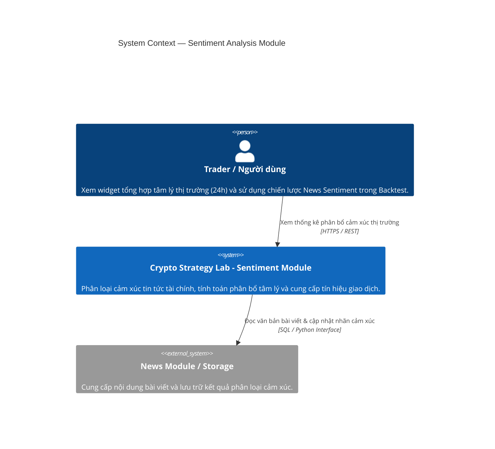
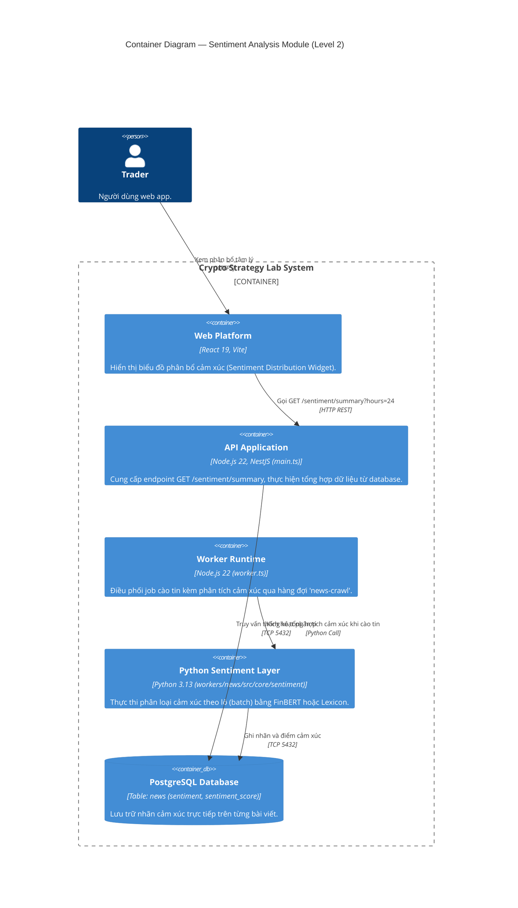
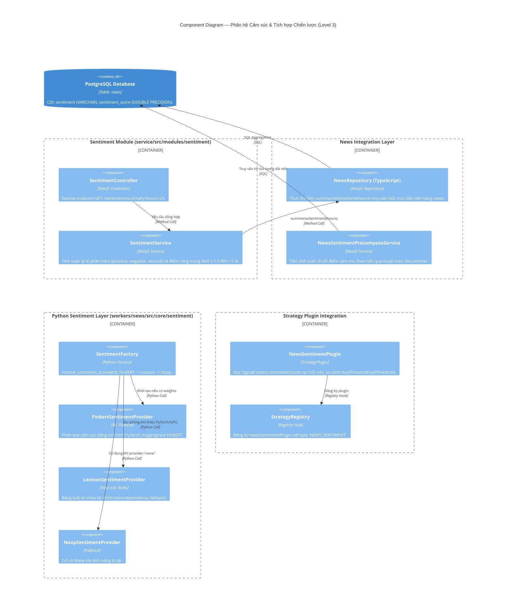
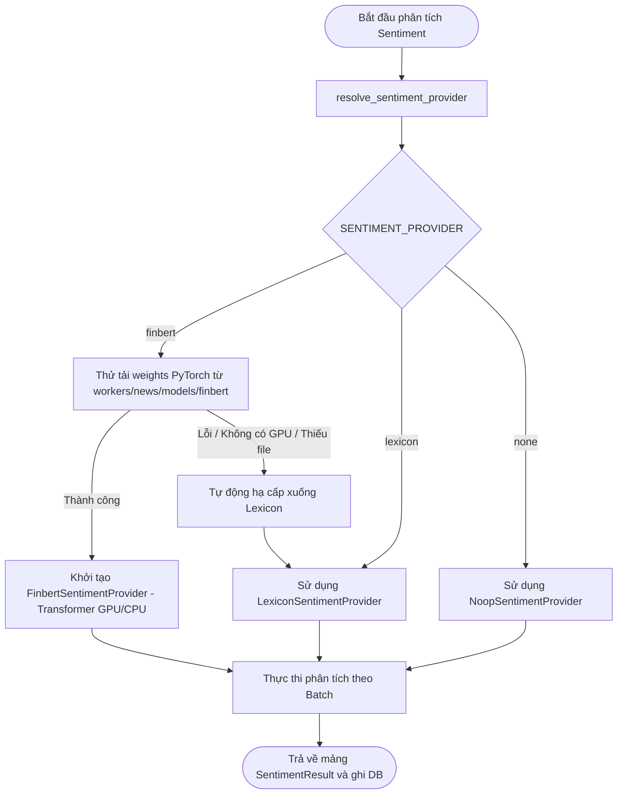

# Phân Tích Kiến Trúc & Cách Hoạt Động Phân Hệ Phân Tích Cảm Xúc (Sentiment Analysis Module)

> **Tài liệu tham chiếu trong dự án**:
>
> - [01-repository-architecture-evidence.md](file:///home/ltp/Code/Course/Software_Architecture/Project/crypto-strategy-lab/temp/01-repository-architecture-evidence.md)
> - [02-news-sentiment-deep-analysis.md](file:///home/ltp/Code/Course/Software_Architecture/Project/crypto-strategy-lab/temp/02-news-sentiment-deep-analysis.md)
> - [report-sentiment.md](file:///home/ltp/Code/Course/Software_Architecture/Project/crypto-strategy-lab/temp/report-sentiment.md)
> - [architecture-c4-component-sentiment.puml](file:///home/ltp/Code/Course/Software_Architecture/Project/crypto-strategy-lab/temp/architecture-c4-component-sentiment.puml)
> - [flow-news-sentiment.puml](file:///home/ltp/Code/Course/Software_Architecture/Project/crypto-strategy-lab/temp/flow-news-sentiment.puml)

---

## 1. Tổng Quan Phân Hệ Phân Tích Cảm Xúc

**Sentiment Analysis Module (Mô-đun 11)** là phân hệ độc lập chịu trách nhiệm phân loại cảm xúc của các văn bản tài chính, tổng hợp chỉ số tâm lý thị trường theo các cửa sổ thời gian, và chuyển đổi dữ liệu cảm xúc lịch sử thành các tín hiệu giao dịch định lượng cho bộ máy Backtest.

### Nhiệm vụ cốt lõi:

1. **Phân loại cảm xúc văn bản (Text Classification)**: Gắn nhãn cảm xúc (`positive`, `negative`, `neutral`) kèm điểm tin cậy (`score` từ 0.0 đến 1.0) cho từng bài viết tin tức.
2. **Tổng hợp chỉ số tâm lý thị trường (Rolling Sentiment Distribution)**: Tính toán phân bổ tỷ lệ phần trăm bài viết tích cực/tiêu cực/trung tính và điểm số ròng tổng hợp trong một khoảng thời gian (ví dụ: 24 giờ qua) qua REST API.
3. **Cơ chế dự phòng đa tầng (Graceful Degradation Hierarchy)**: Thiết kế mô hình suy luận linh hoạt: ưu tiên mô hình học máy chuyên sâu FinBERT (PyTorch); nếu thiếu trọng số hoặc môi trường không có GPU, tự động chuyển xuống bộ luật từ vựng Lexicon dự phòng nhằm đảm bảo tiến trình không bao giờ bị lỗi.
4. **Tích hợp tín hiệu chiến lược với độ phức tạp $O(1)$**: Cung cấp dữ liệu cho `NewsSentimentPlugin` thông qua cơ chế tiền tính toán (Precompute), triệt tiêu hoàn toàn chi phí query cơ sở dữ liệu hoặc gọi mô hình ML bên trong vòng lặp nến của Backtest.

---

## 2. Sơ Đồ Kiến Trúc Hệ Thống (C4 Level 1 → Level 3)

### 2.1. C4 Level 1 — System Context



### 2.2. C4 Level 2 — Container View



### 2.3. C4 Level 3 — Component Diagram



---

## 3. Phân Tích Chi Tiết Các Thành Phần

### 3.1. Bảng Thành phần (Component Inventory)

| Component                                   | Trách nhiệm                                    | Input                                            | Output                                                              | Phụ thuộc                          |
| :------------------------------------------ | :----------------------------------------------- | :----------------------------------------------- | :------------------------------------------------------------------ | :----------------------------------- |
| **SentimentController**               | REST Controller phục vụ thống kê cảm xúc   | Query param`hours` (mặc định: 24)           | HTTP JSON`SentimentSummaryResponse`                               | `SentimentService`                 |
| **SentimentService**                  | Tính toán chỉ số cảm xúc tổng hợp        | Thời gian khảo sát (`hours`)                | Tỷ lệ phần trăm và điểm ròng (-1.0 đến +1.0)              | `NewsRepository (TypeScript)`      |
| **NewsRepository (TypeScript)**       | Truy vấn tổng hợp từ SQL                     | Khoảng thời gian`NOW() - INTERVAL 'X hours'` | Thống kê số lượng bài viết theo nhãn và điểm trung bình | `DatabaseService` (PostgreSQL)     |
| **SentimentFactory (Python)**         | Quyết định provider phân tích cảm xúc     | Cấu hình env`SENTIMENT_PROVIDER`             | Thể hiện cụ thể của`SentimentProvider`                       | `workers/news/models/finbert`      |
| **FinbertSentimentProvider (Python)** | Phân loại cảm xúc chuyên sâu tài chính   | Danh sách văn bản bài báo (`texts`)       | Danh sách`SentimentResult(label, score)`                         | PyTorch, HuggingFace pipeline        |
| **LexiconSentimentProvider (Python)** | Bộ phân tích từ khóa dự phòng (Fallback)  | Danh sách văn bản bài báo (`texts`)       | Danh sách`SentimentResult` dựa trên bảng từ vựng            | Không phụ thuộc thư viện ngoài |
| **NoopSentimentProvider (Python)**    | Giả lập khi tắt phân tích cảm xúc         | Danh sách văn bản                             | Danh sách toàn giá trị`None`                                  | Không                               |
| **NewsSentimentPrecomputeService**    | Tiền tính toán chuỗi cảm xúc cho Backtest  | Dải nến (`candles`) của đợt thử nghiệm  | Mảng`SignalContext.sentimentScores`                              | `DatabaseService`                  |
| **NewsSentimentPlugin**               | Strategy Plugin phát sinh tín hiệu giao dịch | `SignalContext.sentimentScores[candleIndex]`   | Tín hiệu`BUY`, `SELL`, hoặc `HOLD`                         | `StrategyRegistry`                 |

---

## 4. Quy Trình Suy Luận & Cơ Chế Dự Phòng Đa Tầng (Fallback Hierarchy)

Phân tích cảm xúc diễn ra trong tiến trình `workers/news/main.py` ngay sau khi cào tin tức và loại trùng lặp:



### Chi tiết các tầng Provider:

1. **FinbertSentimentProvider**:
   - Sử dụng kiến trúc Transformer đã được huấn luyện trước trên tập dữ liệu văn bản tài chính (ProsusAI/finbert).
   - Tải trọng số cục bộ từ `workers/news/models/finbert` để không phụ thuộc vào việc tải mô hình qua Internet khi khởi động.
   - Nhận diện tốt ngữ cảnh tài chính phức tạp (ví dụ: *"lợi nhuận giảm ít hơn dự kiến"* $\to$ mang tính tích cực).
2. **LexiconSentimentProvider (ADR-008, DEC-004)**:
   - Sử dụng từ điển từ khóa tài chính định nghĩa sẵn:
     - Nhóm tích cực (+1): `bullish`, `surge`, `rally`, `breakout`, `record high`, `adoption`...
     - Nhóm tiêu cực (-1): `bearish`, `hack`, `crash`, `plunge`, `liquidation`, `lawsuit`...
   - Không cần nạp PyTorch hay phụ thuộc vào card màn hình GPU.
   - **Đảm bảo tính bền vững (Resilience)**: Nếu máy chủ gặp sự cố không thể nạp mô hình nặng, tiến trình cào tin vẫn lưu được nhãn cảm xúc, ngăn ngừa lỗi `NULL` dữ liệu trong database.

---

## 5. Hợp Đồng Dữ Liệu (Data Contracts)

### 5.1. Hợp đồng Python (`SentimentResult`)

```python
@dataclass
class SentimentResult:
    label: str    # "positive" | "negative" | "neutral"
    score: float  # Điểm tin cậy (0.0 đến 1.0)
```

### 5.2. Hợp đồng REST API (`GET /sentiment/summary?hours=24`)

```typescript
export interface SentimentSummaryResponse {
  total: number;       // Tổng số bài viết được phân tích trong khoảng thời gian
  positive: number;    // Tỷ lệ % bài viết tích cực (0.0 đến 100.0)
  negative: number;    // Tỷ lệ % bài viết tiêu cực (0.0 đến 100.0)
  neutral: number;     // Tỷ lệ % bài viết trung tính (0.0 đến 100.0)
  score: number;       // Điểm số ròng chuẩn hóa từ -1.0 (rất tiêu cực) đến +1.0 (rất tích cực)
}
```

---

## 6. Tích Hợp Với Bộ Máy Backtest & Strategy Plugin

Tín hiệu cảm xúc tin tức được đưa vào vòng lặp kiểm thử chiến lược thông qua cơ chế tối ưu hóa bộ nhớ:

```
[StrategySearchService.run()]
       │
       ├── 1. Giai đoạn Precompute (Chạy 1 lần duy nhất trước khi lặp nến):
       │      NewsSentimentPrecomputeService.precompute(candles, lookbackHours=48)
       │      - Truy vấn SQL bảng news trong khoảng: [firstCandle - 48h, lastCandle]
       │      - Gán điểm có dấu: POSITIVE -> +score, NEGATIVE -> -score, NEUTRAL -> 0
       │      - Quét cửa sổ trượt Two-pointer: độ phức tạp O(candles + news)
       │      - Lưu mảng Array<number | null> vào SignalContext.sentimentScores
       │
       └── 2. Giai đoạn Duyệt Nến (Backtest Simulation Loop):
              Vòng lặp mỗi nến i:
                  NewsSentimentPlugin.analyze(member, context):
                      score = context.sentimentScores[i]
                      if (score >= member.buyThreshold) return 'BUY';
                      if (score <= member.sellThreshold) return 'SELL';
                      return 'HOLD';
```

- **Quy tắc Zero-Allocation**: Trong vòng lặp hàng trăm nghìn cây nến, `NewsSentimentPlugin` chỉ thực hiện phép so sánh số học trên mảng bộ nhớ với thời gian $O(1)$. Tuyệt đối không thực hiện bất kỳ lệnh query SQL hay gọi mô hình ML nào trong pha này.

---

## 7. Các Quyết Định Kiến Trúc & Xử Lý Lỗi (ADR & Guardrails)

| Mã Quyết Định        | Tên Quyết Định                            | Lý Do Kiến Trúc                                                                                                                                                                                                                           |
| :----------------------- | :-------------------------------------------- | :------------------------------------------------------------------------------------------------------------------------------------------------------------------------------------------------------------------------------------------- |
| **ADR-008**        | **Tách Rời Tin Tức & ML Cảm Xúc**  | Cào tin tức là tác vụ I/O mạng; suy luận cảm xúc là tác vụ tính toán CPU/GPU. Việc trừu tượng hóa qua`SentimentProvider` cho phép kiểm thử độc lập và thay đổi mô hình mà không ảnh hưởng tới crawler. |
| **DEC-004**        | **Dự Phòng Từ Vựng Lexicon**        | Đảm bảo hệ thống vận hành 100% không gián đoạn trên các môi trường CI/CD hoặc máy chủ cấu hình thấp không có card GPU.                                                                                               |
| **DEC-005**        | **Zero-Allocation Hot Path**            | Tiền tính toán chuỗi điểm cảm xúc một lần duy nhất theo thuật toán Two-pointer giúp bộ máy backtest đạt tốc độ mô phỏng hàng triệu nến mỗi giây.                                                                 |
| **Colocated Data** | **Tích Hợp Dữ Liệu Bảng `news`** | Nhãn và điểm cảm xúc được lưu trực tiếp tại hai cột`sentiment` và `sentiment_score` trên bảng `news`, không tạo bảng trung gian thừa, tối ưu hóa tốc độ truy vấn tổng hợp SQL.                           |
