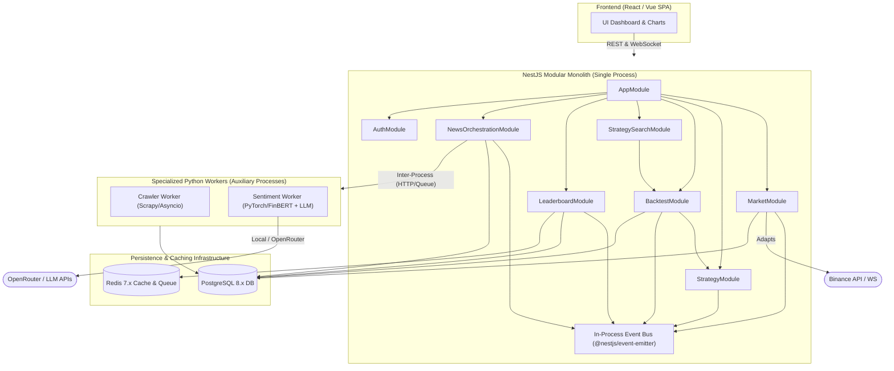

# modules.md — Module Architecture & Component Specification

## 1. Overview and Module Boundary Principles

The platform backend is architected as a **NestJS Modular Monolith** complemented by **Specialized Python Workers**.

```text
Logical Module != Deployable Service
```

- **NestJS Modules** are logical boundaries defined in TypeScript using standard NestJS module decorators (`@Module`). They are compiled and run together inside a single Node.js application process.
- **Python Workers** are auxiliary external processes executed in dedicated Python runtime environments for ML and web scraping workloads.



---

## 2. NestJS Monolith Modules

### 2.1 `MarketModule`

- **Architectural Role:** Manages market data ingestion, normalizes candlestick feeds, maintains live subscriptions, and serves chart histories.
- **Owned Logic:** Exchange adapter implementations (`BinanceAdapter`, interface for `OKXAdapter`/`BybitAdapter`), WebSocket client connection management, automatic reconnection with backoff, gap-fill historical queries, live WebSocket Gateway to Frontend.
- **Exported Public Interfaces (Providers):**
  - `MarketDataService.getCandles(pair, timeframe, from, to): Promise<Candlestick[]>`
  - `MarketDataService.getLatestPrice(pair): number`
  - `MarketGateway`: WebSocket gateway pushing real-time candle ticks to connected browser clients.
- **Internal Events Emitted:** `MarketPriceUpdated`, `CandleClosed` (emitted via `EventEmitter2`).
- **Persistence Ownership:** PostgreSQL `candles` table (Read/Write).
- **In-Process Dependencies:** None (self-contained data provider).
- **Invariants:**
  - Frontend never interacts directly with Binance APIs.
  - Normalizes exchange-specific structures into canonical `Candlestick` schema.
  - Implements lossless reconnect logic on socket disconnection.

---

### 2.2 `StrategyModule`

- **Architectural Role:** Houses the trading strategy plugin registry, technical indicator calculation suite, signal evaluation engine, and Composite Strategy resolution.
- **Owned Logic:**
  - `StrategyRegistry`: In-memory registry mapping strategy identifiers to strategy class constructors.
  - Technical Indicator Engine: Calculates Moving Averages (MA), RSI, Bollinger Bands, Support/Resistance levels over OHLCV arrays.
  - Single Strategy Evaluator: Executes strategy `analyze(context)` returning canonical `Signal { BUY | SELL | HOLD }`.
  - `CompositeStrategyEngine`: Aggregates multiple sub-strategy signals using **Majority Vote** or **Weighted Voting** (`Score = Σ(signal_i × weight_i)`; `|Score| ≥ 0.30` threshold).
- **Exported Public Interfaces (Providers):**
  - `StrategyEngineService.analyze(context: MarketContext, strategyId: string): Signal`
  - `CompositeStrategyService.evaluate(context: MarketContext, config: CompositeConfig): Signal`
  - `StrategyRegistryService.register(strategyClass: Type<Strategy>): void`
  - `StrategyRepository`: Manages versioned strategy definitions.
- **Persistence Ownership:** PostgreSQL `strategies` table (Read/Write). Enforces **immutability** upon insertion (`UPDATE` queries strictly prohibited).
- **In-Process Dependencies:** Uses `MarketContext` abstractions. Does **not** query raw candle tables directly inside strategy classes.
- **Invariants:**
  - Strategy algorithms receive data purely via the `MarketContext` object. Direct database access from strategy classes is strictly forbidden.
  - New strategies are registered via `StrategyRegistry.register()` without modifying existing core classes.

---

### 2.3 `BacktestModule`

- **Architectural Role:** Orchestrates historical backtesting simulations, deterministic trade modeling, performance metric evaluation, and parallel worker dispatch.
- **Owned Logic:**
  - Sequential candle iteration simulation across historical timeframes.
  - Trade execution simulator with Stop Loss / Take Profit boundary checks on OHLC bars.
  - Transaction cost deduction: `Net Profit = Gross Profit (%) - Fee (0.08%) - Slippage (5 bps)`.
  - Financial Evaluator: Computes Total Return, Win Rate, Max Drawdown, Sharpe Ratio, Profit Factor, Total Trades.
  - Ranking Score Formula: `Overall Score = 0.5 × Return + 0.2 × WinRate + 0.3 × RiskScore`.
  - Optional Dispatcher: Uses BullMQ / Redis to distribute parallel backtest sweeps across Node.js worker pools for multi-candidate optimization.
- **Exported Public Interfaces (Providers):**
  - `BacktestService.run(config: BacktestConfig): Promise<ExperimentResult>`
  - `BacktestService.getTradeDetails(experimentId: string): Promise<Trade[]>`
- **Internal Events Emitted:** `StrategyEvaluatedEvent`, `BacktestStarted`, `BacktestCompleted`.
- **Persistence Ownership:** PostgreSQL `experiments` table and `trades` table (Read/Write).
- **In-Process Dependencies:** Imports `StrategyModule` (to evaluate trading signals on each historical candle) and `MarketModule` (to stream historical candles).
- **Invariants:**
  - Backtesting is fully deterministic: executing the same strategy version on identical candle history yields identical trade lists.
  - Default initial capital is set to 100 USD unless overridden.

---

### 2.4 `StrategySearchModule` & `DiscoveryLoopController`

- **Architectural Role:** Coordinates automated candidate strategy optimization, parameter exploration, and continuous search loops.
- **Owned Logic:**
  - Strategy Candidate Generators:
    - **Random Search:** Random parameter permutation generator.
    - **Domain-Guided Search:** Enforces financial heuristic constraints: **Exactly 1 Trend Strategy + 1 Momentum Strategy + 1 Structure Strategy**.
    - **Genetic Search:** Selection, crossover, and parameter mutation optimizer.
  - `DiscoveryLoopController`: State machine managing loop lifecycle (`RUNNING`, `PAUSED`, `COMPLETED`).
  - Strict Stop Conditions Enforcement:
    1. Tested candidate count reaches **100 candidates**.
    2. Continuous runtime reaches **1 hour**.
    3. Stagnation threshold reaches **50 consecutive iterations without Leaderboard improvement**.
- **Exported Public Interfaces (Providers):**
  - `DiscoveryLoopService.start(searchConfig: SearchConfig): Promise<void>`
  - `DiscoveryLoopService.pause(): void`
  - `DiscoveryLoopService.resume(): void`
  - `DiscoveryLoopService.getStatus(): DiscoveryLoopStatus`
- **Persistence Ownership:** Ephemeral in-memory state; writes experiment configurations to PostgreSQL via `BacktestModule`.
- **In-Process Dependencies:** Imports `BacktestModule` and `StrategyModule`. Listens to `LeaderboardUpdated` to detect fitness improvements.
- **Invariants:**
  - Unbounded `while(true)` loops are forbidden; all loops must register with the lifecycle controller and honor stop conditions.

---

### 2.5 `LeaderboardModule`

- **Architectural Role:** Maintains the Top-K (K=10) rankings of best-performing strategies, synchronizes in-memory Redis cache, and pushes live updates to the UI.
- **Owned Logic:**
  - Evaluates `StrategyEvaluatedEvent` against the current Rank[10] baseline.
  - Promotes candidate to Top-K if its `Overall Score` exceeds Rank[10]; evicts previous Rank[10].
  - Synchronizes Top-K snapshot to Redis (`leaderboard:top10`) for sub-millisecond read access.
  - Pushes `LeaderboardUpdated` payloads live to Frontend clients via WebSocket.
- **Exported Public Interfaces (Providers):**
  - `LeaderboardService.getTopK(k?: number): Promise<LeaderboardEntry[]>`
- **Internal Events Consumed:** `StrategyEvaluatedEvent`.
- **Internal Events Emitted:** `LeaderboardUpdated`.
- **Persistence Ownership:** PostgreSQL `leaderboard` table (and Redis cache key `leaderboard:top10`).
- **In-Process Dependencies:** Subscribes to in-process domain events.
- **Invariants:**
  - Default Leaderboard size is fixed at Top K = 10.
  - Updates are push-driven and event-activated (no polling loops).

---

### 2.6 `NewsOrchestrationModule`

- **Architectural Role:** Orchestrates news crawling schedules, receives normalized news items, dispatches sentiment analysis tasks, and injects rolling sentiment scores into the Strategy Engine.
- **Owned Logic:**
  - Cron scheduler for news ingestion intervals (1m to 5m auto-refresh).
  - Inter-process bridge to Python Crawler Worker (via HTTP POST or Redis Queue).
  - Inter-process bridge to Python Sentiment Worker.
  - Aggregation engine: Maintains a 1-hour rolling average sentiment index per asset (e.g., BTC, ETH, SOL).
  - Sentiment-Strategy bridge: Supplies average sentiment to `NewsSentimentStrategy` (`> 0.7 -> BUY`, `< -0.7 -> SELL`, else `HOLD`).
- **Exported Public Interfaces (Providers):**
  - `NewsService.getRecentNews(asset: string, limit?: number): Promise<NewsItem[]>`
  - `NewsService.getSentimentSummary24h(): Promise<SentimentSummary>`
  - `NewsService.getRollingSentiment(asset: string, windowHours?: number): number`
- **Internal Events Emitted:** `NewsCollected`, `SentimentAnalyzed`.
- **Persistence Ownership:** PostgreSQL `news` table and `sentiment_results` table.
- **Invariants:**
  - News crawling failures never impact chart rendering or trading engine loops (Failure Isolation).

---

### 2.7 `LLMStrategyParser` & `AuthModule`

- **`LLMStrategyParser`:** Backend component providing endpoints for converting natural-language prompts (≤1000 chars) or script URLs (TradingView/GitHub Gist) into validated JSON strategy definitions via OpenRouter / LLM APIs.
- **`AuthModule`:** Verifies user account state, plan tiers (e.g., "Pro Student"), and enforces authorization bounds for multi-chart grid viewing and discovery loop triggers.

---

## 3. Specialized Python Auxiliary Workers

### 3.1 Python Crawler Worker

- **Runtime Environment:** Python 3.10+ process managed via Supervisor / systemd / Docker.
- **Responsibilities:**
  - Connects to multi-channel crypto news sources: RSS feeds, public REST News APIs, and raw HTML news websites (CoinDesk, Cointelegraph, The Block, Decrypt, Bankless, The Defiant).
  - Bounded HTML Parser: Extracts standard fields (`title`, `content`, `source`, `publishedAt`, `url`, `relatedCoins`).
  - **Self-Healing Scraper:** Tracks parsing error rate (% empty fields + % malformed types). If error rate exceeds **10%**, invokes LLM adapter to regenerate extraction template (e.g., draft version `v1.4.3`).
  - Returns canonical `NewsItem` entity to the NestJS Monolith.
- **Boundary Contract:** Decoupled from ML sentiment classification. Does not import PyTorch or execute sentiment models.

### 3.2 Python Sentiment Worker

- **Runtime Environment:** Python 3.10+ process with PyTorch / Hugging Face Transformers.
- **Responsibilities:**
  - Consumes raw/normalized news articles dispatched from the NestJS monolith.
  - **Local FinBERT Model:** Executes fine-tuned financial BERT model locally on CPU/GPU to produce sentiment labels (`POSITIVE`, `NEGATIVE`, `NEUTRAL`) and confidence scores `[0.0, 1.0]`.
  - **LLM Adapter (OpenRouter):** Optional high-level fallback / semantic topic extraction engine.
  - Writes back `SentimentResult` records linked to the corresponding `newsItemId`.
- **Boundary Contract:** Operates as a stateless computation worker; does not contain trading strategy logic or direct database management responsibilities.

---

## 4. Module Dependency Hierarchy (Compile-Time / DI)

```text
AppModule
  ├── AuthModule
  ├── MarketModule
  │     └── [BinanceAdapter, MarketGateway]
  ├── StrategyModule
  │     └── [StrategyRegistry, TechnicalIndicators, CompositeEngine]
  ├── BacktestModule
  │     ├── StrategyModule (for signal analysis)
  │     └── MarketModule (for candle feeds)
  ├── StrategySearchModule
  │     ├── BacktestModule (for running candidate tests)
  │     └── StrategyModule (for inspecting registry)
  ├── LeaderboardModule
  │     └── [RedisCacheService]
  └── NewsOrchestrationModule
        └── [PythonWorkerClient, SentimentAggregator]
```

---

## 5. Architectural Anti-Pattern Enforcement

| Anti-Pattern                           | Forbidden Practice                                                                          | Monolith Enforcement                                                                     |
| -------------------------------------- | ------------------------------------------------------------------------------------------- | ---------------------------------------------------------------------------------------- |
| **God Module**                   | Combining market ingestion, ML models, backtesting, and ranking into a single mega-service. | Separated into distinct NestJS modules with clean exported provider interfaces.          |
| **Hard-coded Strategy**          | Writing hardcoded`if/else` ladders across indicator permutations.                         | Implemented via`StrategyRegistry.register()` following the Strategy Pattern.           |
| **Frontend Business Logic**      | Computing indicators, backtest returns, or profit/loss in React/Vue client code.            | Frontend is strictly presentation-only; all calculations occur in NestJS backend.        |
| **Direct DB Access in Strategy** | Strategy classes importing database clients or issuing direct SQL queries.                  | Strategies accept pure`MarketContext` abstractions; DB access is strictly prohibited.  |
| **Tight Crawler-ML Coupling**    | Crawler script importing PyTorch/BERT directly and calling classification inline.           | Crawler and Sentiment are partitioned into isolated worker duties coordinated by NestJS. |
