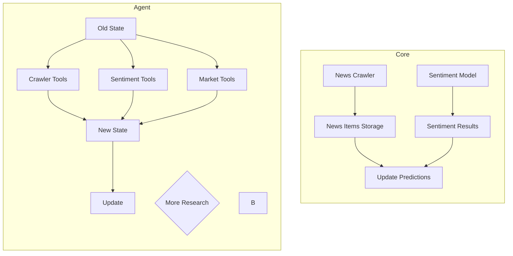

# Crypto Market Intelligence Agent
> Simple Reflex Agent

This is an Agent that helps to crawl cypro-market-related news, then reviews those news and predict that each crypto coin will have any changes by those news.

