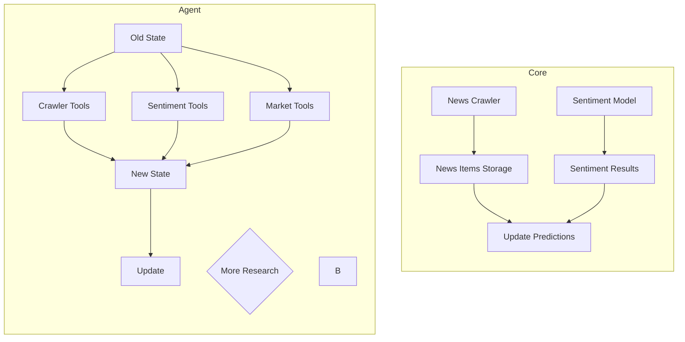

# Crypto Market Intelligence Agent
> Simple Reflex Agent

This is an Agent that helps to crawl cypro-market-related news, then reviews those news and predict that each crypto coin will have any changes by those news.

## Setup (real steps, verified working)

Requires **Python ≥ 3.10** (the crawler uses PEP 604 union syntax, e.g. `str | bytes`,
evaluated at class-definition time). If your system Python is older, install a newer one
separately — do not touch the system interpreter:

```bash
brew install python@3.13
```

Create a project-local virtualenv and install everything (base deps + `sentiment` + `test`
extras + the DB driver):

```bash
cd workers/news
/opt/homebrew/bin/python3.13 -m venv .venv
.venv/bin/pip install -e ".[sentiment,test]"
```

This installs: `feedparser`, `beautifulsoup4`, `pydantic`, `requests`, `pyyaml`,
`psycopg2-binary`, `torch`, `transformers`, `safetensors`, `pytest`.

Both `.venv/` and `models/finbert/` are gitignored — every machine running this worker
repeats this setup once.

### Download the FinBERT sentiment model

```bash
.venv/bin/python src/core/sentiment/setup.py
```

Downloads `ProsusAI/finbert` (~418MB) into `models/finbert/`. Sentiment sits behind the
`SentimentProvider` interface (`src/core/sentiment/provider.py`) — this is the default local
implementation (`FinbertSentimentProvider`), selected via `SENTIMENT_PROVIDER=finbert`
(the default). Swapping to a different model or a remote API means adding a new
`SentimentProvider` implementation and pointing `SENTIMENT_PROVIDER` at it — never editing
the crawler.

**Label order pitfall:** FinBERT's `model.config.id2label` is
`{0: 'positive', 1: 'negative', 2: 'neutral'}` — index 1 is *negative*, not neutral. The
provider always resolves labels through `id2label`, never a hard-coded position; see
`test/core/sentiment/finbert_provider_test.py`, which pins this mapping.

If the model is missing or fails to load, the worker does not crash: it logs a warning and
falls back to a no-op provider, so articles are still crawled and persisted with
`sentiment = NULL` rather than being lost.

### Database

The worker writes into the existing `news` table (already migrated elsewhere in the repo —
this worker never runs a migration itself). Connection defaults to the same DB the rest of
the stack uses (`docker-compose.yml` at the repo root, port `6543`); override via env vars if
needed:

| Env var | Default |
|---|---|
| `NEWS_DB_HOST` (falls back to `DATABASE_HOST`) | `localhost` |
| `NEWS_DB_PORT` (falls back to `DATABASE_PORT`) | `6543` |
| `NEWS_DB_NAME` (falls back to `DATABASE_NAME`) | `crypto_strategy_lab` |
| `NEWS_DB_USER` (falls back to `DATABASE_USER`) | `postgres` |
| `NEWS_DB_PASSWORD` (falls back to `DATABASE_PASSWORD`) | `password` |

`url` has a UNIQUE constraint in `news` — every write is an `INSERT ... ON CONFLICT (url) DO
UPDATE`, so re-running the crawler never creates duplicate rows.

### Run standalone

```bash
.venv/bin/python main.py
```

Loads every `config/*_sources.yml` source, crawls each (RSS today; HTML source configs are
present too but depend on the target site's current markup/anti-bot behavior), dedupes,
scores sentiment, and upserts into `news`. Logs a summary line
(`Upserted N article(s) into news (M with sentiment scored)`) and exits `0` on success. A
non-zero exit code means the run itself failed (not an individual article/source, those are
isolated and logged, not fatal) — this is what `POST /news/crawl` in the Nest API surfaces
back to the caller via the worker's `stderr`.

The Nest API (`service/`) triggers this same script as a separate OS process (see
`artifacts/api-contract.md` §4, `POST /news/crawl` / `GET /news/crawl/status`) — it never
imports or runs crawler code in-process. `NEWS_WORKER_PYTHON_BIN` /`NEWS_WORKER_DIR` env vars
on the API side point at this venv/directory; see `service/src/modules/news/crawl/`.

### Run tests

```bash
.venv/bin/python -m pytest
```

Covers the crawler pipeline (fetch/parse/normalize/validate/dedupe — pre-existing), the
FinBERT label mapping (`test/core/sentiment/finbert_provider_test.py`, skipped automatically
if `models/finbert/` isn't present locally), and `news` upsert idempotency
(`test/core/db/news_repository_test.py`, skipped automatically if no DB is reachable).


